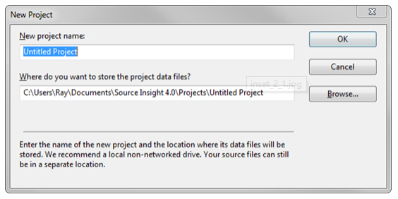

# Source Insight 4 用户指南

Source Insight - 版本 4
1987-2018年版权，由Source Dynamics 股份有限公司出版。

本文档及其中描述的软件受版权保护，保留所有权利。根据版权法，未经Source Dynamics 股份有限公司事先书面许可，不得将文档或软件全部或部分复制，影印，重置，翻译或简化为任何电子媒介或机器可读形式。

免责声明和责任限制

本手册及其中描述的软件由Source Dynamics 股份有限公司制作，如有更改，恕不另行通知。Source Dynamics 股份有限公司对由此处包含的任何不准确或遗漏或由使用此处包含的信息或程序产生的后果不承担任何责任。

Source Dynamics 股份有限公司对这些程序或本手册中的补充文档不做任何明示或暗示的保证。在任何情况下，Source Dynamics 股份有限公司均不对提供，执行或使用程序或文档相关的或由此引起的偶然或间接损害承担责任。本免责声明包括但不限于因使用或操作随附软件而导致的任何服务中断，业务损失或预期利润或间接损失。

Source Insight 是Source Dynamics 股份有限公司的商标。
其他产品名称是其各自制造商的商标。

 

Source Insight 股份有限公司
22525 SE 64th, Suite 260
Issaquah, WA 98027
USA

电话：(425)557 - 425
传真：(425)557 - 425
网站：sourceinsight.com

技术支持：support@sourceinsight.com
销售售：sales@sourceinsight.com

## 一、开始

**入门**

​		欢迎来到 Source Insight。

​		我们希望使用 Source Insight 可以提高您的工作效率和编码乐趣。 它的创建是出于导航大型代码库的需要，并有助于在工作和计划时理解复杂的代码。

​		今天，重要的技术公司正在使用 Source Insight 来开发一些最大的商业硬件和软件产品。

**主要优势**

​		Source Insight 的重要优势是：

* 它有助于理解现有的代码库。
* 您可以快速导航函数调用和调用者。
* 您几乎可以立即找到对函数、变量等的引用。
* 您可以看到调用图和类树图。
* 它无需打开文件即可预览函数和类定义。
* 它使用语法格式显示对变量和其他声明的实时引用。
* 它具有强大的编辑功能，包括代码片段、符号自动完成和智能重命名。
* 动态信息面板协同工作以创建高效的工作流程。

**安装 Source Insight**

​		一旦在一台机器上安装了 Source Insight，该机器上的任何用户都可以使用它，但许可会根据操作系统是否为服务器而有所不同。

​		在桌面操作系统上，Source Insight 是按机器授权的。 为整台机器存储了一个许可证。 安装并激活后，您可以从计算机上的任何用户帐户运行 Source Insight。

​		在服务器操作系统（包括终端服务器）上，Source Insight 是按用户授权的。 它必须为每个用户单独激活，并且为每个用户存储一个许可证。

**激活 Source Insight**

​		Source Insight 需要通过 Internet 进行初始激活。 激活过程是版本 4 的新功能，我们将其设计为对用户的影响非常小。 请理解，激活可保护您的许可证，验证您的序列号，并允许我们继续开发 Source Insight。

​		首次启动 Source Insight 时，将出现“管理许可证”窗口。 请参阅：管理许可证。系统将提示您输入序列号或开始新的试用许可证。 试用许可证运行 30 天。 您不需要序列号即可使用试用许可证。

​		出现提示时，请输入您的姓名和电子邮件地址。 您的电子邮件地址是可选的，但我们强烈建议您提供，这样您就可以在丢失许可证时找回您的许可证。 这也使我们能够在有任何重要更新可用时通知您。

​		然后，Source Insight 将使用我们的许可系统激活您的许可。 一两秒钟后，您的许可证将被激活，您无需再次激活。

​		当您激活许可证时，Source Insight 会通过安全的 SSL 连接将您提供的信息以及硬件指纹发送到我们的许可系统，以便我们可以将许可证与机器相匹配。 您仍然可以在不使安装失效的情况下进行大多数硬件更改。 我们尊重您的隐私，我们明确不会与任何第三方分享您的信息。

​		如果您对激活过程有任何问题或疑问，请发送电子邮件至 info@sourceinsight.com。

**转让您的许可证 - 停用**

​		如果您决定停止使用 Source Insight，或者想在另一台机器上使用您的许可证，您应该首先通过选择帮助 > 管理许可证并选择“停用许可证”来停用旧机器上的许可证。 这会减少您的激活次数，以便您可以在另一台机器上激活它。 一个许可证最多可为您激活两台机器。

​		如果您无法再访问您的旧机器（停用它），请尝试在您的新机器上简单地安装和激活。 它很有可能会很好地激活。 我们允许在一段时间内有一定数量的超额。 如果激活次数过多导致激活失败，请联系info@sourceinsight.com

**激活问题**

问：我可以多次激活 Source Insight 吗？
		Source Insight 许可证允许您同时在最多 3 台机器上激活 Source Insight，前提是只有一个人在使用该软件。 例如，您可以将它安装在您工作时的两台台式机和笔记本电脑上。 因此，每个许可证最多可以激活 3 台机器。 但是，只有一个人可以使用一个许可证。 多人不得共享一个许可证。

​		如果出于某种原因您在同一台机器上多次激活它，则它不计入您的两次激活限制。


问：如何将我的许可证转移到新机器上？
		要将许可证转移到新机器，您应该先在旧机器上停用 Source Insight，方法是选择“帮助”>“管理许可证”，然后选择“停用许可证”。 停用会减少您的激活计数，以便您可以在另一台机器上激活它而不会超过您的激活限制。 单个许可证最多可为您激活 3 台机器（对于单个用户）。

​		当您在新机器上激活时，您将需要提供您的许可证序列号。 使用与以前相同的序列号。


问：如何获得序列号？
		当您购买许可证时，您将获得一个有效的许可证序列号。 它通常通过电子邮件发送给您。


问：如何开始试用许可证？
		启动 Source Insight。 当“管理许可”窗口出现时，选择“开始试用”，然后单击“继续”。


问：试用许可证需要序列号吗？
		您不需要序列号即可开始试用许可证。 当您开始试用许可证时，将分配给您一个特殊的试用序列号。


问：我想将我的许可证转移到一台新机器上，但无法再访问我的旧机器来停用它。
		首先，请尝试在您的新机器上简单地安装并激活。 它很有可能会很好地激活。 我们允许在一段时间内有一定数量的超额。 如果激活次数过多导致激活失败，请联系info@sourceinsight.com。


问：如果我更换硬件会怎样？
		更改硬件不太可能会使您的许可证激活失效。 如果更换主驱动器，则必须重新安装并再次激活 Source Insight。 即使那样，许可系统也允许在一段时间内进行一定数量的更改。 如果您拥有有效的许可证，我们绝对不希望您被卡住。


问：如果我重新格式化我的驱动器并重新安装 Source Insight 会怎样？
		当您重新安装并运行 Source Insight 时，系统将提示您再次激活。 但是，这主要是在您的机器上刷新许可证，不会算作新的激活。


问：如果我没有互联网连接怎么办？
		激活过程将延迟一段时间，直到您可以连接到 Internet，因此您仍然可以使用它。 如果您的机器永远无法连接到 Internet，我们可以通过电子邮件向您发送激活的许可证文件。 请将请求通过电子邮件发送至 activation@sourceinsight.com 并提供有关您或预期最终用户的以下信息：

* 用户名
* 公司或组织，如果适用
* 用户的电子邮件地址
* 许可证序列号


问：激活使用哪些网络端口来设置防火墙/代理？
		激活过程使用端口 443 (HTTPS) 连接到 sls.sourceinsight.com。 您可以使用此 URL 测试与 Web 浏览器的连接：https://sls.sourceinsight.com/lsstatus/。注意：您必须包括尾部斜杠。

​		网页将显示“OK”，表明许可证服务器已启动。 注意：截至 2017 年 11 月，我们解决了一个可能会阻止某些代理到达我们的许可服务器的问题。


问：为什么 Source Insight 需要激活？
		我们对此进行了长时间的考虑，并决定某种形式的许可证验证是有帮助的。 Source Insight 的过去版本没有激活，这导致许多非法许可证被使用，甚至被出售给毫无戒心的客户。

​		此外，许多使用 Source Insight 的客户和公司都想知道他们的许可证是真实的，并希望有一种方法可以自动遵守许可协议。

​		我们将激活系统设计为影响非常小，并且有利于合法用户。 许可系统允许在一段时间内进行一定数量的激活超额，因此任何有效许可证都不太可能无法激活。 我们绝对不希望任何人在拥有有效许可证的情况下被困住。

### 与旧版本 Source Insight 的兼容性

​		如果您使用过旧版本的 Source Insight，例如 3.x 版，您可能会发现本节中的主题很有用。

​		您可以在同一台机器上同时使用 Source Insight 版本 4 和版本 3。 它们各自使用单独的文件和 Windows 注册表设置，因此它们不会发生冲突。 工程数据文件格式不同，但文件扩展名不同，应该不会冲突。

**从版本 3 打开项目**

​		要打开旧版本 3.x 项目，请选择“项目”>“打开项目...”，然后单击“浏览”按钮找到旧项目 .PR 文件。 旧项目将被复制为新格式。 原始版本 3 项目将保持不变。

**从版本 3 导入配置设置**

​		当您首次安装并运行 Source Insight 时，它会查找旧版本。 如果它找到一个旧的配置文件，它会提示您导入设置。

​		要随时导入版本 3 配置设置，请选择选项 > 加载配置，然后导航至您的版本 3 配置文件。 它通常存储在这里：C:\Users\<user-name>\Documents\Source Insight\GLOBAL.CF3\其中 C: 是您的系统盘符，\<user-name> 是帐户用户名。

==**版本 3 的重要变化**==（我感觉是与版本3相比的重要变化）

​		为了使程序更易于理解，一些内容已被移动或重命名。

* 版本 3 中称为“文档选项”(Document Options)的内容现在称为文件类型选项(File Type Options)。 它包含所有特定于文件类型的选项。 例如，有一个名为“C/C++ 文件(C/C++ Files)”的文件类型。 “文档类型”一词已替换为“文件类型”。 请参阅：文件类型。
* C 和 C++ 文件类型已合并为“C/C++ 源文件(C/C++ Source File)”
* 版本 3 中称为“草稿视图(Draft View)”的内容现在称为“单一字体视图(Mono Font View)”
* 以前在版本 3 中称为“符号音节(symbol syllables)”的东西现在称为“名称片段(name fragments)”。
* 可停靠/浮动窗口(Dock-able/Floating windows )现在称为面板(Panels)。 除了上下文和关系窗口(Context and Relation window)，还有一些新面板，例如 FTP 浏览器(FTP Browser)、窗口列表(Window List)、片段(Snippets)、书签(Bookmarks)、目录比较(Directory Compare)和文件比较(File Compare)。
* 项目文件 - 主项目文件的新扩展名为 .siproj。 所有数据文件格式都已从版本 3 开始更改。您仍然可以打开版本 3 项目，但它们将被转换为新格式。
* Project Symbol Path 理念已被 Project > Import External Symbols 取代。 此功能允许您从外部源导入符号，例如头文件、.NET 程序集和 Java jar 文件。 每次您导入某些内容时，Source Insight 都会为您创建一个特殊的“导入”项目。 它会自动在那里搜索符号。 如果需要，您仍然可以使用项目符号路径。 请参阅：从库中导入符号。
* 项目设置现在有一个“备份目录(Backup Directo
* 现在所有项目共享相同的配置设置。 然而，当涉及到项目特定的配置部分时，配置文件系统具有一定的灵活性。 请参阅：自定义设置和配置。

### 版本 4 中的新功能

​		Source Insight 第 4 版中添加了许多新功能。 以下是一些亮点：

* 改进了 C/C++、C#、Java 和其他语言的语言解析。
* 现在内置了对 Objective-C、Python、PHP、XML 和 JSON 文件的语言支持。
* 从外部源导入符号，例如 .NET 程序集、Java JAR 文件和包含文件。 使用 Project > Import External Symbols 来执行此操作。 请参阅：从库中导入符号。
* 文件窗口选项卡出现在主应用程序窗口的顶部。 右键单击它们并选择“窗口选项卡选项(Window Tab Options )”以更改排序顺序。
* 可折叠的代码块。 您可以通过选择 Options > Preferences: Windows 并参考 Outline and Nesting 部分来控制位置和外观。 请参阅：概述和折叠文本。
* 文件和目录比较 (diff)。 从“工具”菜单调用它们。 请参阅：文件比较。 请参阅：目录比较。
* 适用于大括号语言（例如 C/C++ 和 C#）的代码美化器。 请参阅：代码美化器。
* Unicode 支持
* 带有面板和视觉主题的新用户界面。 请参阅：视觉主题。
* 新概览滚动条的位置类似于滚动条，但可以让您鸟瞰文件。 它的工作方式与滚动条略有不同，但您可以使用它来滚动。 它可以向您显示当前函数的边界，并帮助您在较长的函数中定位。 请参阅：概览滚动条。
* 新增强的垂直滚动条在滚动条内显示更多细节。 右键单击它并选择滚动条选项以使用其设置。 请参阅：滚动条选项。
* 您可以快速切换的多个窗口布局。 使用“视图”>“加载/保存布局”，或单击其中一个布局工具栏按钮可在 4 种不同的布局预设之间快速切换。 请参阅：使用布局保存窗口排列。
* 代码片段 - 定义要插入的代码模板。 选择工具 > 激活代码片段窗口以显示代码片段面板。 片段用于您要插入的样板文本。 您可以将文本变量放在插入代码段时展开的代码段文本中。 例如 $date$ 被替换为当前日期。 请参阅：代码片段。
* 改进的书签 - 书签现在永久存储，它们存储为与附近函数或类名的行偏移量。 每个项目都有自己的书签列表。 请参阅：书签。
* 改进的关系窗口 - 参考查找更快。 函数还有一种新的关系类型：“调用和调用者”。 这显示在相同的轮廓或图表中。 您还可以将图形视图复制到窗口剪贴板。 请参阅：关系窗口。
* 维护每个项目的备份文件，并轻松与备份版本进行比较。 使用工具 > 与备份文件比较可快速将当前文件与备份版本进行比较。 您还可以使用“文件”>“打开备份文件”打开当前文件的旧版本。 请参阅：备份文件。
* 更好的正则表达式 - 现在支持 Perl 兼容和多行表达式。 大多数让您输入正则表达式的地方现在都有一个列表，您可以在其中选择 RegEx 的类型。 有经典 Source Insight 正则表达式和 Perl 兼容正则表达式的常规和“多行”版本。 多行正则表达式类型基本上匹配带有点 (.) 字符的换行符。 因此，例如，.* 将匹配整个文件。 而“start.*end”会找到文件中从“start”到“end”的所有内容，甚至跨越换行符。
* 更好地支持大型项目。 虚拟内存的使用得到了改进，因此非常大的项目可以更好地适应内存空间。 对于大量符号，版本 3 可能会在项目索引文件上发生文件读取错误，从而导致项目损坏。 这已被淘汰。
* 通过使用主文件列表，可以更轻松地管理多个用户和机器的项目。 一个项目可以有一个 MFL，它可以是您的源代码存储库的一部分并与其他人共享。 它是一个简单的文本文件，列出了项目中的所有文件（和/或目录）。 请参阅：使用主文件列表。
* 将项目源导出到 HTML 站点。 您可以使用它来将所有文件导出为 HTML 版本，其中包含您在 Source Insight 中看到的大部分相同语法格式。 这基本上构建了一个可用于浏览项目源代码的网站。 请参阅：将项目导出为 HTML。
* 浏览器模式 - Source Insight 表现为只读代码浏览器。 在此模式下，您无法编辑文件。 只需单击标识符即可跳转到定义，就像在网络浏览器中一样。 按 Backspace 键返回，然后在光标位于符号名称上时按 Space 键跳转到其定义。 单击以进行常规选择时按住 CTRL。 请参阅：浏览器模式。
* 附加到每个源文件窗口的符号窗口窗格现在有一个可折叠的大纲视图。
* 全新的配置系统，将您的所有设置保存在 XML 文件中。
* 整个程序的许多改进！

**文件格式更改**

Source Insight 创建和维护的几个数据文件在版本 4 中发生了变化。

* 项目文件 - 主项目文件的新扩展名为 .siproj。 所有项目数据文件格式都已从版本 3 开始更改。您仍然可以打开版本 3 项目，但它们将被转换为新格式。
* 配置文件 - 所有配置设置现在都保存在 XML 文件中。 由于配置变化太大，不支持3.5版本的配置文件。
* 工作区文件 - 新扩展名为 .siwork。 这些与版本 3 不兼容。
* 恢复文件 - 新扩展名是 .si_recovery。

**文件存储**

Source Insight 4 将其大部分数据存储在 \<HOMEDRIVE>/users/\<user-name>/Documents/Source Insight 4.0 中。

“Documents/Source Insight 4.0”文件夹中的文件夹如下：

<center>表 1.1：用户文档区中的文件夹和文件</center>

| 文件夹名称         | 描述                                                         |
| ------------------ | ------------------------------------------------------------ |
| Backup             | 存储非项目文件的文件备份。                                   |
| Bookmarks          | 所有项目中使用的“全局”书签。                                 |
| Clips              | 剪辑存储。 请参阅剪辑功能。                                  |
| Logs               | 日志文件。 由Options > Preferences: General : Log­ging...控制 |
| Projects           | 每个项目在此文件夹中都有一个数据文件夹。                     |
| Settings           | 您的配置设置、主题和布局。                                   |
| Snippets           | 代码片段                                                     |
| c.tom file         | C/C++ 预处理器标记宏。                                       |
| FileAlias.txt file | 将不带扩展名的文件名映射到文件类型                           |

## 二、用户界面

本章描述了 Source Insight 程序的主要窗口和有关使用 Source Insight 中可用的不同窗口的一般信息。

Source Insight 的用户界面主要包括：

* 顶部的主菜单和工具栏区域。
* 编辑文件的源文件窗口。
* 可停靠或浮动的面板窗口。

Source Insight 是一个选项卡式 MDI（多文档界面）应用程序。 这意味着您打开的每个源文件在 Source Insight 应用程序窗口中都有自己的子窗口。 此外，文件窗口选项卡出现在工具栏区域正下方的顶部。

在下面的屏幕截图中，Source Insight 应用程序主窗口包含顶部的主工具栏、中间的源文件窗口和一些停靠在右侧的面板窗口。 源文件中声明的符号出现在符号面板的左侧。


下面是一个典型的窗口布局，显示了源文件窗口、关系窗口和上下文窗口。 Source Insight 程序主窗口，显示一个源文件窗口，左侧有一个符号窗口，右侧有一个关系窗口。 上下文窗口停靠在底部边缘。


想要查询更多的信息：

请参阅：关系窗口。

请参阅：上下文窗口。

### 源文件窗口

您打开的每个文件都将显示在单独的源文件窗口中。 Source Insight 是一个选项卡式多文档界面 (MDI) 应用程序。 每个源文件窗口的左侧都有一个符号窗口。 如果你愿意，你可以隐藏这个窗口。


当您打开一个源文件时，它会出现在它自己的源文件窗口中。 此窗口是您进行所有常规编辑的地方。 文件窗口选项卡出现在主源文件区域上方。

当您打开一个附加了语言的文件时，符号窗口将附加到源文件窗口的左侧。 您可以通过选择文件类型和选项(File Types And Options )并相应地设置使用符号窗口复选框来控制是否使用符号窗口(Use symbol window )。 请参阅：文件类型选项。

下面是一个源文件窗口，它的左侧有一个符号窗口，源窗口的右边缘有可选的 Overview Scroller 控件。


**符号窗口**

符号窗口出现在每个源文件窗口的左侧。 符号窗口列出了文件中声明的所有符号，以便在每个文件中轻松导航，并提供文件的快速概览。 例如，它列出了所有函数、结构、类、宏、常量等。 Symbol Window 列表中每一项的左侧都有一个小图标，用于描述符号的类型。 符号窗口还显示#ifdef-#endif 嵌套级别。

Source Insight 动态更新符号窗口。 如果您输入新的声明，该符号将立即出现在符号窗口中。

数据结构符号（例如类）以粗体显示。 此外，长度大于该文件中平均值的函数以粗体显示。 这个想法是更大的功能可能更重要。

您还可以将符号从一个符号窗口拖到另一个窗口，或拖到同一文件中。


符号窗口的底部是一个小工具栏。 有用于对列表进行排序的控件。 您可以右键单击符号窗口以调出其快捷菜单。

自定义符号窗口

右键单击符号窗口并选择“符号窗口属性(Symbol Window Properties)”以更改其设置。 请参阅：符号窗口选项。

更改符号窗口的宽度

要更改符号窗口的宽度，请单击窗口的右边缘并拖动。 这只会调整当前窗口的大小。 如果要更改所有其他窗口的大小，请调整其大小，然后右键单击它并选择“保存设置(Save Settings)”

永久更改符号窗口的宽度

要永久更改符号窗口的宽度以及其他文件中所有未来的符号窗口，请通过拖动右边缘来调整窗口大小。 然后，右键单击符号窗口并选择“保存设置”。 这会记录窗口的宽度、符号排序和符号类型过滤，并将这些参数用作从现在开始创建的新窗口的新默认值。

### 面板窗口

面板窗口是可以浮动在主应用程序窗口前面的工具窗口，它们可以停靠在主窗口的各个位置。 通过将浮动窗口拖动到主窗口的边缘，您可以将其停靠到主窗口。 面板窗口可以浮动在应用程序窗口之外，甚至可以浮动在另一台显示器上。

下面是浮动在主应用程序窗口前面的片段窗口的示例。 Snippet Window 是位于 Source Insight 主窗口前面的浮动窗口的示例。 您还可以将其停靠在程序窗口的边缘。


当您将面板窗口彼此靠近或靠近 Source Insight 应用程序窗口的边缘时，面板窗口会出现粘性行为。 它们将捕捉到相邻窗口的边缘，并且如果调整相邻面板窗口的大小时它们将自动调整大小。

所有面板窗口的停靠和浮动布局都保存在一个布局文件中。 您可以通过选择“视图”>“加载布局...”(View > Load Layout...)或单击“布局”工具栏中的 A-D 布局按钮之一来快速加载不同的面板布局：


面板窗口有：

* 项目符号列表(Project Symbol List ) - 显示项目中的所有函数、类和其他符号。
* 项目文件列表(Project Files List ) - 显示项目中的所有文件。
* 项目文件类型列表(Project File Type List)  - 显示所有项目文件，按类型组织。
* 项目文件夹浏览器(Project Folder Browser ) - 显示项目的磁盘和目录结构。
* 项目符号类别(Project Symbol Categories ) - 显示所有符号，按符号类型组织。
* 上下文窗口(Context window) - 上下文相关信息窗口。
* 剪辑窗口(Clips Window) - 显示类似剪贴板的剪辑，便于复制和粘贴。
* 书签窗口(Bookmark Window) - 显示已添加书签的地点列表。
* 关系窗口(Relation Windows) - 显示调用树、类树和其他关系。
* Snippet Window - 管理所有代码片段。
* 窗口列表(Window List) - 显示所有打开的文件缓冲区窗口。
* FTP 浏览器(FTP Browser) - 连接到 FTP 服务器。
* 文件比较(File Compare) - 显示两个文件之间的差异。
* 目录比较(Directory Compare) - 显示两个目录之间的差异。

**工具栏**

主工具栏出现在 Source Insight 程序窗口的顶部。 您可以使用“视图”>“工具栏”>“主工具栏”(View > Toolbars > Main Toolbar )命令打开和关闭整个主工具栏。

主工具栏由较小的子工具栏组成。 每个子工具栏都可以使用“视图”>“工具栏”(View > Toolbars)菜单独立显示。 您还可以在主工具栏内拖动子工具栏。

每个工具栏的位置自动保存在配置文件中。

每个工具栏图标对应一个 Source Insight 命令。 有关每个命令的信息，请参阅命令参考章节。

**项目搜索栏**

项目搜索栏用于搜索整个项目。 这是执行基于关键字的搜索以在给定数量的上下文行中查找名称或单词片段的强大方法。 要显示它，请选择“视图”>“项目搜索栏”(View > Project Search Bar)。


请参阅：搜索项目。

**文件搜索栏**

文件搜索栏用于在当前文件中进行搜索。 要显示它，请选择“查看”>“文件搜索栏”(View > File Search Bar)。 或者，您可以使用激活搜索栏 (Alt+Shift+F) 来激活它，以便您可以开始在其中输入内容。


要设置选项，请单击选项按钮。 请参阅：文件搜索栏选项。

**浏览工具栏**

浏览工具栏显示导航操作，就像在网络浏览器中一样。


**标准工具栏**

标准工具栏包含基本的文件操作。


## 三、功能及概念

### 项目

Source Insight 最强大的功能是围绕项目设计的。 Source Insight 项目是源文件以及可帮助您快速浏览源代码的关联数据文件的集合。

您可以将现有的源文件或整个源代码树添加到项目中。 您可以在 Source Insight 中创建文件时添加文件。 如果新文件出现在您的源目录或子目录中，也可以通过运行“项目”>“同步文件”(Project > Synchronize Files)命令或让 Source Insight 在后台自动同步，将它们自动添加到您的项目中。 您还可以让 Source Insight 维护项目的主文件列表，它确定项目中的文件。

**项目特色**

Source Insight 项目有几个重要的特点：

* 项目在逻辑上将相关文件分组。
* 当你想打开一个文件时，你不必指定它的驱动器或目录。
* Source Insight 维护一个符号数据库，其中包含有关项目中所有符号声明和引用的数据。 您可以使用 Source Insight 快速定位符号及其引用。 保存源文件时，符号数据库会自动增量更新，以便 Source Insight 始终“知道”符号的位置。 当文件在外部发生更改时，例如通过源代码控制系统，Source Insight 会自动将这些文件与项目符号数据库同步。 请参阅：符号和语言解析。
* Source Insight 可以显示项目中的符号关系，例如调用树、引用树和类层次结构。
* Source Insight 维护一个参考索引，这大大加快了项目范围内对符号参考的搜索。 参考索引会在您编辑和保存文件时逐步更新。
* 每个项目都有自己的会话工作区。 打开项目时，将恢复所有会话状态。 当项目关闭时，所有打开的文件都将关闭并保存工作区。

**项目内部**

一个项目基本上由两部分组成：您的源文件和 Source Insight 维护的项目数据文件。


<center>图 3.1 Source Insight 项目的组件</center>

每个项目都包含一个指向您的源文件的文件路径列表。 项目还包含一个符号数据库，由 Source Insight 维护。 您的源文件由 Source Insight、符号声明和定义解析，并且引用记录在符号数据库中。 您所要做的就是将源文件添加到您的项目中； 您不必生成任何其他“标记”文件。 Source Insight 会自动执行此操作。

每个项目都有自己的会话工作区。 工作区包含会话信息，例如打开的文件列表和窗口位置。

**当前项目**

每个 Source Insight 实例一次只允许打开一个项目。 您可以运行多个 Source Insight 实例——每个实例都可以打开一个不同的项目。

有时 Source Insight 会打开其他二级项目来搜索符号声明。 这些是后台项目，您不会意识到它们是打开还是关闭。

在整个文档中，除非另有说明，否则大多数讨论都假定您打开了一个项目。 只要在打开和不打开项目的情况下命令的工作方式有所不同，就会被注明。

**项目目录**

创建项目时，必须为每个项目指定两个目录：

* 项目数据目录(Project Data Directory) - 这是 Source Insight 存储其项目数据文件的地方。 例如，.siproj 文件存储在这里。 默认情况下，当您创建新项目时，Source Insight 在 Documents\Source Insight 4.0\Projects 文件夹中创建一个项目数据目录。
* 项目源目录(Project Source Directory ) - 这通常是本地源存储库树的根目录。 通过维护这两个单独的文件夹位置，您可以将 Source Insight 数据与源文件分开存储。 此外，您的 Source Insight 项目数据文件保存在您自己的用户数据区中，同一台机器上的其他用户将无法访问它们。 如果需要，您可以对两个文件夹位置使用相同的位置。

以下是典型项目设置的示例：

项目数据目录：

`C:\Users\John\Documents\Source Insight 4.0\Projects\MyProj`

其中包含文件 MyProj.siproj - 主项目文件。

项目源码目录：

`c:\work\proj1\src`

其中包含您的源代码，可能包括源代码的子目录。

要编辑项目源目录位置，请使用项目设置(Project Settings)命令。 请参阅：项目设置。

**项目源目录**

项目源目录是您认为的源文件的主要位置。 项目源目录通常是源存储库的最顶层或根目录。 您可能会将其视为项目的“主”目录。 Source Insight 在显示文件名时规范化相对于此目录的项目文件名。 实际上，在创建项目后，您可以使用“项目设置”(Project Settings)命令将源目录设置为磁盘上的任何位置。 这会影响源文件路径的显示方式，因为它们是相对于该目录显示的。

请参阅：您要将项目数据文件存储在何处？

在给定目录中创建项目后，您可以从任何目录和任何驱动器（包括网络驱动器和 UNC 路径）向其中添加文件。

例如，假设我们正在为游戏程序创建一个项目。 源代码树如下所示：


我们在“presentation”、“core”和“core”子目录中有源代码。 我们的 Source Insight 项目将包括来自所有这些目录的文件。 我们应该在创建项目时将 c:\game 指定为项目源目录，以便所有文件路径都相对于该目录。

**规范化文件名**

当 Source Insight 显示文件名并且该文件是项目的一部分时，它会排列名称和路径，以便更容易查看和选择基本文件名，而不会妨碍所有目录路径。 此过程称为规范化文件名。 这是一个重要的特性，因为许多项目的文件分布在多个子目录中； 并且“展平”目录树使得键入和选择文件名中最重要的部分变得容易。

规范化文件名始终以叶文件名开头，后面是括号中的目录路径。 此外，显示的目录路径是相对于项目的源目录的，除非文件位于不同的驱动器上。 如果文件在不同的驱动器上，或者不是项目源目录树的一部分，则完整路径显示在括号中。

如果您不希望在项目窗口中看到规范化的文件名，您可以通过使用项目窗口属性(Project Window Properties)命令并选中文件目录(File Directory )框以将单独的列添加到目录名称列表中来将其关闭。

以下是使用上述游戏项目的一些示例：

| 如果文件路径是：            | 文件名显示为：        |
| --------------------------- | --------------------- |
| c:\game\file.c              | file.c                |
| c:\game\core\file.c         | file.c (core)         |
| c:\game\core\io\file.c      | file.c (io)           |
| c:\game\core\enemy\file.c   | file.c (core\enemy)   |
| c:\game\presentation\file.c | file.c (presentation) |
| c:\SomeDir\file.c           | file.c (C:\SomeDir)   |
| d:\OtherDir\file.c          | file.c (D:\OtherDir)  |

**创建一个新项目**

使用 Project > New Project 命令创建一个新项目。 您必须为项目命名并指定希望 Source Insight 存储项目数据的位置。

系统将要求您提供项目名称、文件应存储的位置以及要添加到项目中的源文件。



新项目名称

输入您的项目名称。 Source Insight 将创建多个以此名称开头并具有不同扩展名的文件。

你想在哪里存储项目数据文件？

输入要保存由 Source Insight 创建的项目数据文件的文件夹的完整路径。 它们可以与您的源文件位于同一文件夹中，也可以位于单独的位置。 默认情况下，它们是在 Projects 文件夹中的 Source Insight 用户目录下创建的。

我们建议您的数据目录位于本地非网络驱动器上，以获得可靠性和最佳性能。

回答这两个问题后，您将进入“项目设置”对话框。 请参阅：项目设置。

您应该在哪里创建项目？

如果您正在为存储在本地计算机上的源文件创建项目，则在与源文件相同的目录中创建项目数据文件应该没有任何问题。

如果您创建的项目引用共享服务器上的文件，或者您无权写入的任何其他位置，那么您应该在本地计算机上的某个位置创建项目数据。 当“项目设置”对话框出现时，将源文件的位置输入到项目源目录字段中。

您指定为项目数据目录的文件夹将成为默认的项目源目录。 在“项目设置”对话框中，您可以为项目源目录指定不同的路径。 项目源目录通常是包含源文件的最顶层目录的路径。 当 Source Insight 显示文件名时，文件是相对于项目源目录显示的。 如果你把项目源码目录指向包含你大部分源码文件的目录，那么你就不用看很多多余的路径信息了。

此外，如果文件位于项目源目录或该目录的后代中，“自动添加新文件”功能（在选项 > 首选项：常规中(Options > Preferences: General)）只会自动将新文件添加到项目中。

请参阅：同步文件和项目设置。

**新项目设置**

创建项目时，将打开“新建项目设置”对话框。 请参阅：项目设置。


为项目设置索引选项

名称片段和成员索引占用磁盘和内存中的索引空间。 它还会稍微减慢数据库访问速度。 您可以控制项目设置对话框中的索引内容。

两个复选框控制索引：

* 快速浏览成员名称(Quick browsing for member names)：选择此项以允许成员名称索引。 启用此选项后，您可以简单地键入类或结构的成员名称，而不是让类型为类或结构名称，后跟一个点 (.) 和成员名称。 取消选择此项将节省磁盘空间和内存。
* 快速浏览符号名称片段(Quick browsing for symbol name fragments)：选择此项以允许名称片段索引。 启用此选项后，您可以键入部分名称片段并查找包含这些名称片段的符号。 取消选中此项将节省磁盘空间和内存。 如果您的项目很大，那么在浏览或与符号数据库同步文件时，Source Insight 可能会运行缓慢。

如果两个复选框都关闭，则项目符号列表面板过滤将恢复为简单的前缀匹配。 但是，每个源窗口左侧的 Symbol Window 和 Project Window 文件列表仍将允许名称片段浏览。

**将文件添加到项目**

创建项目后，接下来需要将源文件添加到项目中。 添加文件的方法有多种。

如果您在 Source Insight 中创建了一个新文件并第一次保存它，Source Insight 会询问您是否要将该文件添加到当前项目中。 如果您正在编写新代码并经常创建新源文件，这将是添加文件的最自然方式。

如果您已有现有的源文件并且想将它们添加到当前项目中，请使用“添加和删除项目文件”(Add and Remove Project File)命令。 此命令将任何现有文件（包括整个目录树）从磁盘上的任何位置添加到当前项目。 请参阅：添加和删除项目文件和添加文件列表。

您还可以通过将文件从 Windows 资源管理器拖放到项目文件列表面板上来将文件添加到项目中。 项目文件列表面板还允许从项目中删除文件。

> 您还可以使用主文件列表来维护项目中的文件。 这对于在不同的机器上以及与其他团队成员一起维护项目很有用。 请参阅：使用主文件列表。

将文件添加到项目具有以下效果：

* 文件名存储在项目的文件名数据库中。 每当 Source Insight 显示文件列表时，该文件名将出现在列表中。 因此，例如，当您使用“打开”命令时，文件名将出现在列表框中。
* 该文件根据其语言类型进行解析。 符号定义被添加到项目的符号数据库中。 用于每个文件的语言解析器由其文件类型决定。 请参阅：文件类型。
* 文件的修改日期记录在文件名数据库中，这样如果文件在 Source Insight 之外被修改，例如通过源代码控制系统，Source Insight 将知道同步项目符号数据库。
* 文件名的显示方式已更改。 文件名“标准化”为项目的源目录。
* 该文件将成为项目代码库的一部分，在显示符号关系（例如调用树）时会对其进行搜索。

您应该将哪些文件添加到项目中？

Source Insight 项目应该只包含程序源文件和文本文件。 将二进制格式文件添加到 Source Insight 项目没有任何意义。 例如，将 exe 或位图文件添加到您的项目中不会有任何好处。

选项 > 文件类型选项(Options > File Type Options)中默认定义的文件类型对应于您可能希望与 Source Insight 一起使用的源文件类型。 通常，只有那些类型的文件应该添加到项目中。

使用文件类型选项来控制添加到项目中的文件类型

文件类型选项对话框包含复选框：添加到项目时包括。 您可以使用此复选框来控制 Source Insight 自动将哪些文件类型添加到您的项目中，或者在“添加和删除项目文件”对话框的列表框中显示哪些文件类型。

将远程网络文件添加到项目

无论出于何种原因，您可能希望直接在网络服务器上访问源文件，而不是从文件的本地副本访问。 当然，您可以直接打开网络上的任何文件。 但是，请记住，您可能会通过打开文件或以其他方式导致文件争用而将其他人锁定在文件之外。 此外，除非将远程文件添加到您的项目中，否则您将无法利用 Source Insight 的项目功能。

使项目直接引用服务器上的文件的一种方法是在您的工作站本地创建一个项目，然后使用“添加和删除项目文件”命令将远程服务器上的文件添加到您的项目中。 这样，Source Insight 符号数据库文件存储在本地计算机上，但源文件仍驻留在服务器上。 请参阅：添加和删除项目文件。

使用项目设置命令，您应该将服务器上的远程源代码目录指定为项目源目录。 这样，文件将相对于主源目录显示，而不是相对于您的本地项目数据文件目录。 请参阅：项目设置。

项目主文件列表

您可以设置一个称为主文件列表的特殊文件并将其与当前项目相关联，而不是通过“添加和删除项目文件”命令手动添加和删除文件。 有关详细信息，请参阅：使用主文件列表。

**从项目中删除文件**

要从当前项目的文件列表中删除文件，请使用“项目”>“添加和删除项目文件”(Project > Add and Remove Project Files)命令。 从项目中删除文件时，该文件中找到的所有符号都会从项目的符号数据库中删除。 Source Insight 实际上不会从磁盘中删除文件。 请参阅：添加和删除项目文件。

> 您还可以使用主文件列表来维护项目中的文件。 这对于在不同的机器上以及与其他团队成员一起维护项目很有用。 请参阅：使用主文件列表。

**使用主文件列表**

您可以使用主文件列表来控制项目中的源文件。 主文件列表是一个文本文件，其中包含项目中每个文件或目录的名称。 要使用它，请选择“项目”>“项目设置”(Project > Project Settings)并启用“主文件列表(the Master File List )”设置。

虽然主文件列表 (MFL) 控制项目中的文件，但您仍然可以使用项目 > 添加和删除文件手动添加或删除文件。 当您从项目中添加或删除文件时，更改将保存到 MFL。 如果 MFL 包含一个不在您的项目中的文件，那么它将自动添加到您的项目中。 如果 MFL 不包含项目中的文件，那么它将自动从项目中删除。

主文件列表可以是源代码存储库的一部分并与其他人共享。 它是一个简单的文本文件，列出了项目中的所有文件（和/或目录）。 MFL 在您从项目中添加或删除文件时得到维护。 如果您添加或删除文件，更改将保存到 MFL，当推出或签入 MFL 时，您的团队成员将在他们的 Source Insight 与 MFL 同步时自动获得添加或删除。

主文件列表格式

主文件列表中的每一行都应该包含一个相对于项目源目录的路径。 它可以是一个简单的文件名、一个通配符（如 open*.c）或一个目录名。

如果行项目是目录名称，则该目录中与已知文件类型匹配的所有文件都包含在项目中。 不包括子目录及其内容。

以分号 (;) 字符开头的行是注释。

这是一个例子：

````
; Source Insight Project File List 
; Project Name: WorkTest 
; Generated by Source Insight 4.00.0048 at 11/19/2015 1:41:06 PM 
; Version=4.00.0048 
; 
; Each line should contain either a file name, a wildcard, or a sub-directory name. 
; File paths are relative to the project source root directory. 
; 
FM15Output\copycss.bat 
FM15Output\custom-table.css 
FM15Output\custom.css 
devices 
console\get.c
console\put.c
cmd*.c 
cmd*.h
````

上面的示例使用了特定文件名、通配符和目录名（设备）的组合。 所有名称都相对于项目源目录根目录。

生成主文件列表

如果您已经构建了一个项目并且想要使用主文件列表，请选择“项目”>“导出项目文件列表”(Project > Export Project File List )以创建一个新的文件列表。 选择 Project > Project Settings 并在 Master File List Path 部分指定文件列表。

编辑主文件列表

您可以通过选择“项目”>“打开项目主文件列表”(Project > Open Project Master File List)直接编辑主文件列表。 通常您不需要编辑它，因为在您从项目中添加和删除文件时，Source Insight 会自动更改它。 但是，您可以自由编辑它。 保存文件时，Source Insight 会将项目与新版本的主文件列表重新同步。

与主文件列表同步

Source Insight 定期检查磁盘上的主文件列表是否已更改。 当检测到更改时，它会与它重新同步。 这可能导致将新文件添加到项目中，或从项目中删除文件。 如果您的主文件列表是源代码存储库的一部分，这将很方便。 例如，如果同事向项目中添加了一个新文件，当您获得新版本的存储库时，新的源文件将自动添加到您的 Source Insight 项目中。

**打开和关闭项目**

要打开不同的项目，请使用“项目”>“打开项目(Project > Open Project )”命令（请参阅：打开项目。）Source Insight 一次只允许您打开一个项目，因此如果您已经打开了一个项目，它会询问您是否“ 确定要关闭当前项目并保存对文件的任何更改。 假设您确实关闭了当前项目，“打开项目”命令将显示一个现有项目的列表框，您可以从中进行选择。

要关闭当前项目而不打开任何项目，请使用“关闭项目(Close Project )”命令。 Source Insight 会询问您是否要保存已打开且已更改的每个文件，然后它会关闭所有文件。

**删除项目**

要删除项目，请使用删除项目命令。 此命令删除 Source Insight 创建并与项目关联的所有项目数据文件。 您的源文件不会被删除。 请参阅：删除项目。

**复制项目**

项目 > 复制项目(Project > Copy Project )命令将当前项目复制到新名称和位置。 新项目是通过克隆当前项目数据文件创建的。 您的源文件将不会被复制。 新项目将指向相同的源文件。 如果在复制原始项目后将其删除，则实际上已重命名该项目。 请参阅：复制项目。

**只读项目**

有时将项目设置为只读是有意义的，而 Source Insight 允许这样做。 如果项目仅用作导入库，或者项目仅存在于项目符号路径上以供自动完成使用，则该项目应该是只读的。 此外，一个只读项目可以由多个 Source Insight 实例同时打开。

当 Source Insight 在后台打开一个项目以获取用于自动完成或其他面向引用的用途的符号信息时，它会以只读方式打开该项目，以便 Source Insight 的其他实例也可以打开该项目。

要使项目始终以只读方式打开，请设置项目的 .siproj 文件的只读文件属性，该文件存储在项目的数据目录中。

打开只读项目时，您将无法在项目中保存任何文件，也无法在项目中添加或删除文件。

**更改项目设置**

项目设置命令设置管理当前项目的各种选项。 如果当前没有打开的项目，则“项目设置”命令会设置由后续创建的项目继承的默认选项。

创建新项目时，会出现“项目设置”对话框。

您可以指定项目是否有自己的私有配置，或者它是否使用全局配置文件。 您还可以指示项目的源目录在哪里，以及应该索引哪些类型的符号信息。

请参阅：项目设置。

**符号和项目**

Source Insight 在您编辑时从源文件中动态解析符号定义。 符号信息存储在磁盘上的索引符号数据库中，该数据库是项目不可或缺的一部分。

当您打开和保存文件时，符号数据库会逐渐更新。 其他项目团队成员更改的文件也会在后台自动与符号数据库同步。 您通常不需要执行任何操作来使 Source Insight 的符号信息保持最新。

**同步项目文件**

Source Insight 使用同步过程使文件和符号相对于其项目数据库保持最新。 这在不使用 Source Insight 编辑文件时很有用。 例如，您可能正在使用更新计算机上文件的源代码控制系统，或者您可能拥有由构建过程生成的机器文件。 当发生这种情况时，Source Insight 必须重新解析那些过时的文件以使 Source Insight 项目保持最新。 通常，这是在后台自动为您完成的，但您可以使用“项目”>“同步文件”命令手动完成。

同步过程确保整个项目都是最新的。 它扫描项目中的每个文件，并更新自 Source Insight 上次打开文件以来修改过的每个文件的符号数据库。

同步过程还可以选择在新文件出现或从目录中消失时自动添加和删除文件。 这些选项在选项 > 首选项：常规选项中设置。 请参阅：常规选项。

您还可以使用主文件列表来控制项目中的文件。 如果您使用此选项，则同步过程会使用主文件列表根据需要添加或删除文件。 请参阅：使用主文件列表。

要同步项目中的文件：
您可以通过以下两种方式之一同步项目：

* 默认值：如果在“选项”>“首选项：常规”中启用了“后台同步”选项，则当您继续在 Source Insight 中编辑时，将在后台同步项目。 请参阅：常规选项。 你基本上不需要做任何事情。
* 您可以运行同步文件(Synchronize Files )命令，它会按需同步项目。 请参阅：同步文件。

通常，如果您打开一个自 Source Insight 打开后修改过的文件，则符号数据库会在您打开该文件时自动更新。 通过自动同步，更新对您来说是透明的。 但是，如果符号从一个文件移动到另一个文件，您可能会发现 Source Insight 会忘记符号的位置，除非两个文件都与项目同步。 此外，如果定义了新符号，则 Source Insight 在同步包含的文件之前不会知道它们。

**基础项目**

Source Insight 自动创建一个名为 Base 的项目。 当 Source Insight 在其他地方找不到符号定义时，它会搜索 Base 项目。 它隐含在项目符号路径的末尾。

> 您不必将 Base 项目添加到项目符号路径。 Source Insight 会自动搜索它，就像它在列表中一样。

这为您提供了一个方便的地方来保存常用符号。 存储在基础项目中的任何符号对任何其他项目都是可见的。 Base 项目也是添加您最喜欢的 Source Insight 编辑器宏文件的好地方。

**创建项目的 Web 版本**

您可以将项目源的快照创建为一组网页。 您可以使用任何 Web 浏览器来浏览您的源代码。 生成的网页将具有接近 Source Insight 中显示的语法格式。

使用“项目”>“将项目导出到 HTML”(Project > Export Project to HTML )命令保存一组新的 HTML 文件。 请参阅：将项目导出为 HTML。

**重建项目**

有时，如果您怀疑数据文件已损坏或太过时，您可能需要重建项目。

如果您仍然可以打开您的项目，请使用“项目”>“重建项目”(Project > Rebuild Project )命令重建它。 这将重建所有 Source Insight 数据文件。 请参阅：重建项目。

当您打开项目时，Source Insight 会自动检测项目是否已损坏。 如果检测到损坏，它将在那时重建项目。

### 工程窗口

有几个项目相关的面板窗口。 当您视图 > 面板 > 项目窗口(View > Panels > Project Window)时，将出现主项目窗口。 项目窗口默认设置为所有项目相关面板的选项卡式容器，例如项目文件列表和项目符号列表。 每个项目面板都有一个选项卡。

项目窗口可以停靠在 Source Insight 主应用程序窗口的一侧，也可以浮动在前面。

与任何分组面板一样，您可以单击任何项目面板的选项卡并将其拖出到其自己的浮动窗口中，或将其单独停靠。

**项目文件列表**

项目文件列表显示项目中的所有文件。 您可以在其中键入以快速打开文件； 无论它们位于哪个目录中。大多数文件只需敲击几下鼠标即可打开。 您还可以键入通配符并通过在文本框中键入并按 Enter 键直接更改工作目录。


使用名称片段匹配，您可以键入文件名的一部分来定位文件，而无需担心目录名。

扩展通配符
如果键入通配符规范并按 Enter，则文件列表将被过滤以匹配该规范。 例如，如果您键入 *.c 并按 Enter，您将看到项目中的所有 *.c 文件，而不考虑目录。 要删除通配符，请按 *（星号）并按 Enter。

浏览非项目文件
如果要浏览磁盘并查看不一定属于项目的文件，请键入点 (.) 并按 Enter。 当前工作目录内容将填充列表。 要返回文件的“仅项目”视图，请键入 **（两个星号）并按 Enter。 或者，您可以切换到“项目文件夹浏览器”面板来浏览目录内容。

**项目符号列表**

项目符号列表显示项目中的所有符号。 您可以快速键入大多数文件的前几个字符以快速打开它们，而无需导航至任何目录。


要快速定位符号，请键入符号名称的一部分，列表将在您键入时被过滤掉。 您还可以使用名称片段匹配来查找部分符号名称。 例如，如果您键入：

`doc write`

这将匹配符号名称，例如 DocWrite、WriteDoc、WriteOpenDoc、CanWriteAnyDoc 等。请参阅：名称片段匹配符号名称。
正则表达式搜索

您还可以通过在正则表达式前加上问号 (?) 作为符号名称的正则表达式搜索。 例如，

`?Insert.*Stack`

将找到所有具有“Insert”，后跟零个或多个字符，再后跟“Stack”的符号。

仅查找函数

您可以通过在文本末尾添加左括号将搜索结果限制为仅功能符号。 例如：

`Open(`

只会找到名称中包含 Open 的函数。

结合上下文窗口和关系窗口

上下文窗口和关系窗口都跟踪项目符号列表中的当前选择。 因此，如果您在项目符号列表中选择一个函数，上下文窗口将自动显示该函数的定义。 关系窗口将自动显示函数的调用树或引用树。 （“关系”窗口有一些选项，您可以设置这些选项来告诉它您想要看到的内容。）请参阅：关系窗口。

**项目文件夹浏览器**

项目文件夹浏览器显示磁盘目录和文件。 这允许您执行一些基本的目录和文件维护，并轻松打开非项目文件。


文件类型视图

文件类型视图按文件类型显示项目源文件的细分。


项目符号类别

项目符号类别面板显示按符号类型分类的符号。


### 符号和语言解析

Source Insight 最重要的优势之一是它在您编辑时对源代码进行静态分析。 它的语言解析器确定符号在项目中的定义位置以及使用位置。 它根据该分析显示带有语法格式的源代码。

语言

Source Insight 使用语言抽象来封装各种编程语言的属性。 对于给定的文件缓冲区，文件名决定了它的文件类型。 文件类型决定了它的语言解析器。 选项 > 文件类型选项对话框用于将文件类型与文件扩展名和语言相关联。 例如，Java 源文件文件类型使用 *.java 文件过滤器将 Java 文件与该文件类型相关联。 此外，Java 源文件文件类型指定了 Java 语言解析器。 请参阅：文件类型选项。

要查看当前支持的语言列表，请使用选项 > 首选项：语言对话框。 程序更新中会不时将新语言添加到列表中。 请参阅：语言选项。

Source Insight 中的语言分为两类：内置语言和自定义语言。

**内置语言**

Source Insight 包含对多种语言的内置优化支持，包括 C/C++、C#、Java、Objective-C、Python、Perl、ASP、Visual Basic 等。

大多数内置语言都支持额外的功能，例如查找引用和生成调用树。

**自定义语言**

您还可以使用选项 > 首选项：语言对话框将您自己的自定义语言支持添加到 Source Insight。 自定义语言是一种简单的通用语言，它指定了语法规则、语法格式化关键字和简单的解析表达式。 请参阅：语言选项。

也可以导出和导入自定义语言。

添加自定义语言

添加对新语言的支持基本上是一个两步过程：

1.添加语言，使用选项 > 首选项：语言。 请参阅语言选项。

2.使用选项 > 文件类型选项添加引用语言的文件类型。 请参阅文件类型。

> “文件类型”对话框仍然允许您将自定义解析模式直接添加到文件类型属性中，而不是添加新语言。 但是，您可以通过添加新的自定义语言并使用您的文件类型指向新语言来进行更多控制。

命令参考中的语言选项主题包含有关自定义语言属性的更多详细信息。 请参阅：语言选项。

**符号命名**

在 Source Insight 中，符号名称存储为“点路径”。 虚线路径包含符号的容器名称，后跟一个点 (.) 和符号的名称。 例如，类的成员可能如下所示：

`MyClass.member`

声明嵌套在另一个符号内的所有符号都将具有虚线路径。 如果您查看项目窗口中列出的符号，您将看到虚线路径。 即使在像 C++ 这样的语言中，范围解析运算符 :: 用于声明成员，符号名称在内部存储为点路径。

在键入符号的全名时，如果您还想指定其容器，则应在符号名称中使用点。

>  符号的名称中可能包含嵌入的点 (.) 字符。 Source Insight 将存储符号名称，以便嵌入的点不会与虚线路径点字符混淆。

**解析符号定义**

当 Source Insight 显示源代码时，它会根据声明来格式化标识符。 例如，它是函数、类还是结构？ 是局部变量吗？ 是班级成员吗？ 等等。 Source Insight 使用其符号查找引擎来解析标识符的声明。

当 Source Insight 查找符号定义时，它会按特定顺序搜索以找到它。

1. 它搜索所有打开的文件和当前项目的符号数据库（如果项目是打开的）。
2. 搜索项目的导入库列表。 请参阅：从库中导入符号。
3. 搜索全局导入库列表。
4. 它搜索项目符号路径中的每个项目。
5. 最后搜索Base项目。

**共同项目**

考虑这样一种情况，当您拥有一组经常用于多个项目的库中的头文件时。 您可以将这些文件添加到您的每个项目中，但这将是多余的。 更好的解决方案是为每组公共头文件创建一个公共项目，并让 Source Insight 从任何打开的项目中搜索公共项目。

公共项目使您能够创建更小的、独立的项目，但仍然能够在其他项目中定位符号声明。 Base 项目（请参阅：The Base Project。）是 Source Insight 查找符号的最终位置； 它隐含在项目符号路径的末尾。

共同项目有两种使用方式：

* 您可以将公共项目添加为导入库项目。 有全局和项目特定的导入库列表。 请参阅：从库中导入符号。
* 您可以将公共项目放到项目符号路径中。 无论当前项目是什么，都只会使用一个项目符号路径。 请参阅：项目符号路径。

Source Insight 将搜索导入库项目和项目符号路径，每当它查找符号但无法在当前项目或打开的文件中找到它时。

**从库中导入符号**

您可以从外部源导入符号，例如 INCLUDE 路径头文件、Java 包和 .NET 程序集。 Source Insight 为导入的符号创建一个特殊的导入库项目。 您可以使用 Project > Import Library Symbols 对话框来维护导入库项目的列表。 请参阅：导入外部符号。

导入库是一个特殊的 Source Insight 项目，其符号来自外部源。 可以从以下类型的文件中导入符号：

* INCLUDE 路径下的所有源文件
* .NET .dll 文件
* .NET .dll 文件的整个目录树
* Java .jar 文件
* Java 类文件
* Java .class 文件的整个目录树
* 源文件的整个目录树（例如 *.h 文件）
* 另一个 Source Insight 项目

当您从这些来源之一导入符号时，会创建一个新的特殊 Source Insight 项目来保存这些符号，Source Insight 会自动打开并搜索这些导入项目。

> 导入项目的名称中有一个“_import_”前缀。 您可以通过选择项目 > 打开项目并启用“显示导入项目”来打开导入项目。 项目列表将包含您的所有项目以及导入项目。

既有全局导入库列表，也有项目特定的导入库列表。 因此，导入库比使用工程符号路径更灵活。

全局导入库列表
Source Insight 维护一个单一的全局导入库列表，用于所有项目，或者在您没有打开项目的情况下。 当需要查找符号时，将搜索导入列表。 要管理此列表，请选择 Project > Import External Symbols。

特定于项目的导入库列表
每个项目还包含一个导入库列表，仅当该项目是当前项目时才使用。 当需要查找符号时，将搜索导入列表。 要管理特定于项目的列表，请选择“项目”>“为当前项目导入外部符号”，或选择“项目”>“项目设置”，然后单击“导入符号”按钮。

通过导入列表只能找到定义
导入库仅用于定位符号定义。 它们不用于定位符号引用，也不用于搜索文件或智能重命名。 这些操作仅适用于当前项目中的文件。

**项目符号路径**

项目符号路径是 Source Insight 在查找符号定义时将搜索的常见项目的分隔列表。 它在所有打开的文件、当前项目和导入库项目之后被搜索。

无论当前项目是什么，都只会搜索一个项目符号路径。

搜索项目符号路径中的每个项目。 如果仍未找到该符号，则搜索 Base 项目。 如果找到多个具有指定名称的符号，Source Insight 将要求您从匹配符号、它们的位置和类型的列表中进行选择。

您可以使用 Options > Preferences: Symbol Lookups 命令编辑项目符号路径。 请参阅：符号查找选项。

您可以在首选项：符号查找对话框中启用始终搜索符号路径选项。 启用此选项后，每次 Source Insight 查找符号时都会搜索符号路径中的所有项目，即使该符号已在打开的文件或当前项目中找到。 如果您想要查看您的项目中是否有冗余（或至少相似命名的）符号以及项目符号路径上的任何其他符号，您可能需要打开此选项。

项目符号路径仅用于定位符号定义。 它不用于定位符号引用，也不用于搜索文件或智能重命名。 这些操作仅适用于当前项目中的文件。

**C/C++ 符号**

在编辑 C/C++ 文件时，Source Insight 可以为标准库执行符号补全，例如 C-runtime、STL、WinAPI 或任何其他库，例如 Boost。 这是通过从计算机上的 C/C++ 文件和头文件中导入符号来实现的。

要导入 C/C++ 运行时符号，请使用项目 > 导入外部符号命令，或使用首选项：符号查找对话框并单击导入符号按钮。

要导入 C/C++ 运行时符号：

1. 在选项 > 首选项：符号查找对话框中，单击导入符号按钮。
2. 在“导入外部符号”对话框中，单击“添加...”按钮。 如果您已有 INCLUDE 路径环境变量，则单击从 INCLUDE 路径导入。 否则，您可以单击从源代码树导入并导航到包含运行时库包含文件的目录。
3. 将扫描目录并将符号声明提取到一个称为导入库的特殊项目中。 这可能需要几分钟，具体取决于遇到的文件数量。

现在，自动完成应该适用于头文件中定义的符号。

**C# 和 .NET Framework 符号**

在编辑 C# 文件时，Source Insight 可以为 .NET Framework 类库符号执行符号补全。 这是通过从计算机上的 .NET Framework 程序集中导入符号来实现的。

要导入 .NET Framework 程序集，请使用“项目”>“导入外部符号”命令，或使用“首选项：符号查找”对话框并单击“导入符号”按钮。

要导入 .NET Framework 符号：

1. 在选项 > 首选项：符号查找对话框中，单击导入符号按钮。
2. 在“导入外部符号”对话框中，单击“添加...”按钮。 单击下一步导入 .NET 程序集的目录树。 导航到包含 .NET Framework 程序集的目录。 这通常位于 C:\Windows\Microsoft.NET\Framework\v2.0.50727 等位置。 选择目录并单击确定。
3. 包含.NET dll 的目录树将被扫描，符号声明将被提取到一个称为导入库的特殊项目中。 这可能需要几分钟时间，因为有许多 .NET Framework 程序集。

现在，自动完成应该适用于使用 using 语句导入到 C# 源文件中的包。

**Java 符号**

在编辑 Java 文件时，Source Insight 可以为标准 Java 运行时库执行符号补全。 这是通过从您机器上的 Java jar 文件导入符号来完成的。

要导入 Java 运行时符号，请使用项目 > 导入外部符号命令，或使用首选项：符号查找对话框并单击导入符号按钮。

要导入 Java 运行时符号：

1. 在选项 > 首选项：符号查找对话框中，单击导入符号按钮。
2. 在“导入外部符号”对话框中，单击“添加...”按钮。 单击下一步导入 Java jar 文件。 导航到包含运行时库的 jar 文件。 这通常位于 C:\Program Files (x86)\Java\jre6\lib\rt.jar 等位置。 选择 jar 文件并单击打开。
3. jar 文件将被扫描，符号声明将被提取到一个称为导入库的特殊项目中。 由于 jar 文件很大，这可能需要几分钟时间。

现在，自动完成应该适用于使用 import 语句导入到 Java 源文件中的包。
**HTML 和脚本**

HTML 文件类型使用 HTML 语言解析器，解析 HTML 元素和客户端脚本元素。 客户端脚本块将使用适用于所用脚本语言的语法格式显示。 脚本中定义的符号也显示在符号窗口中，并保存在符号数据库中。

HTML 文件类型使用 HTML 语言解析器，解析 HTML 元素和客户端脚本元素。 客户端脚本块将使用适用于所用脚本语言的语法格式显示。 脚本中定义的符号也显示在符号窗口中，并保存在符号数据库中。

**PHP 页面**

PHP 文件类型使用 PHP 页面语言解析器，支持带有嵌入式 HTML 的 PHP 以及客户端脚本。 PHP 脚本块将使用 PHP 的语法格式和客户端脚本元素的适当格式出现。 PHP 符号也显示在符号窗口中，并保存在符号数据库中。 关系窗口将显示 PHP 符号的引用和调用树。

Source Insight 支持 PHP 脚本开始标记：\<? 和 \<?= 和 \<?php 。 PHP 结束脚本标记是 ?>。 不支持已弃用的 <% 和 %> 标记。 Source Insight 解析脚本和 HTML。

为了填充符号信息，Source Insight 从同一文件解析多个流：一个用于服务器端 PHP，一个用于客户端 HTML。 此外，客户端可能包含 HTML 脚本元素。 鉴于 PHP 页面的典型编写方式，来自 PHP 页面文件的 HTML 元素通常由 Source Insight 解析和识别。 但是，它不能保证工作，因为 PHP 片段可能会发出冲突的 HTML 标记，或者它们可能是无序的。

您可能会注意到在选项 > 首选项：语言中，有一个单独的 PHP 语言未绑定到文件类型。 这个负责解析纯PHP代码，根本不懂交错的HTML。 一种单独的语言类型：PHP 页面解析器将 HTML 和 PHP 服务器端部分代理为 HTML 或 PHP 语言。

**活动服务器页面脚本**

Active Server Page (ASP) 文件类型使用 Active Server Page 语言解析器，支持带有嵌入式服务器端脚本的 HTML，以及客户端脚本元素。 脚本块将使用适用于所用脚本语言的语法格式显示。 脚本中定义的符号也显示在符号窗口中，并保存在符号数据库中。

您可以在选项 > 首选项：语言对话框中指定要在 HTML 或 ASP 中使用的默认脚本语言。 单击“特殊”按钮并在“默认脚本语言”处选择默认语言。

Source Insight 支持使用开始标记 <% 和结束标记 %> 的嵌入式 ASP 脚本。 Source Insight 解析脚本和 HTML。 Source Insight 支持嵌入 HTML 中任何位置的脚本部分，就像 Web 服务器一样。

为了填充符号信息，Source Insight 从同一文件解析多个流：一个用于服务器端 ASP 脚本，一个用于客户端 HTML。 此外，客户端可能包含脚本元素。 Active Server Page 解析器将 HTML 和服务器端脚本代理为不同的语言，具体取决于 ASP 文件中指定的语言。

### 条件解析和预处理器支持

本节讨论主要适用于使用预处理器并具有 #if 或 #ifdef 语句的 C/C++ 和 C# 语言文件的功能和问题。

使用非活动代码 - ifdef 支持

Source Insight 可以识别在编译时使用支持这些语句的语言中的#ifdef、#if 和#elif 指令禁用的非活动代码块。 有条件标识符值的项目特定列表和全局列表。 要编辑条件常量值，请选择选项 > 首选项：语言并单击“项目特定条件”或“全局条件”。 请参阅：条件解析列表。 您还可以使用源窗口右键单击菜单中的“编辑条件”命令来编辑条件。 请参阅：编辑条件。

> 只有在“编辑条件”对话框中指定了所有条件值时，才会解释#if 和#ifdef 等条件语句。

默认情况下，Source Insight 完全忽略条件指令。 它试图理解条件编译构造中的所有分支。 通常，这很有效，因为条件分支中的声明不会相互干扰。

然而，有时一个棘手的声明可能会在中间被#ifdef 打破。 这通常会混淆 Source Insight。 例如：


如果您对非活动代码不感兴趣，您可以指定条件值。 请参阅：条件解析。

非活动代码使用非活动代码样式进行格式化。

非活动代码块以“非活动代码”样式显示。 例如：


<center>图 3.2 显示“Inactive Code”样式</center>

条件解析

条件解析仅适用于在 Source Insight 中支持条件编译的语言：C/C++、C# 等。请参阅：编辑条件。

Source Insight 维护两种类型的条件变量列表。

* 全局条件列表。 这适用于所有项目。 此列表保存在配置文件中，其中包含您的自定义设置。
* 项目特定条件列表。 此列表与每个项目一起保存。 您可以为每个单独的项目定义不同的条件变量。 例如，您可以在一个项目中定义“RELEASE”，在另一个项目中定义“DEBUG”。

当 Source Insight 解析文件时，这两个条件列表会合并。 项目特定条件优先于全局条件。

条件变量

条件变量可以用在#if、#ifdef、#ifndef 和#elif 语句的表达式中。 这些通常是在头文件或编译器命令行中定义的常量值。 例如：

```c
#if VER < 3 && DEF_OPEN != 0
   ....
```

在此示例中，使用了两个条件变量：VER 和 DEF_OPEN。 可以使用“编辑条件”命令指定每个变量值。 请参阅：编辑条件。

每个条件变量都可以有任何文本值。 与在 C 和 C++ 中一样，任何等于零的数值都被认为是“假”，任何非零值都被认为是“真”。

忽略条件变量

如果您没有指定变量的值，那么任何包含该变量的预处理器语句都会被跳过并被忽略。 这是 Source Insight 中任何 #if-type 语句的默认行为。 如果未使用“编辑条件”对话框定义条件，则 Source Insight 将忽略条件，#if-#else 块的所有分支都将由 Source Insight 进行解析。

例如：

```c
#if VER < 3 && WINVER >= 5
   int a = 1;
#else
   int a = 2;
#endif
```

如果 VER 和 WINVER 都是使用编辑条件定义的，那么将计算#if 语句中的表达式，并且只有一个分支将处于活动状态。 但是，如果这些变量中的任何一个未在 Source Insight 中定义，则两个分支都将处于活动状态。

编辑条件变量

要编辑条件变量的值，请右键单击它并选择编辑条件。 请参阅：编辑条件。 当您编辑条件列表时，Source Insight 会询问您是否要重新解析整个项目。 您应该首先对条件列表进行所有更改，然后重新解析整个项目。 在重新解析您的项目之前，存储在 Source Insight 符号数据库中的符号信息不会反映您所做的更改。

**解析注意事项和解析问题**

Source Insight 中的语言解析介于严格的语法解析器和简单的模式匹配器之间。 这很好，因为解析器是容错的，并且可以很好地处理可能不完整或有一些语法错误的代码。 但是，请记住以下几点：

* 源文件可能有语法错误。 它们不必被编译。 这意味着符号将在源代码中找到，这些源代码甚至无法编译或处于中间状态，这在大多数情况下都是如此！
* 在 Source Insight 解析代码之前，预处理器宏不会展开。 这听起来可能很糟糕，但实际上效果很好。 Source Insight 在最抽象的层次上解析您的程序——与编写的层次相同。 除此之外，这还允许调用树包含类似函数的宏。
* 符号声明是从所有源代码中解析出来的，而不仅仅是编译时处于活动状态的代码。 例如，#ifdef-#endif 子句中的 C/C++ 代码也会添加到符号数据库中，即使编译时 #ifdef 分支未处于活动状态。 如果您正在处理多状态程序并且您需要了解所有情况，而不仅仅是编译器看到的情况，这可能会有很大帮助。 如果确实要省略非活动代码块，可以使用“编辑条件(Edit Condi­tion)”命令或在“选项”>“首选项：语言”(Options > Preferences: Languages)中定义条件值。
* 注释和常量中的文本也被索引以供搜索。 Source Insight 专注于源代码； 不仅仅是编译器将什么转换成目标代码。
* 假设所有头文件在所有源文件中都是可访问的。 Source Insight 不会注意到每个特定源文件中包含哪些头文件。 因此，所有符号在所有点上都是已知的。 就编译器如何看待您的程序而言，这在技术上是不准确的，但在大多数情况下它运行良好。 这是速度与完全正确性的权衡。
* 某些编程风格可能会导致 Source Insight 找不到符号。 Source Insight 使用的默认解析适用于大多数编程风格。 如果您有一些 Source Insight 无法识别的声明类型，您可以添加在预处理阶段扩展的令牌宏，或者您可以添加自定义解析正则表达式模式。 请参阅：预处理器令牌宏。

**解析限制**
由于 Source Insight 的解析器不执行常规 C/C++ 预处理，因此某些编码风格会影响 Source Insight 中的解析正确性。

使用 #ifdef 块分解单个声明会使 Source Insight 感到困惑。 如果无法避免，并且 Source Insight 没有正确解析代码，您将需要使用 Edit Condition 定义条件值，以便 Source Insight 禁用导致混淆的非活动代码块。 请参阅：条件解析。

例如：

```c
void MyFunc
#ifdef XYZ
   (int param1, int param2)
#else
   (long param1, long param2)
#endif
{
   ...
}
```

将标准语言关键字或组合替换为#define'd 替换会混淆 Source Insight。 如果您无法避免这种情况，那么您将需要定义令牌宏来支持它们。 请参阅：预处理器令牌宏。

例如：

```c
#define ourpublic public
class D : ourpublic B { … }
```

这会导致问题，因为 Source Insight 不知道关键字 ourpublic 的真正意思是公开。

**修复“解析太复杂”**

如果 Source Insight 在尝试解析文件时遇到太多问题，源窗口左侧的符号窗口将显示“Parse Too Complex”而不是列出文件中的符号。

Parse-too-complex 通常可以通过使用“编辑条件( Edit Condition )”对话框或定义 Source Insight 预处理器宏（令牌宏）来处理。

Parse-to-complex 通常发生在以下情况。

**#ifdef 语句混淆解析器**

在这种情况下，您有一些混淆解析器的#ifdef，尤其是当它拆分某些符号的声明时。 这可以通过使用编辑条件命令来定义#if 或#ifdef 条件变量的状态来处理。 请参阅：编辑条件。

例如：

```c
#ifdef ABC
typedef struct FOO_V1 {
#else
typedef struct FOO_V2 {
#endif
int x;
} FOO;
```

在上面的例子中，typedef-struct 的声明被#ifdef-#else-#endif 分开了。 Source Insight 尝试通过忽略预处理器语句来解析它，因为条件值 ABC 未使用编辑条件定义。 Source Insight 最终解释了这样的代码：

```c
typedef struct FOO_V1 {
typedef struct FOO_V2 {
int x;
} FOO;
```

这显然不是有效代码，因此 Source Insight 无法解析它。 但是，如果您使用编辑条件(Edit Condi­tion )来定义 ABC 的值，则 Source Insight 将解析代码。

**使用预处理器宏声明事物**

在这种情况下，您正在使用预处理器宏来声明事物。 这方面的一个例子可能是这样的：

```c
#define MyArray(name) char *name[] 
MyArray(foo) =
{
   "abc",
   "xyz",
   ...
};
```

在这种情况下，Source Insight 认为 MyArray(foo) 是一个函数，因此它会跳过并最终混淆。

这通常可以通过在位于 Documents\Source Insight 4.0 文件夹中的 c.tom 文件中定义一个令牌宏来解决。 请参阅：预处理器令牌宏。 要修复此示例，您需要为 MyArray 定义一个令牌宏。

**用预处理器宏替换关键字、运算符或定界符**

在这种情况下，预处理器宏包含语法关键字或大括号。

```c
#define DeclareMyFunction(name) void name() {
 
DeclareMyFunction(foo)
..body of function
}
```

这无法解析，因为 Source Insight 没有展开宏并且看不到函数名称或左大括号。 同样，这可以通过在位于 Documents\Source Insight 4.0 文件夹中的 c.tom 文件中定义令牌宏来解决。 请参阅：预处理器令牌宏。 要修复此示例，您需要为 DeclareMyFunction 定义一个令牌宏。

**预处理器令牌宏**

Source Insight 包含自己的预处理器，用于解析文件。 预处理器宏称为标记宏。 它们是在 Source Insight 解析文件时发生的标记替换。 它们允许 Source Insight 处理 Source Insight 的解析器不知道的任何特殊语言关键字，并处理特殊的 C/C++ 预处理器替换，否则会混淆它。

**预处理器宏通常不会被 Source Insight 扩展**

Source Insight 在解析您的文件时不会展开 C/C++ 预处理器宏。 因此，某些预处理器宏和常量可以欺骗 Source Insight。 因此，token 宏被用来让 Source Insight 有选择地扩展一些预处理器替换。

例如，STDMETHOD(methodname) 宏用于声明 COM 方法函数。 Source Insight 附带一个默认的 C/C++ 令牌宏文件 (c.tom)，其中包含此宏和许多其他宏的条目。

**令牌宏文件**

令牌宏列在扩展名为 .tom 的文件中。 全局令牌宏文件位于 Source Insight 程序目录中。 项目特定的令牌宏文件（如果有）存储在项目的数据目录中。 项目令牌宏文件与全局文件合并，项目宏优先。

**令牌宏语法**

令牌宏文件由令牌宏组成，每行一个。 令牌宏的格式是：

```c
macroname    <no text here means macro is a no-op>
macroname    substituted text here
macroname(parameter list)    substituted text with parameter names
macroname(parameter)    text##parameter // concatenates text 
; comments begin with a semicolon 
```

令牌宏的一些示例：

```c
MyStructure(sname)    struct sname
NoOperation
BuildName(name1, name2)    name1##name2
```

每个内置语言解析器都有一个相应的令牌宏文件。 每种语言的令牌宏文件的名称总结如下：

<center>表 3.1：不同语言的令牌宏文件
  文档名称</center>

| 语言                  | 文件名                                            |
| --------------------- | ------------------------------------------------- |
| C/C++/Objective-C     | C.tom – a default copy ships with Source Insight. |
| Java                  | Java.tom                                          |
| Resource Files        | Rc.tom                                            |
| x86 Assembly Language | X86.tom                                           |
| Perl                  | Perl.tom                                          |

**编辑令牌宏**

如果您想更改令牌宏，只需打开令牌宏文件，进行更改，然后保存文件。 Source Insight 将识别令牌宏已针对适当的语言更改。 打开的文件会自动重新解析。

**保存一个令牌宏文件，让 Source Insight 识别宏**

当您编辑令牌宏文件时，您必须先将其保存到磁盘，然后 Source Insight 才会重新解析您打开的文件。 但是，Source Insight 不会自动重新解析您的整个项目。 您应该首先对令牌宏文件进行所有更改，然后使用重建项目命令重新解析整个项目。 在重新解析您的项目之前，存储在 Source Insight 符号数据库中的符号信息不会反映您对令牌宏所做的更改。

**项目特定令牌宏**

每个项目都可以有自己的一组令牌宏文件。 Source Insight 不会自动创建它们，但您可以自己创建。 项目令牌宏文件保存在项目的数据目录中。 当 Source Insight 解析源文件时，它会将项目令牌宏与保存在 Source Insight 程序目录中的全局集结合起来。 项目令牌宏优先于全局宏。 通过添加项目特定的令牌宏，您可以单独为每个项目定制令牌宏扩展。

### 名称片段匹配符号名称

名称片段索引和匹配功能可帮助您查找符号，即使您不确定符号的名称是什么。 对于保持一致命名约定的 API，您可以使用名称片段匹配来查找与特定主题相关的所有符号。 通过键入有意义的部分名称，您将能够将搜索范围缩小到相关项目。 例如，只要输入“Win”，就可以看到所有与“Win”相关的功能。

名称片段匹配也适用于大多数与列表关联的输入框； 不仅仅是符号列表。

符号或文件名中的名称片段（或单词片段）是一系列以大写字母开头的两个或多个字符。 它也可以是一系列大写字母。 这里有些例子：

| 符号名称     | 名称片段          |
| ------------ | ----------------- |
| CreateWindow | Create and Window |
| OpenHTML     | Open and HTML     |
| HTMLOpen     | HTML and Open     |
| FOpenDoc     | Open and Doc      |
| Vip32Test    | Vip32 and Test    |
| open_file    | open and file     |

例如，符号名称“CreateWindow”有两个名称片段：“Create”和“Window”。 Source Insight 为这两个名称片段编制索引，以便您可以通过键入“Cre”或“Win”或任意组合并以任意顺序浏览符号。 每个名称片段都与您键入的内容进行前缀匹配。

您可以使用项目窗口符号和文件列表以这种方式浏览符号。 这也适用于每个源窗口左侧符号窗口窗格上方的文本框。

此外，Source Insight 中所有与文本框匹配的列表也具有此标准功能。

**控制名称片段匹配**

您可以在选项 > 首选项：键入(Options > Preferences: Typing)对话框中控制列表是否受名称片段匹配的影响。 键入时匹配名称片段复选框控制名称片段匹配是否处于活动状态，无论项目设置是否指示名称片段在符号数据库中编制索引。

> 在姓名片段前键入空格字符以切换个别案例的姓名片段匹配。

作为一种快捷方式，您可以通过在您键入的内容前加上空格字符来切换名称片段匹配的使用。 例如，如果您在“选项”>“首选项：键入(Options > Preferences: Typing)”对话框中关闭了名称片段匹配，则可以通过在您键入的名称片段前面添加一个空格字符来选择性地使用它。

**使用名称片段匹配**

许多可以键入符号或文件名的文本框允许您键入一系列名称片段。 与文本框关联的列表框将根据您键入的内容进行过滤。

> 在与列表框关联的任何文本框中键入名称片段。 您可以键入多个名称片段进行过滤。

键入时，从名称片段的前两个或多个字符开始，然后是另一个名称片段。 例如，“CreWin”。 您也可以用空格分隔名称片段。 例如，“Cre Win”。 大多数情况下，您可以按任何顺序键入名称片段。

名称片段过滤不区分大小写。 但是，一旦显示过滤后的列表，Source Insight 将尝试选择列表中与您键入的内容（包括大小写）最匹配的项目。

例如，以下规范是等效的：

````
CreWin
Cre Win
cre win
WinCre
Win Cre
win cre
win_cre
Win.cre
````

Source Insight 将向下过滤列表内容并对结果进行排序，最佳匹配项靠近顶部。 与您键入的内容完全匹配的符号（从符号的第一个字符开始）显示在列表顶部附近。

例如，如果您有两个符号：“TopBottom”和“TopAndBottom”，并且您键入“TopBot”，那么“TopBottom”符号将首先出现，即使两个符号名称都符合规范。

**使用名称片段快捷方式**

在符号名称字段中键入以指定严格前缀匹配或成员名称匹配时，您可以使用这些快捷方式：

要仅严格匹配前缀，请在规范前加上一个空格或脱字符 ^ 字符。

例如，^Format 和 \<space>Format 将只匹配以“format”开头的符号。 （不区分大小写。）它不会匹配“LineFormat”。 前缀实际上会打开和关闭名称片段匹配。

要严格匹配成员名称的前缀，请在规范前加上一个点。 特点。 例如，.fdirty 将只匹配以“fdirty”开头的结构或类成员。 这也适用于嵌套的类成员。 例如，.draw 将匹配方法“Class1::Class2::Draw”。

程序标识符名称中常见的下划线将被忽略。 例如，_insert 和 insert 也会一起出现在列表中。

### 源代码管理

Source Insight 旨在在团队编程情况下很好地工作。 当团队程序员为代码库做出贡献时，Source Insight 会自动识别他们的贡献并更新其符号信息。 此外，随着大量新代码被添加到项目中，或从一个模块移动到另一个模块，您将欣赏 Source Insight 为您跟踪一切的能力。

**在 Source Insight 中使用源代码管理**

Source Insight 内置了一些预定义的自定义命令来处理常见的源代码控制操作。 您可以使用源代码管理工具栏调用它们。 例如，有“签出(Check Out)”和“签入(Check In)”命令。 下一节总结了源代码控制命令的一般含义。

如果每个团队成员在自己的本地计算机上都有自己的项目源文件本地副本（或代码存储库），则 Source Insight 效果最佳。 这提供了最佳性能和可靠性。

**源代码管理命令**

Source Insight 内置了一些预定义的自定义命令来处理常见的源代码控制操作。 使用工具 > 自定义命令(Tools > Custom Commands )对话框编辑命令。 您可以轻松更改它们以支持不同的源代码控制或版本控制系统。

源代码管理命令显示在下表中。 它们的确切含义实际上取决于您在“自定义命令”对话框中选择如何设置它们。 请参阅：自定义命令。 Source Insight 定义了以下命令语义。

<center>表 3.2：源代码管理命令</center>

| 命令名称                             | 动作                                                         |
| ------------------------------------ | ------------------------------------------------------------ |
| Check Out                            | 从源代码管理项目中检出当前文件，以便您可以对其进行编辑。     |
| Check In                             | 将当前文件签入源代码管理项目。 在完成文件编辑并希望将其放回主源代码管理项目以供其他团队成员访问后，您应该使用签入。 |
| Undo Check Out                       | 撤销签出的操作。 这不会重新检入文件。                        |
| Sync to Source Control Project       | 更新当前文件，使其与源代码管理项目相关。                     |
| Sync File to Source Con­trol Project | 更新当前文件，使其与源代码管理项目相关。                     |

**源代码管理工具栏**

源代码管理工具栏包含每个源代码管理命令的按钮。


<center>图 3.3 源代码管理工具栏</center>

**使用 Git 命令**

Git 是一个免费和开源的分布式版本控制系统 下表列出了 Source Insight 中预定义的 Source Control 命令，以及使用 Git 的有用设置。

Git 有许多细粒度的命令和概念，这些命令和概念超出了 Source Insight 中使用的相对简单的源代码控制概念。 下表是您可能会发现有用的一个版本。 您始终可以在 Source Insight 中添加更多自定义命令以添加 Git 命令。

<center>表 3.4：Git 源代码管理命令</center>

| 自定义命令                          | 运行字符串                                     | 描述                                                         |
| ----------------------------------- | ---------------------------------------------- | ------------------------------------------------------------ |
| Check Out                           | n/a                                            | 使用 Git，确实不需要先签出文件。 只需根据需要修改文件副本即可。 完成后使用“签入”命令提交更改。 |
| Check In                            | git commit %r -m ""                            | 将当前文件提交到本地存储库而不加注释。                       |
| Undo Check Out                      | git checkout -- %r                             | 该命令实际上撤消了自您上次提交文件以来对该文件所做的修改。   |
| Sync to Source Con­trol Project     | git pull origin                                | 从远程存储库中拉取新更改并更新当前分支中的所有文件。<br />默认情况下，“origin”是您第一次从中克隆的存储库的名称。 如果您有要从中提取的特定存储库，则应将“origin”替换为存储库的名称。<br />Git pull 将根据需要执行合并，如果您有本地更改，以及自上次拉取文件以来文件的远程版本中的更改。 |
| Sync File to Source Control Project | git fetch origin;git checkout FETCH_HEAD -- %r | 有效地从远程存储库中提取单个文件的更改。                     |

编辑上述每个自定义命令，并设置上表中的“运行”字符串。

> 编辑自定义命令的快捷方式是在按住 Ctrl 键的同时单击工具栏中的源代码管理图标之一。 例如，按住 Ctrl 并单击“签出”按钮。 自定义命令对话框将显示为对“签出”命令打开。

自定义命令的“运行”字符串中的 %r 参数将替换为当前文件相对于项目根源目录的路径。

git.exe 和关联的可执行文件必须在您的 PATH 上。

**其他 Git 信息**

在您可以对给定文件使用上述命令之前，该文件必须是 Git 存储库的一部分。 要将新文件添加到本地存储库，请使用“添加”命令：

````
git add <file>
````

并按照它：

````
git commit -m "here is my comment"
````

默认情况下，“origin”是您第一次从中克隆的存储库的名称。 如果您有要从中提取的特定存储库，则应将“origin”替换为存储库的名称。 此外，如果您需要从远程的特定分支中拉取，则应在命令中指定 origin \<branch-name>。

在使用任何这些命令之前，您需要安装 Git 并使用 git init 命令初始化您的本地存储库。 此外，您可以配置 Git，以便 Git 命令自动与您的远程存储库一起工作。

关于Git的信息，请参考https://git-scm.com/

### 文件类型

文件类型是使用“文件类型选项(File Type Options)”命令定义的文件分类。 有“C/C++源文件”、“Java源文件”等文件类型。 Source Insight 使用每个文件的名称来确定其文件类型。 例如，匹配 *.c 通配符的文件是“C/C++ 源文件”。 文件类型定义解析、显示和编辑选项。


<center>图 3.4 文件名决定文件类型。 文件类型决定了字体、用于解析文件并使用语法格式显示文件的语言类型，以及其他编辑选项。</center>

文件类型选项(File Type Options )命令定义新文件类型或更改内置类型。 请参阅：文件类型选项。

**语言类型**

Source Insight 使用语言抽象来封装各种编程语言的属性。 每种文件类型在解析部分指定一种语言类型。 因此，文件类型和语言类型是分开的，但却是相互关联的。 例如，有一种名为“C/C++ Source File”的文件类型，它使用“C/C++语言”进行解析。

**特定于文件类型的选项**

文件类型是决定 Source Insight 如何处理文件的关键。 最重要的是，它控制与每个文件关联的编程语言。 文件类型还指定了编辑和显示选项，例如制表符宽度、自动换行、自动缩进、显示字体等。

> 要查看与当前文件关联的文件类型，请右键单击源文件窗口并选择文件类型选项。 在对话框中自动选择文件的当前文件类型。

**将文件与文件类型相关联**

文件类型选项命令将文件类型与文件名通配符相关联。 对于任何给定文件，Source Insight 通过将其名称与所有已定义文件类型中指定的文件名通配符进行匹配来确定文件类型。 例如，*.c文件属于“C/C++源文件”文件类型，而*.py文件属于“Python源文件”文件类型。

**关联没有扩展名的文件名**

您项目中的某些文件可能没有任何文件扩展名。 例如，标准的 C++ 头文件（如“complex”）没有文件扩展名。 这种情况使得很难使用通配符规范将文件与文件类型相关联。 出于这个原因，Source Insight 使用一个名为 filealias.txt 的特殊文件来创建文件名别名，以确定文件的文件类型。

filealias.txt 文件存储在您的 Source Insight 程序目录中。 您可以编辑此文件。 默认情况下，它包含标准 C++ 头文件的名称。

filealias.txt格式如下：

````
oldfilename=newfilename
````

这会在确定文件的文件类型之前将旧文件名映射到新文件名。 例如：

````
algorithm=algorithm.h 
````

当 Source Insight 看到文件算法时，它在确定文件的文件类型时使用别名 algorithm.h。

**添加新文件类型**

添加新文件类型使 Source Insight 能够识别新文件类型。 所有定义的文件类型都成为 Source Insight 的文件“词汇表”。 也就是说，当 Source Insight 向您显示目录中的文件时，它只会显示属于当前定义的文件类型的文件。 此外，当 Source Insight 自动将文件添加到项目时，它只会添加属于已知文件类型的文件。 因此，通过添加新的文件类型，您正在扩展 Source Insight 的文件类型知识。

**编辑文件类型**

编辑文件的文件类型或查看它属于哪种文件类型的最简单方法是确保文件的窗口已激活，然后选择选项 > 文件类型选项。 当前文件的文件类型在“文件类型”对话框中自动选择。 请参阅：文件类型选项。

### 浏览和分析

Source Insight 提供了许多方法来定位符号，并查看项目中的符号信息。 这是 Source Insight 的重要优势之一。

本节简要介绍了可帮助您访问符号信息的 Source Insight 功能。

**符号解析**

Source Insight 在您编辑时解析您的项目文件。 您无需编译文件即可找到类、方法、函数等。

将文件添加到项目后，文件中符号定义的名称和位置将存储在项目的符号数据库中。 使用多种技术可以快速找到符号定义。 请记住，您可以右键单击 Source Insight 中的许多对象以调出对象的快捷菜单。 以下某些命令位于快捷菜单上。

**符号导航命令**

这些命令是导航到符号定义或函数调用者的最常用命令。

**跳转到定义命令**

跳转到定义命令跳转到光标下符号的声明。 请参阅：跳转到定义。 键入 Alt+equal 或 Ctrl+单击鼠标左键以调用该命令。 您也可以右键单击符号并使用快捷菜单运行此命令。

> 要跳转到定义，请按住 Ctrl 并单击其名称。

找到符号后，打开符号的文件，显示在窗口中，然后选择符号名称。 如果您的项目中有多个同名符号，Source Insight 会要求您选择一个您想要的符号。

> 跳转到定义的另一种方法是打开上下文窗口。 让上下文窗口显示定义。 如果你想跳到那里，只需双击上下文窗口。

**跳转到调用者命令**

Jump to Caller 命令跳转到光标下函数的调用者。 请参阅：跳转至呼叫者。 您可以右键单击符号并使用快捷菜单运行此命令。 这仅在光标下的对象是函数名称时有效。

**刷新关系窗口命令**

此命令会导致关系窗口更新以反映当前选定的符号。 例如，如果关系窗口设置为显示函数引用并且您将光标放在函数名称上，则此命令将使关系窗口显示对该函数的所有引用。 如果您通常将关系窗口锁定以防止自动更新，则此命令很有用。 请参阅：关系窗口。

**浏览器模式**
编辑 > 浏览器模式(Edit > Browser Mode )命令切换 Source Insight 的浏览器模式。 当浏览器模式打开时，您的源代码变为只读，并像网络浏览器一样运行。 例如，单击函数调用中的函数名称将跳转到函数的定义。 请参阅：浏览器模式。

**项目符号列表窗口**

项目符号列表窗口显示所有项目符号的列表。 您可以在文本框中键入以执行前缀和名称片段名称匹配。 项目窗口是一个无模式窗口。 因此，当您在项目窗口中选择符号时，上下文窗口和关系窗口将更新并提供有关所选符号的信息。 请参阅：项目窗口。

项目符号类别窗口是一个分层视图，其中符号按类别列出。 例如，所有全局变量都组合在一起； 所有结构都组合在一起，依此类推。 对于结构化类型，例如类、结构和联合，项目窗口可以展开它们以显示它们的成员。 请参阅：项目符号类别。

**调用树和引用树**

关系窗口是 Source Insight 的另一项创新，它显示了当前所选符号与其他事物之间的关系。 关系窗口可以显示函数调用树、类层次结构、结构成员、引用树等。 它在后台跟踪您选择的内容并自动显示关系信息。 请参阅：关系窗口。

**上下文窗口**

上下文窗口是 Source Insight 的一项创新，可自动提供符号信息。 它会跟踪您正在选择和输入的内容，并在您工作时自动向您显示相关的符号声明。 请参阅：上下文窗口。

**命令行符号访问**

启动 Source Insight 时，您可以在 Source Insight 命令行上使用 -f \<symbol> 选项跳转到某个符号。

例如：

````
sourceinsight4 -f myfunc
````

这将定位到名为“myfunc”的符号。

您也可以在命令行中简单地给出符号的名称，而无需特殊的命令选项，就好像它是一个文件名一样。 在这种情况下，Source Insight 将尝试确定您指定的符号是文件还是已解析的符号。 您可以在命令行中列出任意数量的符号，就像文件名一样。

例如：

````
sourceinsight4 myfunc fcb init
````

sourceinsight4 myfunc fcb 初始化
这将打开符号“myfunc”、“fcb”和“init”所在的所有文件。 请参阅：命令行语法。

**查找对符号的引用**

Search > Lookup References( Search > Lookup References ) 命令可用于快速查找对当前选择中的单词的所有引用。 例如，要查找对 TextOut 的所有调用，请将插入点放在 TextOut 标识符内并运行 Lookup References 命令。 将构建一个搜索结果窗口，其中将列出找到的所有参考文献。 请参阅：查找参考。

关系窗口还可用于自动显示对当前选择中单词的引用。 请参阅：关系窗口。

项目搜索栏和搜索 > 搜索项目命令可用于搜索整个项目，使用基于关键字和名称片段的强大搜索。 这就像在您的项目中进行 Internet 搜索。

请参阅：搜索项目。

请参阅：项目搜索栏。

**参考亮点**

Source Insight 可以在光标位置自动突出显示对符号的引用。 例如，您可以单击一个变量名，所有对该变量的引用都将突出显示。 引用是上下文相关的，因此不同范围内的符号不会突出显示。 这适用于变量、类成员、函数等。


<center>参考亮点示例</center>

您可以通过选择“选项”>“文件类型选项”(Options > File Type Options)，然后选择“突出显示对所选符号的引用(Highlight ref­erences to selected symbol)”选项来启用此功能。

启用后，如果您单击一个符号名称，该文件中对它的所有引用都会突出显示。 仅当文件中出现多个实例时才会突出显示。

要更改突出显示的颜色或格式，请选择选项 > 样式属性(Options > Style Properties )并编辑“参考突出显示(Reference Highlight)”样式。 默认情况下，它只更改文本和背景颜色。

**创建项目报告**

项目报告命令将创建一个报告文件，其中包含符号交叉引用和项目中文件的统计信息。 请参阅：项目报告。

**智能重命名**

智能重命名命令是上下文相关的全局搜索和替换形式。 它使用智能的上下文相关方法重命名所有项目文件中的标识符。 Source Insight 的搜索索引使搜索速度非常快。 这是用新字符串替换单个单词标识符的最简单方法。 此外，您可以让 Source Insight 在“搜索结果”窗口中生成替换日志。 列出了每个替换行，以及指向已更改的每行位置的源链接。 请参阅：智能重命名。

**比较文件和目录**

Source Insight 可以比较两个文件并显示差异。 它还可以比较两个不同的目录。

**比较文件**

工具 > 比较文件(Tools > Compare File )命令比较两个文件以显示文件内的差异。 它并排显示两个文件并突出显示差异。 这是 diff 命令的奇特版本。 请参阅：比较文件。 请参阅：文件比较。

工具 > 与备份文件比较( Tools > Compare with Backup File )命令将当前文件与同一文件的备份版本进行比较。 请参阅：与备份文件比较。

**比较目录**

工具 > 目录比较(Tools > Directory Compare)命令比较两个文件目录以显示它们之间有哪些文件不同。 请参阅：目录比较。

### 语法格式和样式

Syntax Formatting 是 Source Insight 的一项重要功能，它以密集、令人愉悦且有用的方式呈现信息。

Syntax Formatting 使用基于程序信息的富文本格式。 Source Insight 使用从其解析器收集的信息来格式化源代码。 标识符可以显示为不同的字体或字体大小，以及各种效果，例如粗体和斜体。

例如，在下图中，很容易分辨类成员和局部变量之间的区别，因为类成员是斜体样式。


格式与“样式”一起应用。 样式是一组格式化属性。 例如，样式可以指定粗体+斜体。 您可以使用选项 > 样式属性(Options > Style Properties)命令编辑每个样式的格式属性。 请参阅：样式属性。


根据解析信息，格式化样式会自动应用于源代码元素。 有许多预定义的样式对应于语法元素。 例如，函数定义有一种风格，类定义有另一种风格。 您还可以添加自己的样式，您可以将这些样式显式地与关键字或标识符相关联。

**样式如何应用于源代码**

样式会自动应用于源代码文本。 除了注释样式之外，您不能像在文字处理器中那样自己显式应用样式。 适用的语言解析器用于根据解析的信息分配样式。

样式自动用于以下情况：

* 语言关键字，例如 C 关键字，如 while 和 void。
* 分隔符和数字。
* 注释
* 符号声明 - 例如函数声明。
* 对符号的引用 - 例如，对函数的调用。
* 用户定义的标识符关联 - 您可以通过编辑语言的关键字列表将样式与任何标识符明确关联。

**风格如何运作**

样式包含可以与其他样式组合的格式说明。 将样式应用于文本时，它会与基础文本属性结合。 基本文本属性在每种文件类型的字体设置中设置。 您可以使用“选项”>“文件类型选项”命令来控制它。 样式属性与基本文本属性相结合。 样式还可以从其他“父”样式继承属性。 请参阅：父样式。

所有适用样式的格式属性都与在给定文件类型中选择的字体相结合。


<center>图 3.6 样式属性相互结合，与文件类型对话框中设置的默认字体。</center>

**格式化属性**

每个样式就像一个列表，列出了与其父样式的格式差异。 例如，如果样式具有“粗体”属性，则将“粗体”添加到父级。 每个格式化项都有以下可能的状态：

* On：添加格式属性。 例如。 加粗

* Off：格式化属性被删除。 例如。 加粗

* 数字：此数字适用于缩放或字体点大小等项目。 例如。 缩放 = 120%。

* 字体名称：这会覆盖使用的字体。

* 无变化 样式对格式化属性没有影响。 它继承父样式的属性。

**父样式**

样式从父样式继承格式化属性。 每种样式都有一个“父样式”属性。 因此，样式形成了层次结构。 例如，内置样式包含声明的层次结构，其中一部分如下所示：


<center>图 3.7 样式层次结构示例。</center>

在“样式属性(Style Properties )”对话框中，样式层次结构直观地显示出来。 请参阅：样式属性。

样式中的格式化属性与其父样式相结合。 因此，Declare Struct 样式继承了 Declaration 样式的格式化属性。 您可以通过更改单个声明样式来影响对所有声明样式的更改。

最顶层的父样式是“默认文本”样式。 其格式属性由文件类型的字体设置决定。

您可以使用“样式属性”命令更改任何样式的父样式。

下图是样式如何组合用于函数声明的示例。


<center>图 3.8 样式属性“叠加”在文件类型指定的默认字体之上。</center>

**语言关键字样式**

样式最简单的应用是格式化语言关键字。 每种语言都包含一个关键字列表。 每个关键字列表项都将一个关键字（例如 while）与一种样式相关联。 关键字列表是可编辑的。 Source Insight 使用关联样式显示关键字。 您可以在首选项：语言对话框中编辑语言关键字列表，或直接调用关键字列表命令。 请参阅：语言选项。

为了确定窗口中任何给定单词的格式，Source Insight 在适当语言类型的关键字列表中找到该单词。 关键字列表包含一个样式名称，它又暗示与该样式关联的格式。

因此，从文件名和文件中的单词开始，Source Insight 通过以下关系导出单词的样式：


<center>图 3.9 源文本中某个词所使用的样式由相关文件的文件类型语言的关键字列表决定。</center>

**声明样式**

无论在何处声明或定义符号，其名称都会使用适当的“声明”样式进行格式化。 不同类型的事物有不同的声明样式，例如结构、类、联合、函数等。

例如，结构可能如下所示：


结构名称“CLIP”以“Declare Struct”样式显示。 结构中的成员字段以“声明成员”样式显示。 有几种名为“Declare...something”的样式。

如果选择 Options > Style Properties，您可以看到所有的声明样式。 他们的名字都以“Declare...”开头。

**参考样式**

对不是实际声明的符号的引用使用适当的“引用”样式进行格式化。 不同类型的符号有参考样式。 参考格式为您提供了大量信息，而无需询问。 如果您拼错了一个函数名，或者您使用的是常量、局部变量还是全局变量，这一点会立即变得显而易见。

例如，代码片段可能如下所示：


对“SeekTokenLnIch”的调用使用“Ref to Function”样式进行格式化。 C 宏函数“HdocOfTgl”采用“Ref to Macro”样式格式化，这有助于您一看就知道它是一个宏。 参数“hpar”的格式为“Ref to Parameter”样式，因此我们知道它是传递给当前函数的参数。 标识符“htglLocal”被格式化为“Ref to Local Variable”样式，因此我们知道它是当前函数中的一个局部变量。“kswaChangeMark”常量采用“Ref to Constant”样式格式化，因此我们知道它是#define 或枚举值。

**区分类和结构成员**

引用样式对于将成员变量和成员函数与其他变量区分开来也很有用。 在此示例中，函数 DoSomething 引用了两个成员变量、一个文件范围函数和一个全局变量。 引用样式使每个引用看起来都不同。 本示例中的 Ref To Member 样式已被赋予 Italic 属性。 因此，例如，DoSomething 函数中对 valueTest 的引用以斜体显示。 这告诉您 valueTest 是一个成员变量。


如果您选择选项 > 样式属性，您可以看到所有参考样式。 他们的名字都以“Ref to...”开头。

> 在某些情况下，启用参考格式可能会减慢显示速度。 每次遇到潜在的符号引用时，Source Insight 都需要执行符号查找操作。

**非活动代码风格**

对于支持#if 和#ifdef 语句的语言，Source Insight 根据条件值识别非活动代码块。 您可以通过选择选项 > 首选项：语言并单击“项目特定条件”或“全局条件”来编辑条件值。 您还可以在条件标识符内部单击，然后右键单击并选择“编辑条件”。


非活动代码块被赋予“非活动代码”样式。 有关详细信息，请参阅条件解析。

**注释样式**

Source Insight 为评论添加了一些明确的格式。 所有评论都继承自 Comment 父样式。 注释样式层次结构如下所示。


<center>图 3.10 评论样式层次结构。</center>

**评论标题样式**

注释标题样式对于使用高级注释分解大块代码非常有用。

注释标题样式使用 //n 注释前缀指定，其中 n 是 1 到 4 之间的数字。例如：

````c
//1 This is a Heading 1 comment
//2 This is a Heading 2 comment
//3 This is a Heading 3 comment
//4 This is a Heading 4 comment
````

当注释显示时，注释开头的 //n 被隐藏，除非光标在该行上。 上面几行是这样的：


如果光标在该行上，则会出现 //n 以便您可以对其进行编辑。


**评论权风格**
出现在代码右侧的注释被赋予“Comment Right”样式。 例如：


**单行和多行注释样式**

多行注释以 Comment Multi Line 样式显示。 这些是在 C/C++ 和 Java 中使用 /* 和 */ 定界符的任何注释。

单行注释以 Comment Line 样式显示。 这些包括在 C/C++ 和 Java 中以 // 定界符开头的注释。


**注释样式和自定义语言**

当您定义自定义语言时，使用首选项：语言对话框，您可以指定注释或文本范围类型，并将它们与样式相关联。 例如，您可以创建一个以 (* 开头并以 * 结尾) 的注释范围，并且文本格式设置为“多行注释”样式。 您实际上可以定义任何定界的文本范围，并将其与任何样式（包括非注释样式）相关联。请参阅：符号和语言解析。 和特殊语言选项。

**语法装饰**

语法装饰为您的代码显示添加额外的信息。

Source Insight 可以用更有用的符号字符替换一些常用的运算符。 Preferences: Syntax Decorations 命令控制使用哪些装饰。

符号字符使用“符号字符”样式进行格式化。 如果您使用选项 > 样式属性命令查看符号字符样式，您将看到它使用符号字体。 您可以更改样式的属性，例如颜色或字体大小，但如果您将字体名称更改为 Symbol 以外的名称，您的语法装饰符号可能无法正确显示。

> 请务必记住，符号替换不会更改源文件中的文本； 只有它在屏幕上的表示会改变以显示特殊符号。 在编辑代码或搜索它们时，您仍然需要正常键入运算符。

**操作符替换**
常用运算符，例如指针解引用右箭头 (->) 或赋值运算符 (=) 可以替换为符号运算符，例如箭头。 例如，而不是这个：


启用装饰后，= 和 -> 将替换为箭头：


布尔运算符、数学运算符和其他运算符也可以用装饰符号代替。

**缩放嵌套括号**

Source Insight 可以显示不同大小的嵌套括号，以便更容易识别匹配集。 这甚至适用于多行。


**转到箭头**

另一个有用的装饰是“转到箭头”。 指向目标标签方向的 goto 语句中出现向上或向下箭头。


端括号注释
Source Insight 还可以向 C/C++/C# 和 Java 代码中的右大括号添加自动“结束大括号”注释。 这使得更容易理解嵌套的 if、while、switch 和其他代码块。


**控制语法格式**

您可以控制 Source Insight 如何格式化您的代码。

**更改样式属性**

样式属性命令控制每个样式的格式属性。 您还可以添加自己的样式，并导入和导出它们。

**语法格式命令**

首选项：语法格式命令控制应用多少显示格式。 您可以通过在此处禁用某些选项来加快显示速度。 有关详细信息，请参阅语法格式。

**语法装饰命令**

此 Preferences: Syntax Decorations 命令控制执行哪些语法修饰。

**关闭语法格式**

Source Insight 的 Syntax Formatting 功能非常强大，但有时您可能希望查看文本在另一个编辑器中的排列方式，或者仅使用一种字体时在简单显示模式下的排列方式。

**暂时关闭语法格式**

如果您想暂时查看没有语法格式的文件，请使用视图 > 单字体视图命令。 单字体模式对于快速将显示切换为基本等宽字体显示非常有用。 如果您使用空格而不是制表符来排列列，这将特别有用。 当 Mono Font 模式处于活动状态时，它会覆盖 Preferences：Syntax Formatting 和 Syntax Decorations 对话框的设置。

**保持字体不变**

如果您只想查看颜色格式，但不想更改字体或字体修饰（例如粗体和斜体），请使用选项 > 首选项：语法格式对话框并选中仅使用颜色格式框。

**更改用于显示源代码的字体**

要更改用于显示源代码的基本字体，请打开源文件，然后选择选项 > 文件类型选项。 当前源文件的文件类型将被自动选择为活动文件类型。 单击屏幕字体按钮并选择所需的字体。 该字体将成为该文件类型的新基本默认字体。 例如，声明的样式可能会添加“粗体”。 或者，样式可能会指定不同的字体并覆盖文件类型中的屏幕字体选择。

当您在字体选择对话框中单击“确定”时，您将看到以下提示：


要将字体应用于所有文件类型，请在框中键入“yes”，然后单击“确定”。 要仅将其应用于当前文件类型，请单击否。

### 上下文窗口

上下文窗口是 Source Insight 的一项创新，可在您查看和编辑源代码时自动提供相关信息。 它是一个浮动的、可停靠的面板窗口，可在您键入或单击内容时显示上下文信息。 例如，如果您单击一个函数调用，上下文窗口将显示该函数的定义。 如果您单击一个变量，上下文窗口将对其声明进行解码以向您显示其基本结构或类类型。

上下文窗口与其他面板窗口一起工作以增强这些窗口的功能。 例如，上下文窗口自动显示在项目文件列表中选择的文件、项目符号列表中的符号以及其他类型的预览。


<center>图 3.11 底部的上下文窗口显示了所选符号的声明。</center>

您可以通过选择视图 > 面板 > 上下文窗口来打开和关闭上下文窗口。

以下部分描述了上下文窗口的典型用例。

**预览文件和源代码**

上下文窗口用于快速预览文件和其他内容而无需打开它们。 例如，如果项目文件列表面板在前面，则上下文窗口会预览当前选定的文件。


<center>图 3.12 上下文窗口正在预览在项目文件列表面板中选择的文件</center>

上下文窗口预览以下类型的对象：

* 在项目文件列表、项目文件夹浏览器和目录比较面板中选择的文件
* “项目符号列表”面板中的符号定义
* 关系窗口面板中的参考位置。
* 代码片段面板中的代码片段
* 剪辑面板中的剪辑
* 书签面板中的书签位置
* 在源文件窗口的符号窗格中选择的符号
* 在自动完成列表中选择的符号。
* 在“窗口列表”面板中选择的源窗口

**上下文窗口结果**

总而言之，上下文窗口执行以下操作：

| 你的动作                                       | 上下文窗口结果                                               |
| ---------------------------------------------- | ------------------------------------------------------------ |
| 在源文件窗口中选择（单击）标识符               | 显示基于上下文的符号定义<br />如果有多个符号匹配，上下文窗口将显示匹配列表<br />如果符号是类或数据结构的实例，则显示类或数据结构声明。 |
| 在项目符号列表中选择一个符号                   | 显示符号的定义                                               |
| 在关系窗口中选择一个项目                       | 如果该项目是对符号的引用，则它显示引用或调用发生的位置。 否则它显示所选符号的定义 |
| 在源文件窗口中键入                             | 如果启用了自动完成功能，则它会在自动完成列表中显示所选项目的声明 |
| 在书签窗口中选择书签                           | 显示书签的位置                                               |
| 在剪辑窗口中选择剪辑                           | 显示剪辑内容                                                 |
| 在片段窗口中选择一个项目                       | 显示所选片段的正文                                           |
| 在窗口列表（打开的文件窗口列表）中选择一个项目 | 显示文件窗口的内容                                           |
| 在源文件窗口的符号窗口窗格中键入或选择项目     | 显示符号定义                                                 |

**显示声明和定义**

当您在源文件窗口中单击标识符名称时，上下文窗口将自动向您显示符号的声明。 函数和其他符号连同它们的参数和其他定义信息一起显示在上下文窗口中。

上下文窗口确定您正在单击或键入的符号类型。 例如，如果您单击一个变量，它会显示该变量的声明。 如果变量是数据结构实例或指向数据结构的指针，则上下文窗口将显示结构或类定义。

**解码基本类型以显示结构**

上下文窗口将通过向上攀登类型层次结构来确定符号的“基本”结构类型。 也就是说，typedef 一直被解码回基本结构类型。 例如，如果您有这样的代码：

```c
struct S { ... };
typedef S T;
typedef T *PT;
PT ptvar;
...
...
ptvar->mem....
```

如果选择ptvar->mem中的mem，那么Context窗口会找到PT ptvar的声明，并解码类型层次，直到找到struct S，然后显示struct S中字段mem的声明。

上下文窗口还动态解码类层次结构。 也就是说，它将向上移动类派生层次结构以查找范围内的成员。

**自定义上下文窗口**

上下文窗口选项命令允许您更改上下文窗口设置。 您可以关闭上面提到的基本类型解码，并控制上下文窗口如何跟踪光标。 请参阅：上下文窗口选项。

### 关系窗口

关系窗口是 Source Insight 的一项创新，它显示了当前所选符号与其他事物之间的关系。 关系窗口可以显示函数调用树、类层次结构、结构成员、引用树等。 它可以停靠在您的源窗口旁边，并且它在后台跟踪您正在选择的内容并自动显示关系信息。


要显示关系窗口，请选择视图 > 面板 > 关系窗口。

您可以在“关系窗口选项”对话框中指定关系类型和许多其他选项。 请参阅：关系窗口选项。

关系窗口在后台运行并跟踪您选择的符号。 关系窗口的美妙之处在于您不必做任何特别的事情。 它在您工作时在后台运行，但您可以在需要时与它互动。 您还可以打开多个关系窗口，每个窗口显示不同类型的信息。

**大纲和图形视图**

关系窗口有两种类型的视图：大纲视图和图形视图。 图形视图将符号显示为图形节点，并用线连接它们。 关系图选项命令（在关系窗口右键单击菜单上可用）使您可以控制图视图的外观。

**大纲视图**

关系窗口大纲视图是关系层次结构的紧凑文本视图。 您可以单击以展开和折叠大纲中的级别。


**图形视图**

关系窗口图形视图是与大纲视图相同关系的可视化表示。 您可以展开和折叠图中的节点。 您可以选择水平图形布局或垂直图形布局。 您还可以打印图表，或将图表图像复制到系统剪贴板，以便您可以在另一个成像程序中对其进行处理。


要展开或折叠节点，请先将鼠标光标悬停在水平图中节点的右边缘或左边缘（或垂直图中节点的顶部或底部中间）。 鼠标光标将包含一个 + 或 - 符号。 单击以展开或折叠。


您可以通过右键单击关系窗口并选择关系窗口图形选项来选择图形视图选项。 请参阅：关系窗口图形选项。

**关系窗口右键单击菜单**


**关系规则**

选择符号时出现的关系视图取决于符号的类型。 您可以在“关系窗口选项”中对此进行控制。 例如，您可以指定如果您在源代码中选择一个函数，关系窗口将显示对该函数的引用。 而且，如果您选择一个类名，关系窗口将显示从它派生的类。

每次关系窗口扩展符号以显示新级别时，扩展表示的关系基于被扩展的符号类型。 这意味着每个关系窗口都可能显示多个关系。 请参阅：关系窗口选项。

**关系类型**

这些关系属于这些一般类别，从计算上最快到最慢列出：

* 包含——显示当前交易品种的内容。 例如，结构的成员。
* Calls——显示当前交易品种引用了哪些其他交易品种。 例如，当前函数调用的函数。
* Calls and Callers - 显示拆分图； 一侧是当前函数调用的函数，另一侧是调用当前函数的函数。
* 参考——显示其他符号引用当前符号的内容。 例如，调用当前函数的函数。

**调用图**

可以过滤函数调用图关系以仅显示您认为最有趣的路径。 Relation Window Properties 对话框中的“Call Graph Filtering”按钮会将您带到一个对话框，您可以通过指定要排除的特定函数来控制过滤。 您还可以通过代码指标约束过滤掉函数。

请注意，Source Insight 认为 C/C++ 宏是合法的类似函数的符号，因此 C/C++ 宏可能会出现在调用图中。 如果需要，您可以在“调用图过滤”对话框中过滤掉它们。

**关系窗口性能**

关系窗口需要一些处理。 有些关系的计算速度较慢。 对于非常大的项目，“参考”关系的计算速度最慢。

**多关系窗口**

您可以有多个关系窗口实例，因此您可以同时显示多个关系。 每个关系窗口都有自己的关系选项。 例如，一个窗口可以显示所选函数调用了哪些函数，另一个窗口可以显示哪些函数调用了所选函数。 要创建新的关系窗口，请右键单击关系窗口并选择新建关系窗口。

**自定义关系窗口**

关系窗口选项命令可从关系窗口工具栏或快捷菜单访问。 您可以控制此命令显示的关系以及窗口的显示方式。 请参阅：关系窗口选项。

您还可以使用关系图选项命令自定义关系窗口的图形视图的外观。 请参阅：关系窗口图形选项。

### 代码片段

代码片段是可以插入到源文件中的常用源代码的小块。 例如，您可以使用片段插入“for”或“while”循环。 片段用于样板文本。

Snippets 面板包含所有代码片段并有助于组织它们。 Snippets 面板允许您创建、编辑、删除和插入代码片段。 您还可以导入和导出片段。


片段也可以是特定于编程语言的，或对所有语言通用，或对某些语言集通用。 例如，您可以有一个用于 C/C++ 的片段和另一个同名的片段仅用于 Java。 请参阅：片段窗口。

**插入片段**

要插入片段，您可以执行以下任一操作：

* 在代码片段面板中，双击代码片段或键入代码片段的名称并按 Enter。 您可以先激活代码片段面板，这样您就可以使用激活代码片段窗口命令 (Ctrl+Alt+S) 在其中键入内容。
* 从“编辑”菜单中，选择“插入代码段”>“代码段名称”。
* 使用完整代码段命令 (Ctrl+E) 弹出代码段列表。
* 开始输入片段名称，自动完成列表将显示该片段。 请注意，在自动完成列表中包含片段名称是可选的。

**文本变量**

片段可能包含文本变量（有时称为占位符）。 文本变量是一个特殊标识符，在插入代码段时会替换为特定值。 例如，\$date\$ 是一个文本变量，当您插入包含该文本变量的片段时，它会被替换为当前日期。

文本变量以美元符号 (\$) 开头和结尾。 例如\ $this\$。 当您选择其中的任何地方时，整个事物都会被选中。 箭头键一按即可在文本变量上移动。 要在其中选择一个，请按住 Ctrl 并在其中单击鼠标。

您还可以使用扩展文本变量强制 Source Insight 处理任何选定文本中的文本变量。 请参阅：展开文本变量。

> 文本变量也可以用在 Clips 中（见 Clips）。

**预定义文本变量**

插入片段时，有许多预定义的文本变量会自动替换为值。

<center>表 3.5：预定义文本变量</center>

| 名称                 | 值                                   |
| -------------------- | ------------------------------------ |
| \$current_function$  | 当前封闭函数的名称                   |
| \$current_namespace$ | 当前封闭命名空间的名称               |
| \$current_package$   | 当前封闭包的名称                     |
| \$current_symbol$    | 声明的或包含光标位置的符号的名称     |
| \$current_type$      | 当前封闭结构、类或数据类型的名称     |
| \$current_word$      | 插入片段之前光标位置的当前单词       |
| \$date$              | 当前本地日期                         |
| \$dollar$            | 美元符号 ($)                         |
| \$enclosing_symbol$  | 包含游标的函数、类或符号的名称       |
| \$file$              | 当前文件名和路径                     |
| \$file_in_project$   | 相对于项目源目录（root）的当前文件名 |
| \$file_no_path$      | 没有路径的当前文件名                 |
| \$next_function$     | 在当前行之后声明的函数名             |
| \$next_namespace$    | 在当前行之后声明的命名空间的名称     |
| \$next_package$      | 在当前行之后声明的包名               |
| \$next_symbol$       | 在当前行之后声明的符号名称           |
| \$next_type$         | 在当前行之后声明的类型的名称         |
| \$prev_function$     | 当前行之前声明的函数名               |
| \$prev_namespace$    | 在当前行之前声明的命名空间的名称     |
| \$prev_package$      | 在当前行之前声明的包的名称           |
| \$prev_symbol$       | 在当前行之前声明的符号名称           |
| \$prev_type$         | 在当前行之前声明的类型的名称         |
| \$return_type$       | 当前函数的返回类型                   |
| \$selection$         | 插入片段之前当前选择的文本           |
| \$time$              | 当前当地时间                         |
| \$username$          | 登录的系统用户名                     |
| \$UTC_date$          | 当前 UTC 日期                        |
| \$UTC_time$          | 当前 UTC 时间                        |
| \$UTC_year$          | 当前 UTC 年份                        |
| \$year$              | 当前本地年份                         |

**占位符文本变量**

您还可以使用自己的文本变量来表示占位符，其行为类似于插入代码段后的表单字段。

例如，此代码段插入了一个“for”语句，并为迭代器变量、限制值和最终游标位置提供了占位符。

```c
for ($i$ = 0; $i$ < $lim$; ++$i$)
   {
   $end$
   }
```

插入此片段时，会自动选择第一个文本变量。 在此示例中，这将是 \$i\$ 变量。 您可以简单地键入变量的名称来替换 \$i\$。

然后，您可以使用“选择下一个代码段占位符”命令 (Ctrl+Shift+;) 选择下一个占位符。 或者，您可以使用任何其他导航命令来移动光标。

**自动文本变量替换**

当您编辑占位符时，同一文本变量占位符的所有实例都会自动替换为您键入的内容。 例如，如果 $myvar$ 出现在 4 个位置，您选择它并在其上键入，则所有 4 个位置都将替换为您键入的内容。 这对于在多个地方引用相同标识符的片段很有用。

在上面的示例中，假设您键入 ioffset 来替换 \$i\$ 的值。 \$i\$ 的其他实例将被替换为 ioffset。

要选择文件中的下一个文本变量，请使用“选择下一个代码段占位符”命令 (CTRL+SHIFT+;)。 这将选择文件中的下一个文本变量占位符。 如果您启用了“智能标签”功能，那么在许多情况下您只需键入 Tab 即可移动到下一个占位符。

在上面的示例中，$lim$ 占位符将被选中。 现在您可以键入此 for 循环的限制值。

按 Ctrl+Shift+； 再次选择 $end$ 占位符。 现在您可以编辑 for 循环的主体。

**片段选项**

您可以控制哪些文件类型可以使用片段。 要为每种文件类型启用或禁用片段使用，请选择选项 > 文件类型选项，然后选择或取消选择“启用代码片段”选项。 如果禁用代码片段，则在您编辑时不会在自动完成列表中建议代码片段，并且文本变量在这些文件中不会有任何特殊行为。

您可以控制每个片段的自动文本变量替换。 在“代码片段”面板中，选择一个代码片段并单击“编辑代码片段”按钮 (Ctrl+E)。 根据需要选择或取消选择“插入时启用文本变量”选项。

您还可以在代码片段面板的代码片段窗口选项中为所有代码片段启用或禁用文本变量。 根据需要选择或取消选择“插入时启用文本变量”选项。

请参阅：片段窗口选项。

**项目与全局片段**

片段可以是项目特定的，也可以是所有项目通用的。 片段的存储位置指定片段是与项目一起存储还是全局存储。 全局意味着它对所有项目都是通用的。 Snippets 面板列出了您的所有代码片段，包括项目和全局代码片段。

适用于所有项目的全局片段存储在 Snippets 文件夹内 Source Insight 4.0 文档文件夹中名为 global.snippets.xml 的文件中。 例如：

````
C:\Users\John\Documents\Source Insight 4.0\Snippets\global.snippets.xml
````

特定于项目的片段存储在项目数据目录中名为 <project-name>.snippets.xml 的文件中。 例如在名为“myproject”的项目中：

````
C:\Users\John\Documents\Source Insight 4.0\Projects\myproject\myproject.snippets.xml
````

有关详细信息：请参阅：片段窗口。

### 剪辑窗口

剪辑窗口是一个显示剪辑的浮动和可停靠窗口。 您可以将文本拖放到剪辑窗口上，并将文本从剪辑窗口拖动到您的文件上。


<center>图 3.13 剪辑窗口</center>

**什么是剪辑？**

剪辑是类似于剪贴板的文档。 事实上，剪贴板在 Source Insight 中被认为是一个剪辑。 Source Insight 让您拥有许多剪辑，而不是只有一个剪贴板。 剪辑与任何其他文件一样。 您可以像编辑任何其他文件一样编辑它。 不同之处在于剪辑会在会话之间自动保存，并且可以使用“从剪辑粘贴”命令轻松粘贴剪辑。

剪辑对于重新排列代码很有用，尤其是在许多文件之间。 剪辑对于您经常要插入的样板文本也很有用。

您可以通过运行“剪辑窗口”命令或通过运行“激活剪辑窗口”命令来打开和关闭剪辑窗口，这会使其可见，然后将焦点设置在剪辑窗口文本框上。

**创建新剪辑**

要创建新剪辑，请运行“新建剪辑”命令（位于“文件”菜单和“剪辑窗口”工具栏上）。 将打开一个新的源文件窗口。 您可以像任何其他文件一样键入和编辑此文件。 当您关闭它时，剪辑将保留在剪辑窗口中，直到您将其删除。

您还可以随时使用“复制到剪辑”命令或通过将文本拖放到“剪辑”窗口来创建剪辑。 您还可以将文件从资源管理器拖到剪辑窗口以将文件作为剪辑打开。

**剪辑存储**

剪辑会自动保存到 Source Insight 程序目录的 Clips 子目录中。 当 Source Insight 启动时，您放置在该 Clips 子目录中的任何文本文件都会自动加载。

### 书签

书签有助于记住文件中感兴趣的位置。 从书签窗口面板访问和管理书签。 垂直滚动条和概览滚动条也表示书签。

书签面板是一个浮动的、可停靠的窗口，显示当前的书签列表。 书签命令激活书签窗口。 请参阅：书签。


书签指向文件中的特定行位置。 每个书签都有一个名称，并指定一个文件和行号。 书签窗口还显示标记所在的函数或符号。

书签窗口具有添加、删除、保存和加载书签的功能。 请参阅：书签窗口。

**设置书签**

要设置新书签，请执行以下操作之一：

* 使用书签命令 (Ctrl+M)，或
* 右键单击最左边的选择栏区域，然后选择书签...

书签窗口将打开。


您可以按 Enter 键，Source Insight 将为书签分配一个字母名称并添加一个新书签。 或者，您可以键入一个有意义的名称并按 Enter 键。

您还可以键入现有书签的名称，然后按 Enter 键跳转到该书签。 书签窗口中还有其他可用的键盘快捷键。 请参阅：书签窗口。

**书签存储**

书签保存在一个名为 bookmarks.xml 的特殊文件中，因此它们会在会话之间保存。 每个项目在项目数据目录中都有自己的 bookmarks.xml 文件。 每个书签都保存为相对于符号声明（例如函数）的行偏移量。 如果原始文件是在 Source Insight 之外编辑的，这有助于维护书签。

在您编辑文件时保留书签。 例如，如果您在特定行上设置标记，然后在该行之前插入行，标记仍将位于原始文本行上，即使实际行号可能已更改。 如果设置标记的行被删除，则标记也被删除。

**FTP 书签**

书签也可以指向 FTP 主机上的文件。 如果您使用 FTP 面板打开文件并在该文件中设置书签，则书签将记住 FTP 站点名称和目录，以便您可以再次打开该文件。 但是，这需要在 FTP 面板中定义 FTP 站点。 如果您设置了书签，然后从 FTP 面板的站点列表中删除了 FTP 站点，则该书签将不再起作用。 请参阅：FTP 浏览器。

### 搜索和替换文本

Source Insight 提供了许多搜索命令，以及对当前文件以及跨多个文件进行操作的替换命令。 搜索多个文件时，可以使用源链接快速链接匹配项。

搜索是程序员的一项重要活动。 因此，Source Insight 投入了大量技术来帮助您快速浏览大型代码项目。 这是 Source Insight 的重要优势之一。

**搜索符号引用**

要快速搜索当前项目以查找对当前所选符号的引用，请使用“查找引用”命令 (Ctrl+/)。 请参阅：查找参考。 例如，在诸如“BeginPaint”之类的标识符内单击，然后调用 Lookup References 命令。 Source Insight 将打开一个搜索结果窗口，其中列出了您在项目中使用 BeginPaint 的所有地方。 “搜索结果”窗口中列出的每个匹配行还将有一个源链接，指向包含您查找的单词的每一行的位置。

Lookup References 命令是上下文相关的，因此在给定范围上下文的情况下，如果只找到正确匹配的引用。

Lookup References 命令和 Relation Window 使用特殊的搜索索引来提高速度。

**关系窗口自动显示引用**

关系窗口还会自动在光标位置显示对符号的引用。 除非您想将结果放入“搜索结果”窗口，否则您不需要使用“查找参考”命令。 请参阅：关系窗口。

**自动突出显示代码中的引用**

您可以让 Source Insight 自动突出显示对源代码窗口中光标位置处符号的引用。 这是通过使用“选项”>“文件类型选项”中的选项以每个文件类型为基础进行控制的。 请参阅：文件类型选项。

**搜索当前文件**

搜索命令 (Alt+F) 在当前文件中搜索搜索模式。 搜索可以向前或向后。 此外，搜索可以是批处理方式，搜索输出结果放在搜索结果窗口中。 请参阅：搜索。

向前搜索 (F4) 命令重复上次搜索，允许您在文件中前进，找到每个出现的模式。

Search Forward for Selection 命令搜索当前选择中第一个单词的下一次出现。

增量搜索命令 (F12) 在您键入字符时查找匹配项。 请参阅：增量搜索。

**文件搜索栏**

文件搜索栏用于在当前文件中进行搜索。 要显示它，请选择“查看”>“文件搜索栏”。 或者，您可以使用激活搜索栏 (Alt+Shift+F) 来激活它，以便您可以开始在其中输入内容。


要设置选项，请单击选项按钮。 请参阅：文件搜索栏选项。

**搜索多个文件**

要在所有项目文件或其他非项目文件中搜索模式，请使用“搜索文件”命令。 请参阅：搜索文件。 “搜索文件”命令类似于“搜索”命令，只是您可以指定要搜索的文件。 搜索结果放置在“搜索结果”窗口中。 搜索结果还包含称为源链接的隐藏信息。

如果您只是在整个项目中查找单个完整单词的引用，则查找引用命令要快得多。 请参阅：查找参考。

**搜索项目**

搜索项目命令在所有项目文件中搜索文本或关键字。 此命令与查找引用命令的工作方式相同。 唯一的区别是每个对话框都有自己的持久状态。

**项目搜索栏**

项目搜索栏用于搜索整个项目。 这是执行基于关键字的搜索以在给定数量的上下文行中查找名称或单词片段的强大方法。 要显示它，请选择“视图”>“项目搜索栏”。


请参阅：搜索项目。

**搜索关键词**

如果您想像搜索网站一样搜索整个项目，请使用“搜索项目”命令。 使用关键字搜索，您可以找到出现在指定上下文行数内的术语或符号名称片段的任意组合。 请参阅：搜索项目。

**搜索网络**

搜索网页命令 (Ctrl+Alt+W) 使用您的网络浏览器和您首选的网络搜索引擎在光标位置搜索标识符。 请参阅：搜索网络。

**替换文字**

这些是在当前文件或多个文件中替换或重命名标识符的方法。

**在当前文件中替换**

Replace 命令在当前文件中搜索搜索模式，并用新模式替换该模式。 替换范围可以是整个文件，也可以只是当前选区。 请参阅：替换。

**在多个文件中替换**

替换文件命令类似于替换命令，不同之处在于您可以指定要在其中执行替换的文件。请参阅：替换文件。

如果您想跨多个文件重命名一个符号，智能重命名命令通常更好，因为它是上下文相关的。 请参阅：智能重命名。

**重命名标识符**

使用智能重命名执行上下文相关的符号重命名 - 全局或局部。

要使用智能上下文相关方法重命名所有项目文件中的标识符，请使用智能重命名命令 (Ctrl+单引号)。 智能重命名是全局搜索和替换的上下文相关形式。 请参阅：智能重命名。 Source Insight 的搜索索引使搜索速度非常快。 这是用新字符串替换单个单词标识符的最简单方法。 此外，您可以让 Source Insight 在“搜索结果”窗口中生成替换日志。 列出了每个替换行，以及指向已更改的每行位置的源链接。

Smart Rename 也非常适合重命名局部范围变量。

**搜索结果窗口**

每当您使用搜索多个文件的搜索功能时，都会创建“搜索结果”窗口，例如“搜索项目”、“搜索文件”或“查找参考”命令。 “搜索结果”窗口中的每一行都对应于某个文件中某个行号的匹配项。 “搜索结果”窗口中列出的匹配项包含源链接，这些链接是指向找到匹配项的位置的超文本链接。

搜索结果是一个文本文件缓冲区，您也可以对其进行编辑。

**使用源链接导航**

源链接连接两个不同文本文件中的两个位置。 它们将“链接源”文件中的一行文本连接到“链接目标”文件中的某个位置。 链接与单独的行相关联。

要遍历链接，请使用“跳转到链接”命令 (Ctrl+L)，该命令会将您带到当前行的源链接的另一端。 只要链接源文件打开，就可以遍历链接。 如果链接目标文件没有打开，跳转到链接命令将自动打开该文件。


<center>图 3.14 “搜索结果”窗口在每个列出的匹配项上都有一个源链接。 每个源链接对应于文件中某个行号的位置。 搜索结果上方的窗口是其中一个源链接的目标位置</center>

源链接是双向的，因此您可以使用“跳转到链接”命令从链接源转到目标，或从目标返回到源。

此外，链接信息在您编辑文件时会得到维护，就像书签一样。 仅当删除链接源行或关闭链接源文件时，链接才会被删除。

**搜索和源链接**

通过“搜索”、“搜索文件”和“查找参考”命令放置在“搜索结果”窗口中的搜索结果包含源链接。 链接源文件是搜索结果临时文件，每个链接的链接目标是匹配模式在所搜索的各种文件中的位置。

源链接是当前工作区的一部分，这意味着它是会话状态的一部分。 如果将搜索结果保存为新文件名，则源链接将保留在当前工作区中。 例如，您可以搜索一个模式，将搜索结果保存到 S1.OUT，进行第二次搜索，S1.OUT 和搜索结果都将具有它们的源链接。 如果关闭“搜索结果”窗口，源链接将被删除。

**创建源链接**

解析源链接命令在当前文件中创建源链接。 您指定一个搜索模式，用于从文件中解析文件名和行号。 每次模式匹配时，都会将一个新的源链接插入到当前文件中。

如果您有包含编译器输出和错误消息的“日志”或“输出”文件，则解析源链接命令很有用。 您只需打开日志文件，然后运行 Parse Source Links 命令。 将为包含错误消息的日志文件中的每一行设置一个链接。

**来自自定义命令输出的源链接**

您可以从自定义命令的输出创建源链接。 定义自定义命令时，“解析源链接”选项应在自定义命令对话框中打开。 您必须指定用于解析文件名和行号的搜索模式。 命令终止时，Source Insight 会自动调用 Go To First Link 命令。

这是从 Source Insight 调用编译器或构建工具的推荐方法。 这将运行编译器，Source Insight 会将您定位到每个错误的源代码行。

**源链接命令**

Source Insight 提供了以下用于在链接位置之间移动的命令。

| 命令           | 键           | 描述                                                         |
| -------------- | ------------ | ------------------------------------------------------------ |
| 跳转到链接     | Ctrl+L       | 在当前行移动到源链接的另一端                                 |
| 转到第一个链接 | Ctrl+Shift+L | 选择链接源文件中的第一个链接行，并选择链接目标文件中的关联链接行，并确保这两个文件在 windows 的屏幕上可见 |
| 转到下一个链接 | Shift+F9     | 与上面相同，除了链接源文件中的下一个链接                     |
| 转到上一个链接 | Shift+F8     | 跳转到源文件中的上一个链接                                   |

**搜索结果文本**

“搜索结果”窗口中的每组匹配项都有一个搜索标题，其中列出了用于搜索的模式，后跟匹配项计数。 搜索标题由 Source Insight 解析，每个搜索模式出现在搜索结果窗口左侧的符号窗口中以提供概览。

例如，典型的搜索标题可能如下所示：

````
---- GetStockObject (23) -----
````

搜索结果窗口实际上只是您可以编辑的另一个文件缓冲区。 您可以自由地从窗口中删除行以减少结果。 当您退出 Source Insight 时，搜索结果缓冲区会自动保存。

### 正则表达式

正则表达式是特殊的搜索字符串，可用于匹配复杂的模式。 在正则表达式字符串中，许多字符具有特殊含义。 例如，有一个特殊字符表示“行的开头”。

**可选语法**

Source Insight 支持两种不同的正则表达式语法：“Source Insight”和“Perl Compatible”。 大多数让您输入正则表达式的地方都有一个下拉列表，您可以在其中选择正则表达式语法。

**多行模式**
每个正则表达式语法都有常规和“多行”版本。 多行版本基本上匹配带有点 (.) 字符的换行符（行尾序列）。 因此，例如，.* 将匹配整个文件。 而“start.*end”会找到文件中从“start”到“end”的所有内容，甚至跨越换行符。

**比较文件和目录**

Source Insight 可以比较两个文件并显示差异。 它还可以比较两个不同的目录。

**比较文件**

工具 > 比较文件命令比较两个文件以显示文件内的差异。 它并排显示两个文件并突出显示差异。 这是 diff 命令的奇特版本。 请参阅：比较文件。 请参阅：文件比较。

工具 > 与备份文件比较命令将当前文件与同一文件的备份版本进行比较。 请参阅：与备份文件比较。


<center>图 3.15 文件比较窗口面板显示正在与该文件的早期备份版本进行比较的文件</center>

**比较目录**

工具 > 目录比较命令比较两个文件目录以显示它们之间有哪些文件不同。 请参阅：目录比较。


<center>图 3.16 目录比较窗口面板</center>

### 使用选择历史导航

选择历史是您在当前打开的文件中最后 100 个选择位置的循环列表。

您可以使用“搜索”>“选择历史记录”命令来显示和跳转到选择历史记录中的位置。 选择历史命令还显示每个历史项目所在的函数或符号，以及它的文件和行号。

选择历史窗口如下所示：


**后退和前进命令**

主工具栏左上角的前进和后退按钮就像在网络浏览器中一样工作。 他们调用 Go Forward 和 Go Back 命令。

返回命令 (Alt+,) 跳转到选择历史记录中的上一个位置。 前进命令 (Alt+.) 跳转到选择历史记录中的下一个位置。 选择历史列表是循环的，因此如果您到达列表的末尾，“前进”和“返回”命令将环绕到列表的另一端。

Go Back 和 Jump To Definition 命令可以很容易地沿着函数调用链向下移动，然后“弹出”回到链上，然后沿着另一条路径向下移动不同的函数调用。

### 滚动和选择文本

滚动选择文本是一个基本操作，有很多命令可以做这些事情的一些变化。

在 Source Insight 中，选择是在源文件窗口中突出显示的零个或多个字符的范围。 选中的文本以“选择”样式高亮显示； 通常是反色。 您可以通过在选项 > 样式属性中编辑选择样式来更改所选文本的外观。

每个源文件窗口都有自己的单一选择。 在窗口之间切换会使每个窗口中的选择保持不变。 当前窗口和当前文件中的选择称为当前选择。

可以使用键盘和鼠标进行选择。 下面列出了用于选择文本的命令。 要用鼠标选择文本，只需指向文本并拖过它即可。 双击鼠标左键可选择整个单词。

如果在“选项”>“首选项：常规”对话框中打开了“向上和向下翻页时将光标保持在窗口中”选项，则滚动窗口只会更改选择。 否则，只有光标移动键、用鼠标指向或编辑您的文件才能更改选择。

**在文件中移动**

有许多命令可以让您在文件中四处移动。 重要的是要知道有两种类型的移动：选择和滚动。

选择是在文件中四处移动当前选择（通常是插入点）。

滚动是指滚动文件窗口以显示文件的新部分。 您可以向上、向下、向左和向右滚动窗口。 滚动并不总是影响选择的位置。

如果您选择的位置在窗口中不可见，则选择命令可能会导致滚动。 例如，如果光标位于窗口的底行并使用 Cursor Down 命令，则窗口会滚动以显示下面的行。

**滚动命令**

滚动命令滚动活动窗口。 它们不影响当前选择。 它们只影响窗口。

| 命令         | 键        | 描述                   |
| ------------ | --------- | ---------------------- |
| 向上滚动一行 | Alt+Up    | 向上滚动一行           |
| 向下滚动一行 | Alt+Down  | 向下滚动一行           |
| 上一页       | PgUp      | 向上滚动满一个窗口     |
| 下一页       | PgDn      | 向下滚动满一个窗口     |
| 向上滚动半页 | Ctrl+PgUp | 向上滚动半个窗口       |
| 向下滚动半页 | Ctrl+PgDn | 向下滚动半个窗口       |
| 向左滚动     | Alt+Left  | 向左滚动大约1 个制表位 |
| 向右滚动     | Alt+Right | 向右滚动大约1 个制表位 |

**选择命令**

选择命令更改当前选择。 通常，如果结果选择在窗口中不可见，则滚动窗口以显示它。 这些命令将选择更改为插入点并将其移动到文件中的新位置。

<center>表 3.10：光标移动命令</center>

| 命令         | 键           | 描述                                                         |
| ------------ | ------------ | ------------------------------------------------------------ |
| 光标向下     | Down Arrow   | 向下移动一行                                                 |
| 光标向上     | Up Arrow     | 向上移动一行                                                 |
| 光标向左     | Left Arrow   | 向左移动一个字符                                             |
| 光标向右     | Right Arrow  | 向右移动一个字符                                             |
| 行首         | Home         | 移动到行首                                                   |
| 行尾         | End          | 移动到行尾                                                   |
| 文件顶部     | Ctrl+Home    | 移动到文件顶部                                               |
| 文件底部     | Ctrl+End     | 移动到文件末尾                                               |
| 选择的开始   | Ctrl+Alt+[   | 移动到扩展选择的开始                                         |
| 选择的结尾   | Ctrl+Alt+]   | 移动到扩展选择的末尾                                         |
| 窗口顶部     |              | 移动到窗口顶部                                               |
| 窗口底部     |              | 移动到窗口底部                                               |
| 字左         | Ctrl+Left    | 向左移动一个字                                               |
| 字右         | Ctrl+Right   | 向右移动一个字                                               |
| 左字片段     |              | 向左移动一个单词片段。 片段是由大小写或标点符号的变化界定的一段字符。 您可以将其用于驼峰式单词，例如“OpenFileCore” |
| 右字片段     |              | 向右移动一个单词片段                                         |
| 下一个函数   | Keypad +     | 移动到下一个函数定义                                         |
| 上一个函数   | Keypad -     | 移至上一个函数定义                                           |
| 空行向下     |              | 移动到下一个空白行                                           |
| 空行向上     |              | 移动到上一个空白行                                           |
| 上一个括号   | Ctrl+9       | 移至上一个括号                                               |
| 下一个括号   | Ctrl+0       | 移至下一个括号                                               |
| 空行向上     |              | 移动到上一个空白行                                           |
| 空行向上     |              | 移动到上一个空白行                                           |
| 上一代码块   | Ctrl+Shift+{ | 移动到上一个 { 块级别                                        |
| 下一个代码块 | Ctrl+Shift+} | 移动到下一个 { 块级别                                        |
| 转到行       | F5,  Ctrl+G  | 移动到指定的行号                                             |
| 搜索         | Ctrl+F       | 搜索模式的出现                                               |
| 向前搜索     | F4           | 搜索下一个事件                                               |
| 向后搜索     | F3           | 搜索以前的事件                                               |
| 向前搜索选择 | Shfit+F4     | 搜索光标下单词的下一次出现                                   |
| 选择历史     | Ctrl+Shift+M | 显示您过去选择的列表                                         |

**扩展选择**

这些命令将创建扩展选择或扩展现有选择。 列出的击键是默认值。

<center>表 3.11：选择命令</center>

| 命令           | 键                                     | 描述                                            |
| -------------- | -------------------------------------- | ----------------------------------------------- |
| 全选           | 按住 Ctrl 并在左侧的选择栏中单击鼠标。 | 选择整个文件                                    |
| 选择块         | Ctrl+-                                 | 选择下一组最小的封闭大括号或圆括号              |
| 选择函数或符号 | 双击窗口边缘左侧的选择栏               | 选择整个封闭符号定义                            |
| 向左选择字符   | Shift+Left                             | 将选择向左扩展一个字符                          |
| 向右选择字符   | Shift+Right                            | 将选择向右扩展一个字符                          |
| 选择行         | Shift+F6                               | 选择整行                                        |
| 选择下一行     | Shift+Down                             | 将选择向下扩展一行                              |
| 选择上一行     | Shift+Up                               | 将选择向上扩展一行                              |
| 选择匹配       | Alt+=                                  | 选择直到匹配的大括号、括号或引号。              |
| 选择句子       | Shift+F7, Ctrl+.                       | 选择整个句子（直到下一个句点）                  |
| 选择整个单词   | Shift+F5,  and Double-click L. Mouse   | 选择整个单词                                    |
| 向左选择单词   | Ctrl+Shift+Left                        | 扩展选择以包括左侧的整个单词                    |
| 向右选择单词   | Ctrl+Shift+Right                       | 扩展选择以包括右侧的整个单词                    |
| 选择到         | Shift+L. Mouse                         | 将选择范围扩展到当前鼠标位置。 这是分配给鼠标的 |
| 选择到文件顶部 | Shift+Home                             | 选择直到文件的开头                              |
| 选择到文件结尾 | Shift+End                              | 选择直到文件末尾                                |
| 选择到行尾     |                                        | 选择当前行的末尾                                |
| 切换扩展模式   |                                        | 启用时，移动键会扩展选择                        |

切换扩展模式命令可打开和关闭扩展模式。 当扩展模式打开并且您使用移动命令（例如向左光标）时，当前选择会沿该方向扩展。

请参阅：浏览和分析。

**选择快捷方式**

Source Insight 为在源代码中选择有意义的对象提供了许多捷径。

Source Insight 在每个源文件窗口的左边距都有一个“选择栏”区域。 许多快捷方式涉及单击选择栏。

**选择整个单词**

只需双击一个单词即可选择整个单词。 您可以在此模式下拖出一个选择以选择整个单词

**选择整个函数或符号**

要选择整个函数、结构或其他类型的符号，只需双击源文件窗口的选择栏区域。 如果您按住鼠标按钮并拖动，Source Insight 将在您拖动时选择整个函数或符号。

您还可以使用“选择符号”命令来选择包含当前所选文本的符号。

符号窗口（位于源文件窗口的左侧）也可用于选择整个符号。 双击列表中的任何条目将选择该符号。

**选择匹配的括号和块**

要选择匹配的大括号或圆括号，请双击任何圆括号、方括号、大括号或双引号。 Source Insight 选择匹配项。 选择匹配命令 (Alt+equal) 也最多选择匹配的大括号或圆括号。

**选择封闭块**

选择块命令 (Ctrl+减号) 选择封闭块。 封闭块是由圆括号、方括号或花括号包围的块。 如果重复此命令，它将选择下一个最外层的块。

**选择整行**

要选择整行文本，只需在选择栏中单击即可。 将选择整行文本。 如果按住鼠标按钮并拖动，整行将被选中。 选择行命令 (Shift+F6) 也可以选择整行。

**选择整个文件**

要选择整个文件，请按住 Ctrl 键并在左边距中单击鼠标。 或者，使用全选 (Ctrl+A) 命令。

**选择一段文字**

对于没有附加语言解析器的文件（请参阅文件类型选项），您可以双击选择栏以选择整段文本。

段落被定义为一组由空行包围的文本行。

**在行之间选择**

Source Insight 允许您在光标靠近一行的开头并略高于或略低于它时通过提供楔形光标在行之间进行选择。 当您用鼠标单击该点时，Source Insight 会选择线条之间的空间。 如果您开始键入，Source Insight 会自动先插入一个换行符。 这是插入新行的简便方法。

**概览滚动条**

概述滚动条是一个可选控件，它出现在源文件窗口的右边缘。 它显示了文件的微型版本，以及功能边界标记。


请参阅：概览滚动条。

### 概述和折叠文本

Source Insight 可以使用“大纲”命令折叠源代码块，并在左边距中折叠和展开按钮，或者选择与代码缩进。 下面显示了左边距中的大纲按钮和折叠的 if 语句。


您可以通过选择选项 > 首选项：Windows( Options > Preferences: Windows ) 并选择大纲选项来控制大纲控件是否可见，以及它们是在左边距中还是缩进。 请参阅：窗口选项。

这是同一段代码，大纲按钮与代码缩进：


您还可以选择任何行并使用折叠命令折叠它们，而不管代码块的嵌套结构如何。 您可以通过右键单击左边距并在菜单中选择它来调用折叠。

**潜在的轮廓点**

当 Source Insight 解析您的文件时，它会识别可能被折叠的潜在行。 它在结构和类等数据结构以及函数、if 语句、for 语句、switch 语句和 case 标签等代码块附近显示轮廓按钮。 它还在#ifdef 和#pragma region 语句附近显示大纲按钮。

**大纲工具栏**


按钮

1. Toggle Expansions - 切换所选轮廓区域的扩展。
2. Expand All - 展开所有可以展开的方块。
3. Collapse All - 折叠所有可以折叠的主要块，例如函数。
4. Show Outlineing - 打开和关闭当前文件中的大纲视图。

**代码美化器**

Source Insight 有一个代码美化器，适用于 C/C++、C#、Java 和其他具有类似大括号语法的语言文件。

有几种不同的代码格式预设，您可以保存其他预设。 要访问所有预设或使用预设，请选择“工具”>“重新格式化源代码选项”。 您在此对话框中选择的预设成为当前预设。

要使用当前选定的预设重新格式化文件，请选择工具 > 使用 xxx 预设重新格式化源代码。 注意：xxx 将更改为当前所选预设的名称。

要重新格式化整个文件，请选择文件中任意位置的插入点，然后选择“工具”>“使用 xxx 预设重新格式化源代码”。 要仅重新格式化选定的行，请先选择要重新格式化的行。

**从项目源代码生成 HTML**

项目 > 将项目导出到 HTML 命令生成源文件的 HTML 版本。 它创建您的源代码项目的快照，可以使用 Web 浏览器查看该快照以供在线浏览和参考。


生成的 HTML 文件看起来很像在 Source Insight 中显示的源文件。 HTML 文件将保留大部分语法格式。 出现在源代码中的标识符将具有指向定义的超链接。

请参阅：将项目导出为 HTML。

**文件编码**

Source Insight 可以加载和保存使用不同字符编码的文件。 默认情况下，Source Insight 使用 UTF-8 (Unicode) 编码。

**编码基础**

文件中的字符使用字符编码方案存储。 例子是：

* ASCII码
* Shift-JIS 是日语的字符编码
* Chinese Big5是繁体汉字的字符编码
* Unicode编码

非 Unicode 编码使用代码页，这些代码页是包含字符集的表，这些字符集设计用于对一组特定的字形进行编码。

Unicode 是作为一种可以对所有字符进行编码的统一编码而开发的。 然而，Unicode 本身可以以多种形式进行编码，例如 UTF-8、UTF-16 和 UTF-32。

> 有关字符编码的更多信息，请访问：
> https://www.w3.org/International/articles/definitions-characters/

不幸的是，文件中使用的代码页编码不会随文件一起保存。 因此，可能会假设编码错误而打开文件。 如果您打开编码错误的文件，您可能会发现某些字符不正确或看起来是乱码。 您可以使用 File > Reload As Encoding 命令重新加载具有正确编码的文件。

代码页的另一个问题是不能保证字符在代码页之间映射，这可能导致文件损坏。 最好使用 Unicode 编码来避免这些问题。

现在鼓励程序员使用 UTF-8 编码。 大多数 Web 浏览器和编程工具都支持 UTF-8，而 UTF-8 支持其他区域编码的超集。

**编码与文件缓冲区相关联**

加载具有特定编码的文件后，只要 Source Insight 保持文件打开，该编码类型就会与文件缓冲区相关联。 编码类型也存储在会话工作区中，以便在 Source Insight 会话之间保留。 但是，如果您关闭一个文件，然后再次打开它，将使用默认编码。

**更改默认编码**

首次安装时，Source Insight 默认使用 UTF-8 (Unicode) 编码。 但是，如果您通常处理使用不同编码的文件，例如日语 Shift-JIS 或中文 (Big5)，则您应该更改默认编码。

要更改默认编码，请选择选项 > 首选项：文件，然后更改默认编码的设置。 请参阅：文件选项。


文件首选项中的默认编码设置用于在您打开文件时解释文件。 当您创建新文件缓冲区（使用文件 > 新建）并第一次保存缓冲区时，也会使用它。

如果您打开一个具有显式 UTF 签名（称为字节顺序标记 (BOM)）的文件，则会使用 UTF 格式而不是默认格式。 您可以使用 File > Reload As Encoding 命令覆盖它。

> 如果将默认编码设置为“UTF-8”或“带 BOM 的 UTF-8”，Source Insight 的执行速度会稍微快一些。

**重新加载具有不同编码的文件**

如果您打开文件并且编码看起来不正确，那么您可能需要使用特定编码重新加载它。 如果默认编码设置为文件使用的编码以外的编码，就会发生这种情况。 不幸的是，文件中使用的编码方案通常不会随文件一起保存。 因此，可能会假设编码错误而打开文件。

要重新加载已打开的文件并使用不同的编码，请选择“文件”>“重新加载为编码”。 选择编码并单击加载按钮。 如果您在重新加载文件之前编辑了文件，Source Insight 会要求您先保存文件，因为使用新编码重新加载文件会清除您的更改，并且无法撤消。 请参阅：重新加载为编码。

> 如果你想重新加载你更改过的文件，并且你想保留你的更改，请不要保存文件本身，因为这会覆盖文件并可能损坏它。 相反，通过选择文件 > 另存为编码将其保存到新文件，然后选择 UTF-8 格式。 重新加载原始文件后，您可以比较文件之间的差异并将更改合并回去。

加载具有特定编码的文件后，只要 Source Insight 保持文件打开，该编码类型就会与文件缓冲区相关联。 编码类型也存储在会话工作区中，以便在 Source Insight 会话之间保留。 但是，如果您关闭一个文件，然后再次打开它，将使用默认编码。

**打开具有不同编码的文件**

如果文件当前未打开，而您想要使用特定编码打开该文件，请选择文件 > 打开为编码。 选择编码并单击“打开”按钮以选择文件。 请参阅：打开为编码。

这用于打开尚未打开的文件。 如果文件已经打开，您应该使用“文件”>“重新加载为编码”。

**使用编码保存文件**

要使用不同的编码保存文件，请选择“文件”>“另存为编码”。 选择所需的编码，然后点击保存按钮。 请参阅：另存为编码。

使用 Unicode（例如 UTF-8）保存文件是避免由于不正确的解码或编码而导致损坏的最佳做法。 例如，如果您加载一个使用一个代码页编码的文件，并使用不同的代码页保存它，这可能会损坏您的文件，因为某些字符不会映射到新代码页中的字符。 但是，如果您使用 Unicode 编码保存，字符将被正确映射。 UTF-8 是 Source Insight 中的首选编码，因为打开和保存文件所需的转换较少。

如果您打开一个文件，它看起来像文本是乱码，并且加载了错误的编码，请不要使用“另存为编码”再次保存该文件。 这将覆盖文件并可能更改它。 相反，选择文件 > 重新加载为编码。 请参阅：重新加载为编码。

### 文件缓冲区基础

文件缓冲区是您可以在源文件窗口中编辑的文件的临时图像。 在保存文件之前，所有编辑都记录在这个临时文件缓冲区中。

文件 > 保存命令将文件缓冲区内容写回原始文件。 这是唯一一次更改原始文件。


<center>图 3.17 打开和保存操作</center>

**备份文件**

在打开文件后第一次保存文件时，Source Insight 会制作文件的备份副本。 如果您打开一个文件并保存十次，您仍然只会得到一个备份文件。 如果您关闭并重新打开文件，或启动一个新的 Source Insight 会话，当您再次保存该文件时，将保存一个新的备份。

**打开备份文件**

要打开当前文件的备份版本，请选择文件 > 打开备份文件。 请参阅：打开备份文件。

**保存新的备份文件**

通常您不需要保存自己的备份文件，因为它们会在您保存文件时自动创建。 但是，您可以使用“保存新备份文件”命令拍摄当前文件缓冲区的快照并将其另存为新的备份文件。 新备份将添加到备份文件夹中的现有备份文件中。

要打开当前文件的备份版本，请选择文件 > 打开备份文件。 请参阅：打开备份文件。

**备份文件夹位置**

备份文件存放在当前项目的备份文件夹中。 您可以使用“项目”>“项目设置”来编辑备份文件夹位置。

**备份文件名**

备份文件根据原始文件名被赋予一个唯一的名称。 例如，如果原始文件名为 render.c，则备份名称将类似于 render(1066).c，其中 (1066) 部分是一个随机值，以使文件名在备份目录中唯一。

**将文件与备份版本进行比较**

要将当前文件与同一文件的备份版本进行比较，请选择工具 > 与备份文件比较。 请参阅：与备份文件比较。

**备份选项**

您可以通过选择选项 > 首选项：文件来设置备份文件的选项。 请参阅：文件选项。

以下选项控制备份文件：


**检查点文件**

文件 > 检查点命令将当前文件保存到磁盘并擦除其更改历史记录和撤消历史记录。 您可以将此视为“干净”的保存操作。 它与保存文件、关闭文件并再次打开它的效果相同。

使用 Checkpoint 后，您将无法撤消之前的任何更改。 Checkpoint 还重新启用了文件备份功能，这样当您再次保存时，就会生成一个新的备份文件。

**重新加载和恢复文件**

要重新加载文件，请使用重新加载文件命令。 这会再次从磁盘加载文件，丢失所有撤消信息。 这就像关闭文件，然后再次打开它一样。 您不能使用撤消来撤消任何先前的更改。

要将文件恢复到首次打开时的原始状态，请使用“恢复文件”命令。 这会丢失自您第一次打开它以来所做的所有更改。 它不会从磁盘重新加载文件。 它会将文件恢复到您第一次打开它时的样子。 您可以使用撤消来撤消还原文件操作。

要打开旧版本的文件，请使用“文件”>“打开备份文件”命令选择一个备份文件并加载它。 备份文件将在新的源文件窗口中打开，并且不会更改当前文件。

**时间戳**

Source Insight 在项目数据库中记录每个源文件的签名。 签名由文件的修改日期加上文件的大小组成。 如果稍后打开源文件并且文件的签名与项目数据库中的签名不同，则 Source Insight 将为该文件重新同步项目符号数据库。 通过自动同步，您或开发团队中的其他人可以使用另一个文本编辑器或源代码控制系统，并且仍然维护 Source Insight 的项目数据库。 请参阅：同步文件。

### 从崩溃中恢复

您未保存的编辑会在后台定期保存到临时恢复文件中。 这个保存过程非常快，您通常不会注意到正在做任何事情。 你不会被打扰。 请注意，Source Insight 确实使用了自动保存保护方式，因为恢复文件效率更高。

恢复文件实际上只包含指向其他文件的指针。 所以，写出来是小而快的。 通过将编辑增量保存到恢复文件，Source Insight 确保您不会出现系统故障、断电或崩溃。 Source Insight 将在您下次运行时识别何时需要进行恢复。

您可以在选项 > 首选项：常规对话框中设置恢复文件的保存频率。 默认值是每 15 秒。 如果您使恢复时间更短，则恢复文件的更新频率更高。 如果时间过长，您将能够对文件进行许多更改，而这些更改不会记录在恢复文件中。 恢复保存过程通常很快，因此您应尽可能缩短时间。

**恢复程序**

如果您一直在编辑并且在保存文件之前发生崩溃，则只需再次运行 Source Insight。 Source Insight 会知道您的文件有未完成的更改，因为它会找到孤立的恢复文件。 将出现一个对话框，指示之前与 Source Insight 的会话未正常结束。 那时，您有三个选择。

* 单击恢复按钮。 Source Insight 将继续恢复之前打开的所有文件。 恢复后，您的会话应该看起来与上次同步恢复文件时相同。 所有未保存的编辑应该仍然存在。
* 单击继续按钮。 Source Insight 将继续启动，就好像没有完成恢复一样。 继续后您将无法恢复。
* 单击退出按钮。 Source Insight 将立即退出而不尝试恢复。 如果您再次运行 Source Insight，如果您愿意，它仍然可以进行恢复。

执行恢复后，Source Insight 将恢复，就好像您正在编辑会话中一样。 所有先前打开的文件仍将打开，您所做的任何编辑仍将存在。 恢复后，您可以继续正常编辑，也可以退出并保存每个有更改的文件。 使用文件 > 全部保存以保存所有恢复的文件。

> 在恢复发生之前，恢复系统要求您之前打开的原始文件必须仍然存在，并且自 Source Insight 打开或保存它们后没有改变。 如果您需要执行恢复，您应该在任何原始文件被修改之前立即执行。

**警告**

保存前验证恢复结果。

Source Insight的恢复系统非常好，但是没有一个恢复系统是万无一失的。 总有漏洞的窗口。 如果需要恢复，则可能是由于异常情况，例如硬件故障、电源故障、您从 Source Insight 生成的程序中的错误或 Source Insight 中的错误。 不管是什么原因，在您实际继续保存文件之前，滚动浏览每个恢复的文件以查看一切看起来是否完好仍然是一个好主意。 如果 Source Insight 的恢复文件损坏或未完全写入，或者在更新恢复文件时发生故障，则 Source Insight 可能会在它认为正在恢复文件时无意中将您的文件丢弃。

如果您发现恢复工作不正常，请不要保存该文件。 关闭文件而不保存它。 原始的、未保存的文件仍将完好无损，尽管您没有保存最后的更改。 此外，备份功能可能会在备份文件夹中对您的文件进行最近的备份。

### 命令行语法

Source Insight 的命令行语法如下：

````
sourceinsight4 [-option] [ [+linenumber file] [+file] [file] [symbolname] ]
````

可选参数显示在 […] 括号内。 可以在命令行上给出任意数量的选项、文件和符号名称。

命令行中给出的每个选项前面必须有破折号 (-) 或正斜杠 (/)。

**用户级命令**

命令是 Source Insight 在您选择菜单项或键入击键时执行的用户级操作。 例如，文件 > 打开命令打开一个文件，Ctrl+S 调用文件 > 保存命令。 每个命令都有一个名称和一个操作。

您可以将命令分配给菜单、击键和鼠标单击，这些分配将与当前配置一起保存。 您可以使用 Options > Key Assignments 将击键分配给命令。 您可以使用选项 > 菜单分配将命令分配给菜单。 请参阅按键分配和菜单分配。

用户级命令也可以通过 Source Insight 宏函数来实现。 请参阅：作为命令的宏。

您还可以定义自定义命令，这对于从 Source Insight 启动编译器和其他外部工具很有用。 请参阅：自定义命令。

**自定义命令**

命令是 Source Insight 在您选择菜单项或键入击键时执行的用户级操作。

除了 Source Insight 中内置的命令之外，您还可以定义自定义命令。 自定义命令类似于 shell 批处理文件。 它们执行外部命令行程序和 Windows GUI 程序。 Source Insight 允许自定义命令在后台执行。 自定义命令的输出可以捕获到一个文件中进行编辑，或者可以粘贴到当前选择中。

要定义或编辑自定义命令，请选择工具 > 自定义命令。 一旦定义，自定义命令就像任何其他命令一样。 可以将其分配给菜单或可以将击键分配给它。 自定义命令保存在当前配置中。

自定义命令对于启动编译很有用。 通过使用运行编译器或 make 程序的自定义命令，您可以捕获编译器错误消息并解析错误，并使源链接自动指向错误的源代码。

您还可以使用自定义命令实现各种文本过滤器。 例如，您可以定义一个排序自定义命令来运行排序过滤器并将输出粘贴回当前选择。

另请参阅：自定义命令、按键分配和菜单分配。

### 自定义设置和配置

您可以自定义 Source Insight 的许多方面，例如屏幕颜色和命令的击键分配。 此选项集合存储在配置文件中。

> 布局是您可以保存和加载的另一种设置文件。 布局包含窗口排列。 请参阅：使用布局保存窗口排列。

当前配置会自动加载和保存，但您可以使用选项 > 保存配置和选项 > 加载配置命令直接保存和加载配置文件。 您还可以保存或加载单个部分，例如仅键分配。

默认情况下，您的所有自定义设置都保存在一个名为 config_all.xml 的文件中，该文件存储在 Source Insight 用户数据目录中。 这是一个全局配置文件，无论打开什么项目都适用。

**自定义键盘和菜单**

命令是 Source Insight 在您选择菜单项或键入击键时执行的用户级操作。 例如，Open 命令打开一个文件； Save 命令保存一个文件。 每个命令都有一个名称和一个操作。

命令是可以分配给菜单、击键和鼠标单击的资源，这些分配是配置的一部分。

Source Insight 还允许您定义自定义命令，这对于从 Source Insight 启动编译器和其他外部工具很有用。

请参阅：自定义命令。

**使用 Options > Key Assignments 将键分配给命令**

键击和鼠标点击被分配给命令。 例如，Ctrl+O 击键被指定给打开命令。 一个给定的命令可以分配一个以上的击键。 使用选项 > 按键分配命令自定义键盘。 请参阅：键分配。

**使用 Options > Menu Assignments 将命令分配给菜单**

命令被分配给菜单。 例如，打开命令被指定给文件菜单。 使用选项 > 菜单分配命令自定义菜单的内容。 请参阅：菜单分配。

**更改屏幕颜色和外观选项**

Source Insight 中有多个屏幕颜色选项，以及控制外观的选项。

**更改视觉主题**

要快速更改视觉主题，请选择选项 > 视觉主题并选择一个主题。 您还可以更改和定义新主题。 请参阅：视觉主题。

**更改颜色设置**

要更改主应用程序窗口和各种显示元素的屏幕颜色，请使用选项 > 首选项：颜色命令。 请参阅：颜色选项。

每个面板窗口都有自己的字体和颜色设置。 编辑设置并在所有面板中选择所需的字体和颜色。 一次设置它们的快速方法是使用选项 > 首选项：颜色和字体选项卡，然后单击设置面板字体和颜色按钮。


**更改源代码的外观**

Source Insight 有许多用于格式化源代码的显示选项。

要微调有关语法元素一般格式化方式的选项，请选择选项 > 首选项：语法格式，然后选择选项 > 首选项：语法装饰。

请参阅：语法装饰。

请参阅：语法格式。

要更改语法元素的外观，例如定界符的样式或声明的显示方式，请选择选项 > 样式属性。 这控制了应用于这些元素的颜色、字体、字体大小和其他样式。 请参阅：样式属性。

**更改各种选项**

Options > Preferences 对话框指定了许多程序选项。 这个多页对话框包含多个选项卡，用于各种类型的选项，例如显示、文件和语法格式。 请参阅：首选项。

Source Insight 维护一个名为 config_all.xml 的配置文件，存储在 Source Insight 用户目录的 Settings 子目录中。 （通常是 Documents\Source Insight 4.0\Settings。）您不需要自己加载或保存此文件。 这是自动完成的。 每当您对配置设置进行任何更改时，它都会被保存。

配置文件包含不同类型选项的多个部分。 以下是配置中存储的一些内容：

* 首选项 - 首选项命令设置各种用户选项，例如文件处理、显示选项和语言支持。
* 文件类型 - 文件类型选项命令定义和更改文件类型。 文件类型让您可以根据每个文件的名称或扩展名来管理 Source Insight 的行为。
* Key Assignments - Key Assignments 命令重新映射 Source Insight 中的键盘。 Source Insight 中的每个命令都列在此对话框中，并且可以为每个命令提供击键或鼠标按钮快捷方式。
* 菜单分配 - 菜单分配命令自定义 Source Insight 菜单栏。 Source Insight 中的每个命令都列在此对话框中，每个命令都可以放在任何菜单上。

当您通过对话框设置更改设置或加载新配置时，磁盘上的配置文件也会更新。

config_all.xml 文件包含配置的每个部分的部分。 当您加载或保存配置文件时，您可以指定加载或保存哪些部分。

每个登录并运行 Source Insight 的用户都会在 Documents\Source Insight 4.0 文件夹中获得一个用户数据目录。 因此，特定机器上的每个用户都将单独存储自己的首选项。

> 保留全局配置文件的备份副本是明智的，它最终将包含您的所有自定义设置。 使用“加载配置”命令或更改 Source Insight 中的自定义设置后，配置文件将自动更改。
>
> 如果您更新 Source Insight 软件，制作备份副本也是一个好主意。 通常，较新版本的 Source Insight 将与较旧的配置文件兼容，但反之则不然。 如果您希望恢复到软件的旧版本，最好使用旧的配置文件。

**配置主文件**

一个名为 config_master.xml 的特殊文件指定了各个配置部分的来源。 它存储在 Settings 子目录中的 Source Insight 用户目录中。 它是在您第一次运行 Source Insight 时创建的。 通常它不需要在那之后改变。

典型的 config_master.xml 文件如下所示：

```xml
<?xml version="1.0" ?>
<SourceInsightMasterConfiguration
   AppVer="4.00.0010"
   AppVerMinReader="4.00.0008"
    >
   <Options
       OverrideWithFile="config_all.xml"
       ProjectDir="Projects"
       BackupDir="Backup"
       ClipsDir="Clips"
       />
   <ConfigurationParts>
       <GeneralPreferences file="config_general.xml" />
       <DisplayPreferences file="config_display.xml" />
       <EditingPreferences file="config_editing.xml" />
       <SyntaxFormatting file="config_syntaxformatting.xml" />
       <SyntaxDecorations file="config_syntaxdecorations.xml" />
       <DisplayColors file="config_displaycolors.xml" />
       <FilePreferences file="config_fileprefs.xml" />
       <LookupPreferences file="config_lookupprefs.xml" />
       <Menus file="config_menus.xml" />
       <Keymaps file="config_keymaps.xml" />
       <CustomCommands file="config_customcommands.xml" />
       <DocumentTypes file="config_documenttypes.xml" />
       <Styles file="config_styles.xml" />
       <Ftp file="config_ftp.xml" />
       <RemoteAccess file="config_remoteaccess.xml" />
       <ProjectSync file="config_projectsync.xml" />
       <ProjectDefaults file="config_projectdefaults.xml" />
       <Logging file="config_logging.xml" />
       <Languages file="config_languages.xml" />
       <Search file="config_search.xml" />
       <Toolbars file="config_toolbars.xml" />
       <PrintPageSetup file="config_pagesetup.xml" />
       <ProjectReport file="config_projectreport.xml" />
       <SymbolPane file="config_symbolpane.xml" />
       <ImportLibs file="config_importlibs.xml" />
       <SourceFormatter file="config_sourceformatter.xml" />
   </ConfigurationParts>
</SourceInsightMasterConfiguration>

```

**将所有设置存储在一个配置文件中**

config_masterl.xml 中的一个重要选项位于选项部分：名为 OverrideWithFile 的属性。 如果这个值指向一个文件，那么所有的配置部分都保存在那个文件中。 这是最简单的安排，也是默认设置。

**将配置部分存储在单独的文件中**

如果您更喜欢将配置的不同部分存储在多个文件中，请将 Option 属性 OverrideWithFile 设置为空字符串。 然后使用 ConfigurationParts XML 元素。

ConfigurationParts 元素包含每个配置部分的元素。 在每个部分中，文件属性的值是将包含给定配置部分的文件。 例如，菜单设置可以保存在“config_menus.xml”中。

**项目特定的配置部分**

您可能希望某些配置部分特定于每个项目。 在这种情况下，配置部分文件与项目的源代码或项目的数据目录一起存储。

任何配置部分文件属性都可以使用以下标记作为前缀：

| 前缀标签        | 文件位置                                                     | 例子                              |
| --------------- | ------------------------------------------------------------ | --------------------------------- |
| project_source: | 指向项目源文件所在的目录。 您可以在“项目”>“项目设置”中查看和编辑此路径。 | project_source:config_keymaps.xml |
| project_data:   | 指向维护项目数据文件的目录。 这是在您首次创建项目时指定的    | project_data:config_menus.xml     |

**将配置部分分组到文件中**

通过在多个配置部分文件属性中指定文件，可以将多个配置部分分组到一个文件中。 例如，您可以将 Menus 和 Keymaps 配置部分保存在一个名为 config_menu_keymap.xml 的文件中，并具有以下属性：

```xml
<ConfigurationParts>
....
<Menus file="config_menu_keymap.xml"/>
<Keymaps file="config_menu_keymap.xml"/>
....
</ConfigurationParts>
```

**加载配置**

使用选项 > 加载配置命令并选择要加载的新配置文件。 此命令加载整个配置内容，或仅加载配置的指定子集，例如仅加载菜单内容。 请参阅：加载配置。

**从版本 3 导入配置设置**

当您首次安装并运行 Source Insight 时，它会查找旧版本。 如果它找到一个旧的配置文件，它会提示您导入设置。

要随时导入版本 3 配置设置，请选择选项 > 加载配置，然后导航至您的版本 3 配置文件。 它通常存储在这里：

````
C:\Users\<user-name>\Documents\Source Insight\GLOBAL.CF3\
````

其中 C: 是您的系统盘符，\<user-name> 是帐户用户名。

**保存配置**

使用选项 > 保存配置命令将当前配置的内容保存到任何其他配置文件。 通过保存配置文件，您可以创建多个自定义版本的 Source Insight，每个版本都有不同的菜单、按键分配、屏幕颜色等。 Save Configuration 命令还可以保存当前配置的指定子集。

Source Insight 会自动保存您所做的任何选项更改，因此您通常不需要使用“保存配置”命令。 请参阅：保存配置。

**将配置重置为默认值**

有几种方法可以将所有配置设置重置为出厂默认设置：

* 选择选项 > 首选项：常规，然后单击使用默认值按钮。 或者，
* 在命令行中，使用 -reset-config 选项。 例如：`sourceinsight4.exe -reset-config`

当您重置配置时，您之前的配置设置将备份到 Setting 文件夹中的另一个文件中。 您可以使用选项 > 加载配置命令重新加载它。

**视觉主题**

视觉主题是用户界面颜色设置和语法格式样式属性的快照。

您可以通过更改当前的视觉主题来快速更改 Source Insight 的颜色和外观。 要选择并应用新主题，请选择选项 > 视觉主题 > 主题名称。

您还可以创建新主题。 定义主题时，您正在记录各种用户界面项和面板中使用的颜色和字体，以及语法格式样式。

Source Insight 附带了一些预定义的主题。 例如，有一个名为“黑色”的主题，可切换为黑色背景上的浅色文本。

要管理主题，请选择选项 > 视觉主题 > 管理视觉主题。 您可以定义新主题、重新定义主题以及导入和导出主题。 请参阅：管理视觉主题。

**主题内**

视觉主题是字体和颜色设置的集合。 它包含了：

* 用户界面元素的颜色（来自选项 > 首选项：颜色和字体）
* 所有面板字体和颜色。 请注意，每个面板都可以有自己的颜色和字体设置。
* 用于源窗口中语法格式化的样式属性

当您定义主题时，您可以选择以上任何或所有内容作为主题的一部分进行保存。 加载主题将应用主题中包含的组件，其余部分保持不变。 因此，例如，您可以定义一个仅更改面板颜色的主题。

**颜色相互作用**

选择可以很好搭配的颜色和款式很重要。 用户界面元素的颜色，例如窗口背景颜色和默认文本颜色，会影响使用某些样式格式化的文本的可读性。 例如，如果您将窗口背景颜色设置为黑色，并且您有一个使用黑色文本颜色的样式，那么该样式的文本将不会显示。

因此，您需要确保颜色和样式颜色协调一致。 这就是为什么主题设计为将样式设置与其他颜色设置捆绑在一起的原因。

**应用主题**

要选择并应用新主题，请选择选项 > 视觉主题 > 主题名称。 您还可以通过选择选项 > 视觉主题 > 管理视觉主题，然后选择要应用的主题来应用主题。

应用主题后，主题属性将简单地应用到 Source Insight 中的各种字体、颜色和样式设置。 这些设置都保存在您当前的配置中，通常都保存在一个配置文件中。 因此加载主题会在配置中设置一堆设置，然后保存配置文件。

请参阅：自定义设置和配置。

**定义视觉主题**

一旦按照您喜欢的方式设置了所有颜色、字体和样式，就可以使用“管理视觉主题”对话框将所有设置记录到一个新主题中。 单击“定义”按钮，出现“定义视觉主题”对话框。

要定义或重新定义主题：

1. 首先选择您要记录为主题的所有颜色和字体设置。 使用选项 > 首选项：颜色选项卡选择用户界面颜色。
2. 使用选项 > 样式属性命令定义语法格式样式。
3. 每个面板窗口都有自己的字体和颜色设置。 编辑设置并在所有面板中选择所需的字体和颜色。 一次设置它们的快速方法是使用选项 > 首选项：颜色和字体选项卡，然后单击设置面板字体和颜色按钮。


4. 选择选项 > 视觉主题 > 管理视觉主题并单击定义按钮。 将出现“定义视觉主题”对话框。


5. 在“保存到”项中，如果要创建新主题，请选择“新建主题”，或者要重新定义现有主题，请选择现有主题名称。 在标题为“包含在主题中”的部分中，选择您希望成为主题一部分的组件。 应用主题时，只有属于主题的组件才有效。

**使用布局保存窗口排列**

您可以使用布局保存和加载窗口排列。 这使得需要不同窗口排列的不同任务之间的转换变得容易。

布局包含以下内容：

1. Source Insight 应用程序窗口的大小和位置。
2. 每个面板窗口的大小和位置。 面板窗口是浮动的或停靠的。

**保存布局**

要保存布局，请选择视图 > 保存布局。 这会将当前布局保存到新的布局文件中。 您也可以单击布局工具栏上的保存布局按钮来保存当前布局。

**布局文件**

布局文件以 XML 格式存储在 Documents\Source Insight 4.0\Settings 用户文件夹中。 您可以根据需要保存任意数量的不同文件。

有四个特殊的布局文件名：

* layout_a.xml
* layout_b.xml
* layout_c.xml
* layout_d.xml

每个名称对应于布局工具栏上的四个“加载布局”按钮。

**加载布局**

要加载布局，请选择视图 > 加载布局，或单击布局工具栏上的四个“加载布局”按钮之一。

还有四个加载布局命令，您可以将击键绑定到这些命令。 他们是：

* Load Layout A
* Load Layout B
* Load Layout C
* Load Layout D

它们加载上面提到的四个特殊 layout_X.xml 文件之一。

**布局工具栏**

布局工具栏包含按钮，因此您可以在布局之间快速切换。


**保存和恢复工作区**

工作区包含会话状态，会话状态随会话而变化，例如打开的文件列表。 工作区包含以下内容：

* 您打开的文件的名称
* 每个文件中的选择
* 选择历史记录（您在每个文件中的位置）
* 每个源文件窗口的大小和位置
* 搜索和替换字符串
* 源链接
* 对话框输入历史
* 命令记录（请参阅开始记录。）

当您退出 Source Insight 时，当前工作区将保存在工作区文件中。 当 Source Insight 启动时，它会恢复上一个会话的工作区。

如果项目未打开，则当前工作区文件的名称为 Global.siwork。 如果项目已打开，则当前工作区文件的名称为 \<projectname>.siwork，它存储在项目的数据目录中。

**加载和保存工作区**

要打开工作区，请使用文件 > 加载工作区命令。

您可以使用“文件”>“保存工作区”命令将当前工作区的内容保存到任何其他工作区文件中。

**使用工作区管理任务**

通过使用多个工作区，您可以对任务进行分组，并单独保存它们。

例如，假设您正在处理两个不同的任务。 对于任务 1，您打开该任务的所有源文件并开始工作。 当您想停止处理任务 1 时，您可以使用“保存工作区”命令来保存文件“Session1”（或您想要使用的任何名称）。 关闭所有文件，并打开源文件以开始处理任务 2。当您想停止处理任务 2 并继续处理任务 1 时，请使用“保存工作区”命令保存文件“Session2”，然后使用“打开工作区” 命令打开任务 1 会话，“Session1”。

### 性能调优

根据项目的大小，您可能希望调整 Source Insight 以获得更好的性能。 “首选项”对话框和“项目设置”对话框都包含影响性能的选项。

**影响性能的因素**

Source Insight 旨在突破编程编辑器的一些功能限制。 因此，它具有的功能可能会对速度太慢或未针对它进行优化的系统造成压力。 本节介绍您可以控制的影响 Source Insight 性能的因素。

**项目规模**

项目的大小对 Source Insight 中某些功能的性能有很大影响。 项目大小可以用文件数量和声明符号的数量来衡量。

> 使用项目报告查看项目大小统计信息。

要了解您的项目有多大，请使用“项目”>“项目报告”命令并注意报告的最上面几行。 在项目报告的顶部，Source Insight 打印项目中的文件数、符号数和符号索引条目数。 您还可以在对话框底部的“项目”>“重建项目”对话框中看到这些相同的统计信息。 （您不必重建项目即可查看统计信息。）

**项目索引设置**

“项目设置”对话框包含用于为项目编制索引的选项。 如果您启用所有索引选项，并且您的项目很大，则可能会影响性能。

索引太大的症状是：

* 构建或重建大型项目时磁盘抖动，但进展甚微。 对于一个非常大的项目来说，在重建阶段接近尾声时需要大量的磁盘访问是很正常的。
* 打开或关闭项目需要很长时间。
* 同步单个文件很慢。
* Project Symbol List 窗口 (F7) 出现缓慢，伴随着大量的磁盘活动。 第一次使用时停顿一两秒是正常的。

> 索引大型项目的名称片段可能会很慢并且占用大量内存

如果您有一个大型项目（超过 500,000 个符号），您应该尝试关闭符号名称片段索引。 您可以通过选择 Project > Rebuild Project 并查看对话框底部的统计数据来了解数据库的大小。 完成后只需取消此对话框即可。 如果索引条目的数量超过 100 万，那么事情就会开始变慢。 为您的机器添加更多内存将提高性能。

要删除名称片段索引，请运行 Project > Project Settings 命令并关闭 Quick browsing for symbol name fragments。 然后使用重建项目命令从头开始重新创建您的项目。

**内存使用情况**

Source Insight 在内存使用方面非常高效。 但是，Source Insight 使用的虚拟内存与项目大小成比例。 如果您的项目很大，Source Insight 将需要更多虚拟内存。 大型项目会使用大量虚拟内存。

Source Insight 大量使用内存映射文件。 这是一种操作系统功能，文件可以映射到虚拟地址空间，因此文件看起来像程序的内存块。 Source Insight 使用内存映射文件提供对源文件和数据库文件的最快访问。

Source Insight 使用一种有效的方式将大型项目数据库和索引映射到虚拟内存中。

项目数据库的大小与项目中声明的符号数量成正比。 因此，如果您的项目非常大，任务管理器（工作集）报告的 Source Insight 使用的内存量可能为数百兆字节。 然而，大部分内存表示映射到虚拟内存空间的符号数据库部分。 Source Insight 不需要这么多物理内存。

**自定义解析表达式**

您可以使用自己的自定义解析正则表达式来扩充语言。 您可以通过右键单击源文件并选择语言属性来编辑这些表达式。

请注意您定义的自定义解析表达式。 如果您有太多表达式，或者您使用的正则表达式本身匹配速度很慢，您可能会注意到解析文件需要一两分钟。

如果正则表达式以易于匹配的模式开头，但以通常不匹配的模式结尾，则它的匹配速度可能会很慢。 例如：

````
[a-z]*(\([a-z]+\))
````

这个表达式匹配起来会很慢，因为模式以 [a-z]* 开头，这意味着“匹配任何零个或多个字母字符”。 文件中的大多数字符都可能匹配，导致模式匹配器多次尝试匹配但都失败。

**文件在网络上的位置**

虽然可以从远程网络驱动器将源文件添加到您的项目，但这可能会导致 Source Insight 变慢，因为访问网络驱动器的速度通常较慢。

此外，将项目数据文件夹定位在网络驱动器上也会导致性能不佳。 我们建议将项目数据目录放在本地的非联网驱动器上。

**“文档”文件夹的位置**

在 Windows 中，“文档”文件夹是一个虚拟文件夹，可以存在于本地或远程网络驱动器上。 由于 Source Insight 将每个用户的数据存储在该文件夹中，因此如果您将此文件夹放在远程驱动器上，某些操作可能会变慢。 特别是，如果您使用了导入外部符号功能，则生成的导入项目符号将存储在 Documents\Source Insight 4.0\Projects 文件夹中。 因此，键入时自动完成会变慢。

如果可能，请在本地驱动器上找到“文档”文件夹。 如果你不能这样做，那么你可以设置一个注册表项来强制 Source Insight 为每个用户的数据文件夹使用本地驱动器。

在 regedit.exe 中，找到密钥：

`HKEY_CURRENT_USER\Software\Source Dynamics\Source Insight\4.0\Paths`

添加一个名为“UserDataDir”的新字符串值。 将字符串值设置为您希望用于每个用户数据的文件夹的完整路径。

**加速程序功能**

本节包含有关加速 Source Insight 不同方面的建议。

**加速语法格式化**

Source Insight 具有许多有趣且有用的显示功能，可用于格式化源代码。 其中一些功能需要大量处理。

显示代码已大大加快，能够以可接受的性能提供更多功能。 可以减少显示功能以加快速度。

Preferences: Syntax Formatting 对话框允许您指定显示的详细程度。 每个选项都有性能成本。 这里列出了重要的选项，从成本最低的开始，到最慢和成本最高的：

1. 为成员引用应用样式
2. 为符号声明应用样式
3. 为局部符号声明应用样式
4. 为函数局部符号的引用应用样式
5. 为非函数局部符号应用样式
6. 使用项目符号路径查找参考
7. 合格的成员引用

**格式化“引用”比“声明”慢**

一般来说，识别“引用”比“声明”慢。 如果项目非常大，识别对符号的引用可能会更慢，因为每个引用都必须通过符号查找来解析。

符号查找引擎已经过大量优化，允许以“显示速度”格式化对符号的引用。 在此过程中缓存了大量信息，因此您可能会注意到，当您第一次打开文件并开始在其中滚动时，速度有时可能会变慢。 随后查看该文件将加快速度。

有些人想要尽可能快的显示。 但是，您可能愿意牺牲一点速度来换取更有用的信息，从而提高工作效率。

**加快浏览对话框中的键入**

如果您有一个大型项目，并且您打开了“项目设置：快速浏览符号名称片段”，则键入和过滤符号列表会变得很慢。 Source Insight 正在尝试对大型名称片段索引执行名称片段匹配。

您可以通过两种不同的方式解决这个问题。 您可以在“项目设置”对话框中关闭名称片段索引，或者您可以使用“首选项：键入”对话框更改列表过滤的行为。

项目设置选项控制符号数据库中存储和索引的内容。

首选项：键入选项控制信息在列表中的使用方式。 您确实需要数据库中的名称片段信息才能使用列表的符号名称片段匹配功能。 （但是，不适用于文件名列表。）

如果内存允许，请保留项目设置：启用快速浏览符号名称片段，并关闭首选项：键入：键入时匹配名称片段。 即使在输入时禁用名称片段匹配，您仍然可以通过在您输入的内容前加一个空格来使用它。 也就是说，在您键入的内容前加一个空格会打开和关闭名称片段匹配。

如果您在尝试匹配列表中的任何名称片段时遇到大量磁盘抖动，那么您的项目可能对于可用内存来说太大了。

在 Preferences: Typing 中，关闭“Match name fragments”和“Match members”将加快速度并将列表过滤返回到 2.1 版功能。

**加快构建和同步项目**

一个非常大的项目将需要一段时间来构建或重建。 要加快速度，您可以尝试以下操作：

* 在项目设置中，关闭符号名称片段的快速浏览。 此索引选项使用大量内存并减慢索引过程。

* 在项目设置中，关闭成员名称的快速浏览。 此索引选项也会使用大量内存。
* 减少添加到项目中的文件类型的数量。 默认情况下，Source Insight 附带许多已定义的文件类型，例如 Visual Basic 文件和 ASP 文件。 如果您的源代码树中有这样的文件，但您不需要处理它们，那么请将它们从您的项目中删除。 您可以从项目中永久排除这些文件类型，方法是选择选项 > 文件类型选项，然后取消选中添加到项目时包括的选项 - 对于您要从项目中排除的每种文件类型。
* 将您的项目分解为更小的项目。 如果您仍想在项目之间使用 Jump To Definition 命令，可以将“子项目”添加到项目符号路径，该路径在 Preferences: Symbol Lookups 对话框中定义。

**加速关系窗口**

关系窗口显示符号之间的关系。 它像上下文窗口一样工作，因为它在后台工作并自动显示有关所选内容的信息。 例如，如果您选择一个函数调用，它可以向您显示从该函数开始的调用树。

关系窗口可能需要大量处理。 有些关系的计算速度较慢。 这些关系分为三类，此处从最快到最慢列出：

* 包含 - 显示当前交易品种的内容。 例如，显示结构的成员。
* 调用 - 显示当前交易品种引用了哪些其他交易品种。 例如，显示当前函数调用的函数。
* 引用 - 显示其他符号引用当前符号的内容。 例如，显示调用当前函数的函数。

**显示参考资料需要更多工作**

对于非常大的项目，“参考”关系的计算速度是最慢的。 在具有中等规模项目（大约 200,000 行代码）的 Pentium II 机器上，性能似乎是可以接受的。

将关系限制为非引用类型关系将加快关系窗口的速度。

它也可以很好地锁定关系窗口。 要锁定关系窗口，请单击关系窗口工具栏中的锁定按钮。 您可以随时使用刷新关系窗口命令或单击关系窗口工具栏中的刷新按钮来刷新关系窗口。

**加速自动完成**

当您键入标识符时，自动完成窗口会弹出以建议匹配的标识符名称。 每次键入字符时，Source Insight 都会将该文件的符号数据视为“陈旧”。 为了给你最准确的自动完成结果，Source Insight 需要在你键入每个字符后重新分析你的文件。 在 Preferences: Symbol Lookups 对话框中有一个选项可以控制它。

Parse locally before lookup 选项会导致 Source Insight 在自动完成窗口出现之前重新解析。 在速度快的机器上，或者在小文件中，速度是可以接受的。 但是，关闭此选项将导致更快的响应。

**加快搜索文件**

使用查找引用而不是搜索文件。

在 Source Insight 中可以通过多种方式搜索多个文件。 命令：Search Files、Lookup References 和 Search Project 都执行多文件搜索。

Source Insight 中最快的搜索类型是 Lookup References 搜索。 当您以这种方式搜索时，Source Insight 会查找对单个完整单词项目的引用。 当您搜索一个完整的单词时，Source Insight 使用一个特殊的索引文件来加快搜索速度。 如果可以，养成使用查找引用而不是搜索文件的习惯是个好主意。

**加速查找引用**

Lookup References 命令有几个选项会影响其速度。

智能参考匹配选项意味着搜索是范围和上下文相关的； 使用周围的上下文，搜索结果将仅包含对您指定的确切符号的引用的匹配项。 此选项会减慢处理速度，因为每个相同字符串的出现都必须使用符号查找进行限定，这需要进行一些动态解析。 如果你关闭它，它将像搜索文件命令一样工作； 也就是说，它将在所有项目文件中搜索该字符串。

跳过评论和仅搜索评论选项也会稍微减慢搜索速度，但不如智能参考匹配选项那么慢。

**预定义路径变量**

预定义路径变量是设置为一些最常用文件夹的路径变量。 您可以在多个选项对话框中使用路径变量，例如“项目设置”对话框。 路径变量不区分大小写。

<center>表 3.12：预定义路径变量</center>

| 变量                     | 值                                                           |
| ------------------------ | ------------------------------------------------------------ |
| %APPDATA_DIR%            | 当前用户的漫游应用程序数据文件夹。                           |
| %DESKTOP_DIR%            | Windows 桌面文件夹                                           |
| %LOCAL_APPDATA_DIR%      | 当前用户的非漫游应用程序数据文件夹                           |
| %MYDOCUMENTS_DIR%        | 当前用户的文档文件夹                                         |
| %PROGRAM_DIR%            | 包含 Source Insight 程序的文件夹                             |
| %PROGRAMFILES_DIR%       | Windows 程序文件文件夹。 例如。 C:\程序文件                  |
| %PROGRAMFILESX86_DIR%    | 32 位 Program Files 文件夹。 例如。 C:\程序文件 (x86)        |
| %PROJECT_DATA_DIR%       | 当前项目的数据目录，其中包含由 Source Insight 维护的数据文件。 |
| %PROJECT_SOURCE_DIR%     | 当前项目的源码目录根目录，在Project Settings中设置。         |
| %PROJECT_NAM%E           | 当前项目的简单名称，没有扩展名或路径。                       |
| %SHARED_DOCUMENTS_DIR%   | 公共或共享的 Windows 文档文件夹。                            |
| %SOURCEINSIGHT_USER_DIR% | 当前用户的 Source Insight 文档文件夹。 这通常是 C:\Users\<user-name>\Documents\Source Insight 4.0 |
| %TEMP_DIR%               | Source Insight 创建临时文件的临时文件目录。                  |
| %WINDOWS_DIR%            | Windows 目录。                                               |

### Source Insight 创建的文件

Source Insight 在您的硬盘上创建以下文件和文件类型。

**程序目录中的文件**

安装 Source Insight 时在安装目录中创建以下文件。 安装目录是您在运行安装程序时指定的目标目录。

| 文件                | 描述                                                         |
| ------------------- | ------------------------------------------------------------ |
| sourcein­sight4.exe | Source Insight 程序                                          |
| sourcein­sight4.chm | Source Insight 帮助文件                                      |
| ReadMe.txt          | 包含最新笔记的文本文件                                       |
| Sihook4.exe         | Source Insight 用于启动自定义命令的实用程序                  |
| FileAlias.txt       | 文件名别名文件，用于覆盖与给定文件名关联的文件类型。 当您第一次运行 Source Insight 时，此文件将复制到您的用户文档区域。 如果您需要编辑此文件，您应该编辑您的用户副本。 |
| reflector.exe       | 用于导入 .NET 程序集的实用程序                               |
| reflector.class     | 用于导入 Java 符号的 Java 实用程序                           |

**每用户数据文件夹**

在 Windows 中，“Documents”文件夹是一个为每个用户单独存在的虚拟文件夹。 Source Insight 将每个用户的数据存储在 Documents\Source Insight 4.0 中。

您的 Source Insight 项目数据文件保存在您自己的用户数据区，同一台机器上的其他用户将无法访问它们。

如果可能，请在本地驱动器上找到“文档”文件夹。 如果你不能这样做，那么你可以设置一个注册表项来强制 Source Insight 为每个用户的数据文件夹使用本地驱动器。

在 regedit.exe 中，找到密钥：

````
HKEY_CURRENT_USER\Software\Source Dynamics\Source Insight\4.0\Paths
````

添加一个名为“UserDataDir”的新字符串值。 将字符串值设置为您希望用于每个用户数据的文件夹的完整路径。 之后您将需要重新启动 Source Insight，并且您可能必须重新创建您的项目。

**为每个用户创建的文件**

每个登录 Windows 的用户都有自己的个人数据文件夹，称为“文档”。 Source Insight 在“文档”文件夹下创建一个“Source Insight 4.0”文件夹以包含用户特定的数据。

用户数据目录包含用户特定的配置设置文件 (config_all.xml) 和“无项目打开”模式的工作区文件，以及项目数据。

在当前用户的 Source Insight 文件夹中创建以下文件夹：

| File or Folder             | Description                                                  |
| -------------------------- | ------------------------------------------------------------ |
| Backup                     | 包含使用 Source Insight 保存的文件的非项目备份版本的文件夹。 |
| Clips                      | 包含剪辑文件的文件夹，这些文件在剪辑窗口中列出。 您也可以将自己的文本文件复制到此目录，它们将自动包含在剪辑窗口中。 |
| Projects                   | 包含在您的计算机上创建的 Source Insight 项目的文件夹。 每个项目在此文件夹中都有自己的子文件夹 |
| Projects\project_list.sidb | 项目列表：包含在您的计算机上打开或创建的所有项目的列表       |
| Projects\Base              | 包含“基础”项目的项目文件的文件夹。                           |
| Snippets                   | 包含代码片段的文件夹                                         |
| Settings                   | 包含配置设置文件和布局文件的文件夹。                         |
| c.tom                      | C/C++ 预处理器标记宏                                         |
| .si_recovery               | 崩溃恢复文件，其中包含在异常终止后恢复未保存的更改所需的信息。 这些文件仅在较早的会话崩溃时才存在。 |
| Global.siwork              | 全局工作区：没有项目打开时使用的会话状态。                   |
| filealias.txt              | 文件名别名文件，用于覆盖与给定文件名关联的文件类型。 这是当前用户的本地副本。 原始版本存储在 Source Insight 的 Program Files 目录中 |

**为每个项目创建的文件**

创建 Source Insight 项目时，会在“Documents\Source Insight 4.0\Projects”文件夹中创建一个项目子文件夹。 项目文件夹的名称与项目名称相同。

例如，如果您创建一个名为“Abc”的项目，则会创建一个项目文件夹：

````
C:\Users\<username>\Documents\Source Insight 4.0\Projects\Abc
````

在该文件夹中，创建了一个名为 Abc.siproj 的文件，它是主项目文件。 其他数据文件存储在该文件夹中。

在项目目录中创建以下文件和文件夹。 在此列表中，“名称”是给定项目的名称。

| File                 | Description                                                  |
| -------------------- | ------------------------------------------------------------ |
| Name.siproj          | 主项目文件，其中包含项目中文件的列表。 您可以直接从“项目”>“打开项目”>“浏览”对话框打开此文件。 |
| Name.siproj_settings | 项目设置文件                                                 |
| Name.siwork          | 项目工作区文件                                               |
| Name.snippets.xml    | 项目的代码片段                                               |
| Name.SearchResults   | 最后执行的搜索结果                                           |
| Name.sip._*          | 各种数据文件                                                 |
| Backup               | 项目的备份文件夹，其中包含源文件的备份版本                   |
| cache                | 各种缓存文件                                                 |

## 四、命令索引

这是所有用户级 Source Insight 命令的字母顺序列表。 每个命令都有详细的描述。

有关重要概念的概述，请参阅功能和概念。

### 命令概述

命令是 Source Insight 在您选择菜单项或键入击键时执行的用户级操作。 例如，Open 命令打开一个文件； Save 命令保存一个文件。 每个命令都有一个名称和一个操作。

命令是可以分配给菜单、击键和鼠标单击的资源，这些分配是配置的一部分。

键击和鼠标点击被分配给命令。 例如，Ctrl+O 击键被指定给打开命令。 一个给定的命令可以分配一个以上的击键。 使用按键分配命令自定义键盘。

命令被分配给菜单。 例如，打开命令被指定给文件菜单。 使用“菜单分配”命令自定义菜单的内容。

Source Insight 还允许您定义自定义命令，这对于从 Source Insight 启动编译器和其他外部工具很有用。 请参阅：自定义命令。

**命令**

这是 Source Insight 中所有用户级命令的字母顺序列表。

## 五、宏语言指南

Source Insight 提供了一种类似 C 的解释型宏语言，这对于编写命令脚本、插入特殊格式的文本和自动编辑操作很有用。

下面是一个显示消息框的宏函数示例。

````
macro HelloWorld()
{
   msg("Hello World!")   // message box appears with "Hello World"
}
````

宏保存在扩展名为 .em 的文本文件中。 宏源文件可以添加到您的项目中，或者添加到项目符号路径上的任何项目中，或者添加到基础项目中。 一旦宏文件成为项目的一部分，文件中的宏函数就可以在键分配或菜单分配对话框中作为用户级命令使用。

有一个内置宏函数库，用于访问 Source Insight 对象，例如文件缓冲区或窗口。 您可以从自己的宏函数中调用这些内置函数。

**基本语法概述**

Source Insight 的宏语言旨在易于编写并且需要最少的内务处理。 语法一直保持相当简单。

**标识符名称**

标识符名称用于标识变量和函数。

* 标识符名称不区分大小写。 例如，Open 和 open 是相同的。
* 标识符名称必须以字母 A 到 Z 或 a 到 z 或下划线 (_) 开头，后跟零个或多个字母、下划线和数字。 例如 isOpen、MyThing2 和 open_file。
* 标识符名称不能包含标点字符，例如 @ 或 % 或点 (.)。

**缩进和空白**

空白表示制表符或空格字符。 空白通常被忽略，除非它用于分隔标识符和运算符。 完全空白的行将被忽略。 您可以使用您喜欢的任何缩进样式，因为 Source Insight 会忽略它。

**注释**

支持两种类型的注释：

* 注释以 /* 开头，以 */ 结尾。 注释可以跨越任意多行。
* 单行注释以 // 开头并延伸到行尾。

例如：

````
/* this is a comment */
var a
 
/* this comment
  spans 
 multiple lines */
 
a = 0  // this is a comment to the end of the line
````

**字符串**

字符串必须用双引号括起来。 不使用单引号。 例如：

````
a = "this is a literal string"
````

要在字符串中嵌入双引号字符，您必须使用反斜杠字符将其转义。 例如：

````
a = "Open the file \"test.txt\" to begin the test."
````

语句末尾的分号

语句末尾不需要分号，但允许和忽略分号

**宏函数**

宏函数以类似于 C 函数的格式声明。 忽略空格，函数名和变量名不区分大小写。 宏函数以 macro 或 function 关键字开头，后跟函数名称。 这是一个最基本的功能：

````
macro HelloWorld()
{
   msg("Hello World!")   // message box appears with "Hello World"
}
````

宏函数可以有参数并且可以调用其他宏。 您可以使用“return n”从宏中返回一个值，其中 n 是返回值。 例如：

```
function add2(n)
{
   return n + 2
}
```

用户级宏与函数

宏函数分为三种:

* 您可以分配给键或菜单的用户级命令。 这些必须用宏关键字声明，并且没有函数参数。 命令的名称与宏函数名称相同。
* 用作可从其他宏函数调用的子例程的函数。 这些应该用 function 关键字声明。
* 用于挂接到事件的事件函数。 这些是用 event 关键字声明的。 请参阅：宏事件处理程序。

例如，此功能成为用户级命令，并且可以将其分配给击键：

````
macro SaveCurrentFileNow ()
{
   perform_save()
}
````

您可以使用 Options > Key Assignments 找到 SaveCurrentFileNow 命令并为其分配击键。

但是这个函数只能从另一个宏函数调用，因为它是用 function 关键字声明的：

````
function perform_save ()
{
   var hbuf
 
   hbuf = GetCurrentBuf()
   if (hbuf != nil)
       SaveBuf(hbuf)
}
````

**宏观范围和参考**

所有宏函数都位于同一个全局命名空间中。 在任何打开的文件中声明的、存储在项目中的或项目符号路径上的项目中的所有宏都在范围内。 也就是说，您可以拥有对宏的前向引用。 您不必在调用它们之前声明它们。

Source Insight 使用其符号查找引擎在执行宏时和用户调用宏命令时解析对宏函数的引用。 因此，符号查找规则适用于宏名称绑定。 请参阅：符号和项目。

您还可以在编辑时使用各种符号查找技术来定位宏函数。 请参阅：符号导航命令。 例如，您可以在“浏览项目符号”对话框中键入宏函数的名称并跳转到其定义。

### 运行宏

您可以通过使用按键或菜单项直接调用宏命令来运行宏，或者通过使用“运行宏”命令在当前光标位置开始运行宏语句来运行宏。 您还可以通过在“选项”>“键分配”或“选项”>“菜单分配”对话框中选择宏命令，然后单击“运行”按钮来运行宏。

**作为命令的宏**

如果宏函数是用 macro 关键字声明的，并且没有参数，那么 Source Insight 会将其视为用户级命令。 用户级宏命令出现在键分配和菜单分配对话框的命令列表中。 这允许您在菜单或键盘映射中放置宏命令。 您还可以直接从这些对话框中运行命令。 如果宏函数有参数，它就不会作为命令出现在命令列表中，您也无法为其分配按键或将其放在菜单中。

> 编辑用户级宏命令的快捷方式是在选择命令时按住 Ctrl 键。 将为该命令显示宏函数源代码。

如果在宏文件中创建新的宏命令功能，则必须先保存宏文件并允许 Source Insight 将其与项目数据库文件同步，然后宏命令才会出现在菜单和键分配命令列表中。

您还可以将宏存储在 Base 项目或项目符号路径上的任何其他项目中。 Source Insight 将在解析宏名称时搜索这些项目。

> Source Insight 不会将宏函数添加到用户级命令列表中，除非它们使用 .em 扩展名保存在 Source Insight 宏文件中。

**运行内联宏语句**

Run Macro 命令从光标所在的行开始执行宏语句。 这允许您在任何类型的文件中运行开放编码的宏语句。 这对于测试和调试宏代码非常有用。

运行内联宏语句对于运行存储在程序注释中的简短实用宏脚本也很有用。 请记住在末尾使用停止语句，否则宏解释器将尝试运行超过注释的末尾。

例如，C 文件注释中的这个内联宏搜索对标识符 ucmMax 的引用，并导致重新编译引用它的所有文件。 要使用它，用户将光标放在宏的第一行并调用运行宏命令。

```
#define ucmMax            120
 
/* Macro: touch all ucmMax references:
 
// to run, place cursor on next line and invoke "Run Macro" 
hbuf = NewBuf("TouchRefs") // create output buffer
if (hbuf == 0)
   stop
SearchForRefs(hbuf, "ucmMax", TRUE)
SetCurrentBuf(hbuf)       // put search results in a window
SetBufDirty(hbuf, FALSE); // don't bother asking to save
Stop  
*/
```

**语句**

宏由单独的语句组成。 由两个或多个语句组成的复合语句用花括号 { } 括起来。

语句可以是以下之一：

* 宏语言语句元素，例如 if 或 while 语句。 这些语句将在后面描述。
* 调用用户定义的宏函数。 您在宏源文件中定义和保存宏函数。
* 调用内部宏函数，例如 GetCurrentBuf。 Source Insight 提供了许多内置功能。 它们将在后面的部分中描述。
* 调用 Source Insight 用户命令，例如 Line_Up 或 Copy。 Source Insight 中的所有用户级命令都可用于宏语言。 要调用用户命令，请单独使用命令名称，不带参数。 不使用括号。 如果命令名称中包含嵌入的空格，则必须将空格替换为下划线 (_) 字符。 例如，要调用“全选”命令，语句应类似于 Select_All。

您可以使用 stop 语句停止执行。

如果您使用宏中的对话框运行 Source Insight 命令，则会出现该对话框。

函数和变量名称不区分大小写。

语句语法通常与 C 或 Java 中的语法相同，只是分号不是必需的并且会被忽略。

**语句示例**

以下是一些示例语句：

```
hbuf = OpenBuf("file.c")    // call internal function OpenBuf
SaveBufAs(hbuf, "filenew.c")  // call internal function SaveBufAs
Select_All    // call user-level command "Select All"
Copy             // call user-level command "Copy"
Line_Up       // call user-level command "Line Up"
x = add2(n)   // call user-defined macro function add2.
```

**语句元素**

下表总结了宏语言语句。

<center>表 5.1：宏语句</center>

| Statement             | Description                                                |
| --------------------- | ---------------------------------------------------------- |
| break                 | 退出 while 循环                                            |
| if (cond)… else       | 测试条件                                                   |
| continue              | 在顶部继续 while 循环                                      |
| global                | 声明一个全局变量                                           |
| return n <or> return; | 从函数返回 n。 如果 return 后面有分号，则返回 nil 字符串。 |
| stop                  | 停止执行宏.                                                |
| strictvars true/false | 打开或关闭严格的变量声明模式                               |
| var                   | 声明一个函数局部变量                                       |
| while (cond)          | 当 cond 为真时循环                                         |

### 变量

变量是通过简单地第一次给它们赋值来定义的。 使用默认设置，变量在使用前不需要声明。 但是，您可以使用 var 语句显式声明变量。 此外，您可以使用 strictvars 语句要求变量声明。

您可以通过首次为其赋值来创建变量。 例如：

````
i = 0     // creates new variable i with value 0
````

如果开启了 strictvars 模式，那么上面的语句将导致错误，因为变量在声明之前就被使用了。

您可以使用 var 语句声明变量。 例如：

````
var i     // declares new variable i
````

变量名不区分大小写。 变量名称必须以字母或下划线开头，而不是数字。

大多数时候，变量就像字符串一样。 没有像 C 中那样的类型，也不需要声明变量。 这使得使用变量变得非常容易。 无需进行转换或强制转换。 此外，也不需要字符串内存管理。

**声明一个变量**

var 语句声明一个局部变量，并将其值设置为空字符串 (nil)。

````
var variable_name
````

您可以通过用逗号分隔变量来声明多个变量。 例如：

````
var a, b, c    // declares three variables
````

不能在其函数之外访问局部变量。

如果 strictvars 模式关闭（默认），则不必声明变量，但这样做有几个好处：

* 语法格式在显示中起作用以供参考。
* 变量被初始化为空字符串值 nil，因此在未初始化的情况下使用它们不会与文字值混淆。

例如：

````
macro SomeFunction()
{ 
   var localx
 
    // "localx" is displayed with "Ref to Local" style 
    localx = 0  
}
````

您可以使用 strictvars 语句来要求变量声明。

**严格变量模式**

strictvars 语句打开或关闭 strictvars 模式。 如果启用了 strictvars 模式，则必须在使用变量之前声明变量。 默认情况下，strictvars 模式是关闭的。

strictvars 语句语法是：

````
strictvars <value>
````

其中 \<value> 为 true 或“1”以启用该模式，或为 false 或“0”以禁用该模式。

例如：

````
strictvars true
i = 0     // error: the variable i has not been declared
````

如果您引用一个尚未声明的变量，并且启用了 strictvars 模式，那么您将得到一个错误。 例如：

````
var s
s = somestring    // error if variable "somestring' is not declared
````

如果启用了 strictvars 模式，则标识符必须是定义的变量，并且标识符名称永远不会用作文字字符串。

请注意，strictvars 语句是一个已执行的语句，并且必须在执行路径中。 如果程序从不运行 strictvars 语句，则模式不会更改。 此外，您可以多次使用 strictvars 语句来打开或关闭模式。

**变量初始化**

变量通过简单地为它们赋值来初始化（除非启用了 strictvars 模式）。 将变量初始化为空字符串可能很有用。 为此使用了一个名为 nil 的特殊常量。

例如：

````
S = nil    // s is set to the empty string
S = ""     // same thing
````

您还可以使用 var 语句声明一个新变量并将其设置为 nil。 例如：

````
var s      // s is created and set to the empty string
````

**全局变量**

使用 var 语句声明或通过赋值创建的变量被认为是包含该语句的函数的局部变量。 您不能在定义它的函数之外访问局部变量。 局部变量在函数返回后不复存在。 但是，全局变量具有全局范围而不是局部范围。 这意味着您可以从多个函数访问它，并且它的值在函数返回后存在，或者整个宏停止运行。

一旦定义了一个全局变量，只要 Source Insight 会话持续，它的值就会被保留。 也就是说，它们可以包含调用宏或事件函数之间的信息。 当您退出 Source Insight 时，它们会丢失。

global 语句用于声明全局变量。 例如：

````
global a
````

您可以通过用逗号分隔变量来声明多个全局变量。 例如：

````
global a, b, c    // declares three global variables
````

全局语句应该出现在函数内部，并且必须在代码的执行路径中。 例如：

````
macro SomeFunction()
{
   global last_count
   ...
}
````

当遇到全局语句时，变量被输入到全局范围变量表中。 该变量被初始化为 nil。 此示例显示了如何声明和使用全局计数器变量：

````
macro SomeFunction()
{
   global last_count
 
   // this initializes it the first time through
   if last_count == nil last_count = 0
 
   last_count++  // increment our global counter
   ...
}
````

> 全局变量在整个 Source Insight 会话中保留它们的值。

全局变量对于添加计数器和其他持久状态很有用。 它们不能持有任何类型的句柄，因为当宏完成时所有句柄都会被销毁。 因此，例如，这将不起作用：

````
global hbuf
hbuf = OpenBuf("abc.txt")
````

在上面的示例中，hbuf 变量将在该宏完成后立即包含一个伪造的句柄，因为句柄仅在宏运行时存在。

**变量值**

如果标识符是已定义变量的名称，则它会产生变量值。 否则，标识符名称用作文字字符串。 例如：

````
s = abc  // same as s = "abc" if abc is not defined
````

..或者..

````
abc = Hello
s = abc     // same as s = "Hello" (if Hello is not defined!)
s = "abc"   // s equals "abc"
````

如果启用了 strictvars 模式，则标识符必须是已定义变量的名称，并且标识符名称永远不会用作文字字符串。

为避免无意中将变量名称用作文字值，您应该养成使用 var 语句声明变量的习惯。 或者，您可以使用 strictvars 语句来要求变量声明。 请参阅：strictvars 模式。

**扩展字符串中的变量**

您可以使用特殊的 @ 字符将变量插入到另一个字符串中。 当变量名出现在文字字符串中，并且变量名被 @ 字符包围时，Source Insight 会将 @variable@ 替换为变量值。

例如：

````
s = "Hey, @username@, don't break the build again!"
````

此示例将 @username@ 替换为字符串中变量 username 的值。

您可以使用反斜杠 \ 或同时使用两个 @ 字符来转义 @ 字符。 例如：

````
s = "Mail info@@company.com for information."
````

**变量运算**

即使变量表示为字符串，您也可以对它们执行算术运算。 例如。

````
s = "1"
x = s + 2       // x now contains the string "3"
y = 2 * x + 5   // x now contains "11"
````

> 变量在算术之前被转换为数字。

以数字方式使用变量是很自然的，通常您甚至不必考虑它们的存储方式。 唯一需要注意的是变量可能包含计算结果不是数字的字符串。 在这种情况下，会产生一个错误。 例如：

````
s = "hello"
x = s + 1  // error
````

您可以通过调用 IsNumber 函数判断字符串是否为数字。

````
if (IsNumber(x))
   x = x / 4    // okay to do arithmetic
````

不支持浮点数。

**索引到字符串**

您可以索引变量，就好像它们是字符数组一样。 指数是从零开始的。 例如：

````
s = "abc"
x = s[0]    // x now contains the string "a"
````

索引到一个变量会产生一个包含单个字符的新字符串。

通过索引最后一个字符后返回的字符串是一个空字符串。 这类似于 C 中以零结尾的字符串，只是零“字符”是一个空字符串。

````
s = "abc"
length = strlen(s)
ch = s[length] // ch now contains the empty string
if (ch == "")
   msg "End of string."
````

**记录变量**

虽然不支持类等数据结构，但 Source Insight 支持记录变量。 记录变量实际上是“名称=值”对的分隔列表。 记录变量中的字段没有预定义的顺序，并且在使用它们之前不必声明它们。

记录变量的使用方式与在 C 中使用“结构”的方式相同。记录字段通过使用 \<recordvar>.\<fieldname> 格式的点 (.) 运算符引用。

例如，这从符号查找记录变量中读取符号文件位置的名称。

````
Filename = slr.file       // get file field of slr
LineNumber = slr.lnFirst  // get lnFirst field of slr
````

您以类似的方式为记录变量赋值：

````
userinfo.name = myname; // set "name" field of userinfo
````

您可以通过为其分配 nil 来初始化空记录：

````
userinfo = nil   // make a new empty record
userinfo.name = "Jeff"   // begin adding fields
````

您可以随时通过这种方式创建自己的记录变量。

记录变量是从函数返回多个值的便捷方式。 几个内置函数返回记录变量。

标准记录的一个例子是选择记录。 请参阅：选择记录。

**记录变量存储**

记录变量简单地存储为字符串。 每个字段都存储为“fieldname=value”对，用分号分隔。

例如，

````
name="Joe Smith";age="34";experience="guru"
````

如果你想从头开始构造一个完整的记录变量字符串，你必须用双引号将它括起来，并用反斜杠字符转义每个嵌入的引号，就像这样：（C 程序员应该习惯于这样做。）

````
rec = "name=\"Joe Smith\";age=\"34\";experience=\"guru\""
````

但是，一次为其分配一个字段更容易。 例如：

````
Rec = nil  // initializes as an empty string
Rec.name = "Joe Smith"
Rec.age = "34"
Rec.experience = "guru"
````

记录中的字段不必按任何特定顺序排列。 没有与记录变量关联的预先声明的结构，因此您可以随时通过简单地为它们分配一个值来自由附加新字段。

例如：

````
Location = GetSymbolLocation(symname)
Location.myOwnField = xyz  // append a field when you feel like it!
````

**数组技术**

Source Insight 宏语言不支持数组变量。 但是，文件缓冲区可以用作动态数组。 缓冲区中的每一行都可以代表一个数组元素。 此外，记录变量可以存储在每一行中，为您提供记录数组。

缓冲区函数在下一节中描述。 一些有用的函数是用于创建和销毁缓冲区的 NewBuf 和 CloseBuf； 缓冲线函数：GetBufLine、PutBufLine、InsBufLine、AppendBufLine、DelBufLine 和 GetBufLineCount。 您还可以调用 NewWnd 将数组缓冲区放在一个窗口中，以便您可以看到数组内容。

此示例创建一个记录缓冲区数组。

````
hbuf = NewBuf()
rec = "name=\"Joe Smith\";age=\"34\";experience=\"guru\""
AppendBufLine(hbuf, rec)
rec = "name=\"Mary X"\";age=\"31\";experience=\"intern\""
AppendBufLine(hbuf, rec)
// hbuf now has 2 records in it
...
rec = GetBufLine(hbuf, 0) // retrieve element at index 0
PutBufLine(hbuf, 1, rec)  // store element at index 1
CloseBuf(hbuf)
````

请参阅：文件缓冲区函数。

**特殊常量**

某些常量值总是在宏运行时定义。 与所有其他标识符一样，常量名称不区分大小写。

<center>表 5.2：运行时常量</center>

| Constant | Value              |
| -------- | ------------------ |
| True     | "1"                |
| False    | "0"                |
| Nil      | "" – 空字符串.     |
| hNil     | “0”——无效的句柄值  |
| invalid  | “-1”——无效的索引值 |

**操作符**

大多数二元运算符与 C 中的相同。运算符优先级与 C 相同。您还可以使用括号对表达式进行分组。

<center>表 5.3：运算符</center>

| Operator    | Meaning                                                 |
| ----------- | ------------------------------------------------------- |
| + and -     | 加减法                                                  |
| * and /     | 乘除法                                                  |
| !           | 反转或“不”。 例如。 !True 等于 False。                  |
| ++i and i++ | 前增量和后增量                                          |
| --i and i-- | 前递减和后递减                                          |
| \|\|        | 逻辑或运算                                              |
| &&          | 逻辑与运算                                              |
| !=          | 逻辑不等于运算                                          |
| ==          | 逻辑相等运算                                            |
| <           | 小于                                                    |
| >           | 大于                                                    |
| <=          | 小于等于                                                |
| >=          | 大于等于                                                |
| #           | 中缀字符串连接 - 例如：“狗”#“猫”                        |
| "@var@"     | 变量扩展 - 在带引号的字符串内部用于扩展字符串中的变量。 |

由于变量可能包含非数字值，因此关系运算符被处理为：

<center>表 5.4：字符串运算符的关系</center>

| Operator  | Meaning                                                      |
| --------- | ------------------------------------------------------------ |
| ==        | 字符串必须相等（区分大小写）                                 |
| !=        | 字符串不能相等（区分大小写）                                 |
| < > <= >= | 字符串被转换为数字，然后进行比较。 空字符串或非数字字符串会导致运行时错误 |

### 条件和循环：if-else 和 while

Source Insight 宏语言支持用于条件测试和循环的 if 和 while 语句。

**if 语句**

if 语句用于测试条件并根据条件执行一条或多条语句。 if 语句具有以下语法：

````
if (condition)
   statement    // condition is true
````

在上面的示例中，如果条件为真，则执行语句。 您可以使用 {} 括号对多个语句进行分组。 例如：

````
if (condition)
   {
   statement1
   statement2
   }
````

else 子句可以添加到 if 语句中：

````
if (condition)
   statement1    // condition is true
else
   statement2    // condition is false
````

Source Insight 评估整个条件表达式，与执行部分评估的 C/C++ 不同。 请参阅：条件评估。

**while 语句**

while 语句在条件为真时循环。 while 语句具有以下语法：

````
while (condition)
   statement    // keeps executing statement until condition is false
````

在上面的示例中，只要条件为真，就会执行 while 块中的语句。 每次都在循环的顶部测试条件。 您可以使用 {} 括号对多个语句进行分组。 例如：

````
while (condition)
   {
   statement1
   statement2
   }
````

Source Insight 评估整个条件表达式，与执行部分评估的 C/C++ 不同。 请参阅：条件评估。

**中断和继续**

break 语句用于退出 while 循环。 如果嵌套了多个 while 循环，则 break 语句会跳出最内层的循环。

````
while (condition)
   {
   if (should_exit)
       break        // exit the while loop
   …
   }
````

continue 语句在循环的顶部再次继续，就在评估条件表达式之前。

````
while (condition)
   {
   if (skip_rest_loop)
       continue         // continue at the top of the while loop
   …
   }
````

**条件评估**

Source Insight 每次都会评估整个条件表达式。 表达式没有短路。 这是与 C 条件表达式求值方式的重要区别。 在 C 中，表达式可能会被部分求值。 考虑以下条件表达式：

````
if (hbuf != hNil && GetBufLineCount(hbuf) > x)
````

如果 hbuf 等于 hNil，此条件表达式将导致 Source Insight 出错。 在 C 中，计算将在确定 hbuf != hNil 后终止。 在 Source Insight 中，对整个表达式进行求值。 在这种情况下，会导致错误，因为 hNil 将作为缓冲区句柄传递给 GetBufLineCount。

在 Source Insight 中，这条语句必须这样写：

````
if (hbuf != hNil)
    if (GetBufLineCount(hbuf) > x)
````

**命名约定**

本宏指南中描述的变量和函数参数使用以下约定命名。

<center>表 5.5：标识符命名约定</center>

| Name            | Meaning                                                 |
| --------------- | ------------------------------------------------------- |
| s and sz        | 一个字符串                                              |
| ch              | 单个字符串。 如果字符串中有多个字符，则只使用第一个字符 |
| ich             | 字符串中字符或行中字符的从零开始的索引                  |
| ichFirst        | 字符范围内的第一个索引                                  |
| ichLast         | 字符范围内的最后一个索引（包括）                        |
| ichLim          | limit index - 范围内最后一个索引之后的一个              |
| cch             | 字符数                                                  |
| fThing          | “f”表示标志或布尔值。 fThing 表示“事物”为真             |
| TRUE            | 一个非零值，例如 “1”                                    |
| FALSE           | 一个零值，即 "0"                                        |
| ln              | 从零开始的行号                                          |
| lnFirst         | 范围内的第一行号                                        |
| lnLast          | 范围内的最后行号（包括）                                |
| lnLim           | limit - 超出范围中最后一行的行号                        |
| hbuf            | 文件缓冲区句柄                                          |
| hwnd            | 窗口句柄                                                |
| hprj            | 项目句柄                                                |
| hsyml           | 符号列表句柄                                            |
| Any other names | 一般字符串变量                                          |

### 标准记录结构

记录结构类似于 C 数据结构。 记录变量实际上是“名称=值”对的分隔列表。 记录变量的使用方式与 C 中使用“结构”的方式相同。请参阅：记录变量。

记录变量由一些内部宏函数返回，因为它是返回多个值的便捷方式。

本节介绍 Source Insight 中内部宏函数使用的记录结构。

**书签记录**

书签指向文件中的位置。 书签记录具有以下字段：

| Field        | Description                                                  |
| ------------ | ------------------------------------------------------------ |
| Name         | 书签名称                                                     |
| File         | 书签位置的文件名                                             |
| ln           | 行号位置                                                     |
| ich          | 行中的字符索引（从零开始）                                   |
| Symbol       | 书签所锚定的附近符号定义。 这通常是封闭函数或类              |
| lnOffset     | 与 Symbol 的行号偏移量（距离）                               |
| SymbolType   | 符号的类型                                                   |
| FtpSiteName  | 如果书签指向托管在 FTP 主机上的文件，则这是 FTP 面板中使用的“站点名称”。 如果书签指向本地文件，则此字段为空。 |
| FtpRemoteDir | 如果书签指向 FTP 主机上托管的文件，则这是主机上的远程目录名称。 如果书签指向本地文件，则此字段为空。 |

**Bufprop记录**

Bufprop 记录包含文件缓冲区属性。 它由 GetBufProps 返回。 Bufprop 记录具有以下字段：

| Field           | Description                                    |
| --------------- | ---------------------------------------------- |
| Name            | 缓冲区名称（即文件名）                         |
| fNew            | 如果缓冲区是一个新的、未保存的缓冲区，则为真。 |
| fDirty          | 如果缓冲区在保存或打开后被编辑过，则为真。     |
| fReadOnly       | 如果缓冲区是只读的，则为真。                   |
| fClip           | 如果缓冲区是出现在剪辑窗口中的剪辑，则为真。   |
| fMacro          | 如果缓冲区是宏文件则为真。                     |
| fRunningMacro   | 如果缓冲区是当前正在运行的宏文件，则为真。     |
| fCaptureResults | 如果缓冲区包含捕获的自定义命令输出，则为真。   |
| fSearchResults  | 如果缓冲区包含搜索结果，则为真。               |
| fProtected      | 如果缓冲区受保护并保留供内部使用，则为真。     |
| lnCount         | 缓冲区的行数。                                 |
| Language        | 缓冲区的编程语言。 语言由文件的文档类型决定。  |
| DocumentType    | 缓冲区的文档类型。                             |

**DIM记录**

DIM 记录描述了水平和垂直像素尺寸。

| Field | Description          |
| ----- | -------------------- |
| Cxp   | X 像素数（水平尺寸） |
| Cyp   | Y 像素数（垂直尺寸） |

**链接记录**

链接记录描述文件中的位置，源链接指向该位置。 链接记录具有以下字段：

| Field | Description                                                  |
| ----- | ------------------------------------------------------------ |
| File  | 文件名                                                       |
| ln    | 行号 - 这仅在文件未更改时有效。 如果在文件中插入或删除行，行号将被关闭。 但是，您可以再次调用 GetSourceLink 以获取更新的行号。 |

**ProgEnvInfo记录**

ProgEnvInfo 记录包含有关 Source Insight 运行环境的信息。

| Field                   | Description                                                  |
| ----------------------- | ------------------------------------------------------------ |
| ProgramDir              | Source Insight 程序目录，存储程序文件的位置。                |
| TempDir                 | 临时文件目录。                                               |
| BackupDir               | 备份目录，Source Insight 存储您保存的文件的备份。            |
| ClipDir                 | 保存剪辑的目录。                                             |
| ProjectDirectoryFile    | 项目目录文件的名称。 项目目录文件包含已打开的所有项目的列表。 |
| ConfigurationFile       | 当前活动的单个配置文件的名称。 如果主配置文件对单独的部分使用单独的文件，则此条目将为空。 |
| MasterConfigurationFile | 主配置文件的名称。                                           |
| ShellCommand            | 命令外壳的名称。 命令 shell 取决于您运行的操作系统版本。     |
| UserName                | 注册用户的姓名。                                             |
| UserOrganization        | 注册用户的组织。                                             |
| SerialNumber            | 注册的许可证序列号。                                         |

**程序信息记录**

ProgInfo 记录描述了正在运行的 Source Insight 的版本。 它有以下字段：

| Field             | Description                                                  |
| ----------------- | ------------------------------------------------------------ |
| ProgramName       | 程序名称（即“Source Insight”）                               |
| versionMajor      | 主要版本号。 如果版本号是 1.02.0003，那么主版本是 1。        |
| versionMinor      | 次要版本号。 如果版本号是 1.02.0003，那么主版本是 2。        |
| versionBuild      | 版本的内部版本号。 如果版本号为 1.02.0003，则内部版本号为 3。 |
| CopyrightMsg      | Source Dynamics 版权信息。                                   |
| fTrialVersion     | 如果程序是试用版，则为真。                                   |
| fBetaVersion      | 如果程序是测试版，则为真。                                   |
| ExeFileName       | 可执行文件的名称。                                           |
| cchLineMax        | 源文件行中允许的最大字符数。                                 |
| cchPathMax        | 路径名中支持的最大字符数。                                   |
| cchSymbolMax      | 符号全名中允许的最大字符数。                                 |
| cchCmdMax         | 命令、自定义命令或宏命令名称中允许的最大字符数。             |
| cchBookmarkMax    | 书签名称中允许的最大字符数。                                 |
| cchInputMax       | 对话框文本输入字段中允许的最大字符数。                       |
| cchMacroStringMax | 宏字符串变量中允许的最大字符数。                             |
| lnMax             | 源文件中支持的最大行数。                                     |
| integerMax        | 支持的最大整数值。                                           |
| integerMin        | 支持的最小整数值（负数）。                                   |

**矩形记录**

Rect 记录描述了矩形的坐标。 Rect 记录有以下字段

| Field  | Description        |
| ------ | ------------------ |
| Left   | 矩形的左像素坐标   |
| Top    | 矩形的顶部像素坐标 |
| Right  | 矩形右侧像素坐标   |
| Bottom | 矩形的底部像素坐标 |

**Selection Record **

选择记录描述窗口中文本选择的状态。 选择记录具有以下字段：

| Field                               | Description                                                  |
| ----------------------------------- | ------------------------------------------------------------ |
| lnFirst                             | 第一行号                                                     |
| ichFirst                            | 行中第一个字符的索引 lnFirst                                 |
| lnLast                              | 最后行号                                                     |
| ichLim                              | lnLast 给出的行中最后一个字符的限制索引（最后一个）          |
| fExtended                           | 如果选择扩展为包含多个字符，则为 TRUE。 如果选择是一个简单的插入点，则为 FALSE。<br />这与以下表达式相同：<br />(sel.fRect \|\| sel.lnFirst != sel.lnLast \|\| sel.ichFirst != sel.ichLim)<br /> |
| fRect                               | 如果选择是矩形（块样式），则为 TRUE。<br />如果所选内容是字符的线性范围，则为 FALSE。 |
| 以下字段仅在 fRect 为 TRUE 时适用： |                                                              |
| xLeft                               | 窗口坐标中矩形的左侧像素位置。                               |
| xRight                              | 窗口坐标中矩形右边缘的像素位置。                             |

**符号记录**

符号记录描述了一个符号声明。 它指定符号的位置和类型。 它用于唯一地描述项目中或打开的文件缓冲区中的符号。

符号记录由多个函数返回，符号记录用作多个函数的输入。 符号记录具有以下字段：

| Field    | Description                                                  |
| -------- | ------------------------------------------------------------ |
| Symbol   | 完整的符号名称。 一个符号名实际上是一个路径。 每个符号名称都分为路径组件，路径组件由点 (.) 字符分隔。 例如，符号名称可能是“myclass.member1”。 在此示例中，“member1”包含在“myclass”中。 |
| Type     | 符号的类型（例如“函数”、“类”等）                             |
| Project  | 找到符号的项目的完整路径                                     |
| File     | 找到符号的文件的完整路径                                     |
| lnFirst  | 符号声明的第一行号                                           |
| lnLim    | 符号声明的限制行号                                           |
| lnName   | 符号名称出现在声明中的行号。                                 |
| ichName  | lnName 行声明中符号名称的字符索引。                          |
| Instance | 文件中符号的实例编号路径。 例如，符号第一次出现是实例 0，第二次出现是实例 1，依此类推。 |

**系统记录**

SYSTIME 记录描述了系统时间。 它由 GetSysTime 函数返回。

| Field        | Description                             |
| ------------ | --------------------------------------- |
| time         | 字符串格式的时间。                      |
| date         | 作为字符串的星期几、日、月和年          |
| Year         | 今年                                    |
| Month        | 当前月份编号。 一月是 1                 |
| DayOfWeek    | 星期几。 周日为 0，周一为 1，依此类推。 |
| Day          | 每月的第几天                            |
| Hour         | 当前时间                                |
| Minute       | 当前分钟                                |
| Second       | 当前秒                                  |
| Milliseconds | 当前毫秒                                |

**内部宏函数**

Source Insight 提供了许多内置的内部宏函数。 有用于操作字符串、文件缓冲区、窗口、项目和符号信息的函数。

调用内部宏函数的语法与调用用户定义宏函数的语法相同。 例如：

````
hbuf = GetCurrentBuf()   // call GetCurrentBuf function
````

### 字符串函数

提供字符串函数以允许字符串操作。 您不必担心字符串的内存管理，或声明缓冲区来保存字符串。

**AsciiFromChar (ch)**

返回给定字符 ch 的 ASCII 值。 如果 ch 是一个包含多个字符的字符串，则只测试第一个字符。

**cat (a, b)**

将字符串 a 和 b 连接在一起并返回结果。

或者，您可以在表达式中使用中缀字符串连接运算符 (#)。 例如：

````
full_name = first_name # " " # last_name
````

**CharFromAscii (ascii_code)**

返回包含与 ascii_code 中的 ASCII 代码相对应的单个字符的字符串。

**islower  (ch)**

如果给定字符 ch 是小写，则返回 TRUE。 如果 ch 是一个包含多个字符的字符串，则只测试第一个字符。

**IsNumber (s)**

如果字符串 s 包含数字字符串，则返回 TRUE。 非数字字符串在算术表达式中使用时会导致运行时错误。

**isupper (ch)**

如果给定字符 ch 是大写，则返回 TRUE。 如果 ch 是一个包含多个字符的字符串，则只测试第一个字符。

**strlen (s)**

返回字符串的长度。

**strmid (s, ichFirst, ichLim)**

返回从 ichFirst 到 ichLim 范围内的中间字符串，但不包括 ichLim。 也就是说，s[ichFirst] 到 s[ichLim - 1]。 如果 ichFirst 等于 ichLim，则指定空字符串范围。

**strtrunc (s, cch)**

返回截断为 cch 字符数的字符串 s。

**tolower (s)**

返回给定字符串的小写版本。

**toupper (s)**

返回给定字符串的大写版本。

### 用户输入和输出函数

用户输入和输出函数允许您从用户那里获得输入，或在消息窗口中显示输出。

**Ask (prompt_string）**

用户输入和输出函数允许您从用户那里获得输入，或在消息窗口中显示输出。

**AssignKeyToCmd(key_value, cmd_name) **

将 key_value 分配给 cmd_name 命名的命令。 随后，当用户按下 key_value 时，将调用该命令。

key_value 是由 GetKey 和 KeyFromChar 返回的数字键盘值。 您可以使用 CharFromKey 将 key_value 转换为字符。

cmd_name 是命令的字符串名称。

例子：

````
key = GetKey();
AssignKeyToCmd(key, "Open Project");

````

**Beep ()**

发出一声蜂鸣声。

**CharFromKey  (key_code)**

返回与给定键码关联的字符。 如果 key_code 不是常规字符键码，则返回零。

key_code 是由 GetKey 和 KeyFromChar 返回的数字键盘值。 您可以使用 CharFromKey 将 key_code 转换为字符。

**CmdFromKey(key_value) **

返回当前映射到 key_value 的 Source Insight 命令的字符串名称。 返回的命令是用户按下 key_value 时调用的命令的名称。

key_value 是由 GetKey 和 KeyFromChar 返回的数字键盘值。

您可以使用 CharFromKey 将 key_value 转换为字符。

````
key = GetKey();
cmd_name = CmdFromKey(key);
msg("That key will invoke the @cmd@ command.");
````

**EndMsg ()**

取下由 StartMsg 启动的消息框。

**FuncFromKey  (key_code)**

从功能键代码返回功能键编号（F1 - F12 为 1 - 12）。 如果 key_code 不是功能键代码，则返回零。

key_code 是由 GetKey 和 KeyFromChar 返回的数字键盘值。 您可以使用 CharFromKey 将 key_code 转换为字符。

**GetChar ()**

等待用户按下一个键并返回一个字符。

**GetKey ()**

等待用户按下一个键并返回键码。 密钥代码是 Source Insight 与每个密钥相关联的特殊数值。 您可以使用 CharFromKey 函数将键码映射到字符。

**GetSysTime(fLocalTime) **

返回 SYSTIME 记录，其中包含时间和日期的字符串表示形式。 请参阅：SYSTIME 记录。

如果 fLocalTime 非零，则返回本地时间，否则返回系统时间（以协调世界时 (UTC) 表示）。

**IsAltKeyDown (key_code)**

如果针对 key_code 按下 ALT 键，则返回 TRUE。 键码包含 CTRL 和 ALT 键状态。

key_code 是由 GetKey 和 KeyFromChar 返回的数字键盘值。 您可以使用 CharFromKey 将 key_code 转换为字符。

**IsCtrlKeyDown (key_code)**

如果针对 key_code 按下 CTRL 键，则返回 TRUE。 键码包含 CTRL 和 ALT 键状态。

key_code 是由 GetKey 和 KeyFromChar 返回的数字键盘值。 您可以使用 CharFromKey 将 key_code 转换为字符。

**IsFuncKey  (key_code)**

如果 key_code 是功能键，则返回 TRUE，否则返回 FALSE。

key_code 是由 GetKey 和 KeyFromChar 返回的数字键盘值。 您可以使用 CharFromKey 将 key_code 转换为字符。

**KeyFromChar(char, fCtrl, fShift, fAlt)**

在给定字符和修饰符键状态的情况下返回键值。 键值是由 GetKey 返回的数字键盘值。 您可以使用 CharFromKey 将键值转换为字符。

输入：

* char - 击键的字符部分。 它不区分大小写。
* fCtrl - 如果包含 CTRL 键则非零。
* fShift - 如果包含 Shift 键则非零。
* fAlt - 如果包含 ALT 键则非零。

char 参数可以有一些特殊的值：

<center>表 5.6：“char”参数值及其含义</center>

| Char Value                                              | Meaning                            |
| ------------------------------------------------------- | ---------------------------------- |
| a-z                                                     | 简单的字母字符                     |
| Fx                                                      | 功能键编号 x； 例如 F10            |
| Nx                                                      | 数字键盘字符 x； 例如 N+ 代表“+”键 |
| Up, Down, Left, Right                                   | 方向键                             |
| Page Up, Page Down Insert, Delete Home, End, Tab, Enter | 其他特殊键                         |

关键任务的例子：

````
// assign Ctrl+C to Page Down command:
key = KeyFromChar("c", 1, 0, 0);  // Ctrl+C 
AssignKeyToCmd(key, "Page Down");
````


````
// assign F9 to Close Project command:
key = KeyFromChar("F9", 0, 0, 1);  // Alt+F9 
AssignKeyToCmd(key, "Close Project");
````

输入函数示例：

```
// input a keypress and decode it
key = GetKey()
if (IsFuncKey(key))
   Msg cat("Function key = ", FuncFromKey(key))
if (IsAltKeyDown(key))
   Msg "Alt key down"
if (IsCtrlKeyDown(key))
   Msg "Ctrl key down"
ch = CharFromKey(key)
if (Ascii(ch) == 13)
   Msg "You pressed Enter!"
else if (toupper(ch) == 'S')
   Search_Files
...
```

**Msg (s)**

显示一个显示字符串 s 的消息窗口。 消息框有一个取消按钮，用户可以单击该按钮来停止宏。

**StartMsg  (s)**

显示一个显示字符串 s 的消息窗口。 消息框有一个取消按钮，用户可以单击该按钮来停止宏。 返回后消息窗口一直亮着。

### 缓冲区列表函数

缓冲区列表是文件缓冲区句柄的集合。 Source Insight 应用程序中只有一个缓冲区列表。 它包含所有开源文件的文件缓冲区句柄。 您可以使用缓冲区列表函数来枚举所有文件缓冲区。

**BufListCount()**

此函数返回缓冲区列表中的缓冲区数。 使用 BufListItem 访问特定索引位置的缓冲区句柄。

BufListItem（索引）

此函数返回给定索引处的缓冲区句柄。 缓冲区列表的大小由 BufListCount 返回。 索引值从零开始，一直到比 BufListCount 返回的值小一。

此示例枚举所有打开的缓冲区句柄：

```
cbuf = BufListCount()
ibuf = 0
while (ibuf < cbuf)
   {
   hbuf = BufListItem(ibuf)
    // ... do something with buffer hbuf 
   ibuf = ibuf + 1
   }
```

### 文件缓冲区函数

文件缓冲区函数用于创建和操作文件缓冲区及其中的文本。 文件缓冲区是文本文件的加载图像。 文件缓冲区由用户编辑，然后使用“保存”命令保存回磁盘。

许多文件缓冲区函数使用缓冲区句柄 (hbuf)。 这些是打开文件缓冲区的句柄。 hbuf 通常是一个小整数值。 hNil（零）的 hbuf 值指示错误。

AppendBufLine (hbuf, s)

向文件缓冲区 hbuf 追加一行新的文本 s。

ClearBuf  (hbuf)

清空缓冲区 hbuf，使其不包含任何行。

CloseBuf  (hbuf)

关闭文件缓冲区。 Hbuf 是缓冲区句柄。

CopyBufLine (hbuf, ln)

将文件缓冲区 buf 中的行复制到剪贴板。

DelBufLine (hbuf, ln)

从文件缓冲区 hbuf 中删除 ln 行。

GetBufHandle (filename)

返回名称为 filename 的打开文件缓冲区的句柄。 此函数搜索所有打开的文件缓冲区以找到与给定文件名参数匹配的缓冲区。 如果找不到具有给定文件名的缓冲区，则 GetBufHandle 返回 hNil。

GetBufLine (hbuf, ln)

返回给定文件缓冲区 hbuf 中 ln 行的文本。

GetBufLineCount (hbuf)

返回文件缓冲区中文本的行数。 Hbuf 是文件缓冲区句柄。

GetBufLineLength (hbuf, ln)

返回给定文件缓冲区 hbuf 中 ln 行的字符数。

GetBufLnCur (hbuf)

返回文件缓冲区 hbuf 中用户选择的当前行号。 如果给定的文件缓冲区尚未显示在源文件窗口中，则会生成一个宏错误。

GetBufName (hbuf)

返回与文件缓冲区关联的文件的名称。 Hbuf 是文件缓冲区句柄。

GetBufProps (hbuf)

返回一个 Bufprop 记录，其中包含给定缓冲区的属性。 请参阅：Bufprop 记录。

GetBufSelText (hbuf)

将文件缓冲区 hbuf 中的选定字符作为字符串返回。 最多返回一行文本。 这对于获取单词选择的文本很有用。 如果给定的文件缓冲区尚未显示在源文件窗口中，则会生成一个宏错误。

GetCurrentBuf ()

返回当前缓冲区的句柄。 当前缓冲区是出现在最前面的源文件窗口中的文件缓冲区。 如果没有当前缓冲区（即没有开源文件窗口），则返回 hNil。

InsBufLine (hbuf, ln, s)

在文件缓冲区 hbuf 中为行号 ln 插入一个新的文本行 s。

IsBufDirty (hbuf)

如果缓冲区脏，则返回 True。 脏缓冲区是在打开或保存后被编辑过的缓冲区。 脏缓冲区包含尚未保存的更改。

IsBufRW (hbuf)

如果给定的缓冲区是可读写的，则返回 True。 如果缓冲区是只读的，则此函数返回 False。

MakeBufClip (hbuf, fClip)

如果 fClip 为 True，这会将文件缓冲区 hbuf 转换为 Clip 缓冲区。 在此之后，缓冲区将在剪辑窗口中显示为常规剪辑。

如果 fClip 为 False，这会将缓冲区变成一个常规的非剪辑文件缓冲区。

当 Source Insight 退出时，剪辑缓冲区会自动保存到 Source Insight 程序目录的 Clips 子目录中。

NewBuf  (name)

创建一个新的空文件缓冲区并返回文件缓冲区的句柄（hbuf）。 新缓冲区的名称由名称参数指定。 如果由于错误而无法创建缓冲区，NewBuf 将返回 hNil。

OpenBuf  (filename)

在文件缓冲区中打开名为 filename 的文件，并返回文件缓冲区的句柄。 如果文件无法打开，OpenBuf 返回 hNil。

OpenMiscFile (filename)

打开名为文件名的文件。 采取的操作取决于打开的文件类型。 例如，打开一个扩展名为 .CF3 的文件将加载一个新的配置文件。 打开项目文件（.PR 扩展名）将打开该项目。 如果成功，OpenMiscFile 返回 TRUE，否则返回 FALSE。

PasteBufLine (hbuf, ln)

将剪贴板内容粘贴到文件缓冲区 hbuf 中的 ln 行之前。

PrintBuf  (hbuf, fUseDialogBox)

在打印机上打印给定的文件缓冲区。 如果 fUseDialogBox 为 True，则打印对话框首先出现。 否则，文件将在默认打印机上打印而无需用户交互。

PutBufLine  (hbuf, ln, s)

用 s 中的字符串替换文件缓冲区 hbuf 中行号 ln 的文本行。

RenameBuf  (hbuf, szNewName)

将给定的缓冲区重命名为 szNewName。 磁盘上的文件也被重命名。 如果缓冲区是打开项目的成员，则该文件在项目中重命名。

SaveBuf  (hbuf)

将文件缓冲区保存到磁盘。 Hbuf 是缓冲区句柄。

SaveBufAs  (hbuf, filename)

将文件缓冲区保存为不同的文件名。 Hbuf 是缓冲区句柄。 文件名是新文件的名称。

SetBufDirty  (hbuf, fDirty)

将给定缓冲区的脏状态设置为 fDirty。 脏缓冲区是在打开或保存后被编辑过的缓冲区。 脏缓冲区包含尚未保存的更改。

当用户关闭脏缓冲区时，Source Insight 会提示保存文件。 您可以使用此函数清除缓冲区的污垢，这样就不会提示用户保存它。

SetBufIns  (hbuf, ln, ich)

将光标位置插入点设置为文件缓冲区 hbuf 中字符索引 ich 处的行号 ln。 如果给定的文件缓冲区尚未显示在源文件窗口中，则会生成一个宏错误。

SetBufSelText (hbuf, s)

用字符串 s 替换文件缓冲区 hbuf 中当前选定的字符。 这对于替换单词选择的文本很有用。 如果给定的文件缓冲区尚未显示在源文件窗口中，则会生成一个宏错误。

这是将新文本插入缓冲区的最简单方法。 例如，此代码将“新文本”插入到当前缓冲区的当前插入位置：

````
hbuf = GetCurrentBuf()
SetBufSelText(hbuf, "new text")
````

SetCurrentBuf (hbuf)

将活动文件缓冲区设置为句柄为 hbuf 的缓冲区。 当前缓冲区是出现在最前面的源文件窗口中的文件缓冲区。

### 环境和过程功能

环境和流程功能允许您获取和设置注册表和环境值； 以及运行内部和外部命令。

GetEnv (env_name)

返回 env_name 中给定的环境变量的值。 如果环境变量不存在，则返回一个空字符串。

GetReg  (reg_key_name)

返回与名为 reg_key_name 的注册表项关联的值。 键值存储在键路径下：HKEY_CURRENT_USER/Software/Source Dynamics/Source Insight/4.0。 如果键不存在，则返回一个空字符串。

SetReg 和 GetReg 函数为您提供了一种在会话之间存储自己的 Source Insight 相关信息的方法。

IsCmdEnabled (cmd_name)

如果当前启用了 cmd_name 中指定的命令，则返回 TRUE。 如果 Source Insight 由于程序状态而无法运行命令，则不会启用该命令。 例如，如果没有开源文件窗口，则不会启用“保存”命令。

PutEnv  (env_name, value)

将名为 env_name 的环境变量设置为值。

RunCmd  (cmd_name)

运行 cmd_name 指定的命令。 这允许您运行特殊命令，即自定义命令，这些命令是使用 Custom Commands 命令定义的。

RunCmdLine  (sCmdLine, sWorkingDirectory, fWait)

在 sCmdLine 中生成给定的命令行字符串。 如果成功则返回非零值，如果出错则返回零值。

如果 sWorkingDirectory 不是 Nil，则使用工作目录。 如果 sWorkingDirectory 为 Nil，则使用当前项目主目录。

如果 fWait 不为零，则该函数将在进程完成之前不会返回。 否则，它会立即返回。 如果进程是另一个 windows 应用程序，它会立即返回，而不管 fWait。

SetReg  (reg_key_name, value)

设置与名为 reg_key_name 的注册表项关联的值。 键值存储在键路径下：HKEY_CURRENT_USER/Software/Source Dynamics/Source Insight/4.0。 如果密钥尚不存在，则创建该密钥。

SetReg 和 GetReg 函数为您提供了一种在会话之间存储自己的 Source Insight 相关信息的方法。

ShellExecute (sVerb, sFile, sExtraParams,  sWorkingDirectory, windowstate) 

对给定文件执行“ShellExecute”函数。 这使您可以告诉 Windows shell 对指定文件执行操作。

ShellExecute 的好处是您不需要知道注册了哪个特定应用程序来处理特定类型的文件。 有关技术背景信息，请参阅 Windows Shell API 文档中的“ShellExecute”函数。

ShellExecute 参数

<center>表 5.7：ShellExecute 参数</center>

| **Parameter ** | Meaning                                                      |
| -------------- | ------------------------------------------------------------ |
| sVerb          | 指定要采取的操作的单个词。 有关可能的值，请参见下表。        |
| sFile          | filespec 参数可以是任何有效路径。 在带有嵌入空格的复杂路径名周围使用双引号。 它也可以是可执行文件的名称。 |
| sExtraParams   | 可选参数：指定传递给最终运行的应用程序的参数。 格式由要调用的动词和运行的应用程序决定。 |
| sWorkingDir    | 命令运行时的工作目录。 如果为空，则使用项目主目录。          |
| windowstate    | 一个整数，它指定打开的窗口的大小和状态。 有效值为：1 = 正常，2 = 最小化，3 = 最大化。 |

**动词值**

sVerb 参数是一个单字串，它指定 Shell Execute 将采取的操作。

<center>表 5.8：sVerb 参数的值</center>

| sVerb Value       | Meaning                                                      |
| ----------------- | ------------------------------------------------------------ |
| edit              | 打开文件的编辑器                                             |
| explore           | 该函数探索指定的文件夹.                                      |
| open              | 该函数打开指定的文件。 该文件可以是可执行文件或文档文件。 也可以是文件夹。 |
| print             | 该函数打印指定的文档文件。 如果 filespec 不是文档文件，该函数将失败。 |
| properties        | 显示文件或文件夹的属性。                                     |
| find              | 启动“开始”菜单上的“查找文件”应用程序。                       |
| "" (empty string) | 将此参数发送到 ShellExecute。                                |

例子：
浏览网站：

````
ShellExecute("open", "http://www.somedomain.com", "", "", 1)
````

要打开文档文件：

````
ShellExecute("open", "somefile.doc", "", "", 1)
````

要浏览您的 Windows 文档文件夹：

````
ShellExecute("explore", "C :\Documents and Settings", "", "", 1)
````

要启动 Internet Explorer：

```
ShellExecute("", "iexplore", "", "", 1)
```

要在 Internet Explorer 中预览文件：

```
ShellExecute("", "iexplore somefile.htm", "", "", 1)
```

要在当前项目文件夹中搜索文件：

```
ShellExecute("find",  filespec, "", "", 1)
```

### 窗口列表函数

窗口列表是源文件窗口句柄的集合。 Source Insight 应用程序中只有一个窗口列表。 它包含所有源窗口句柄。 您可以使用窗口列表来枚举所有源文件窗口。

WndListCount ()

此函数返回窗口列表中的窗口数。 使用 WndListItem 访问列表中特定索引处的窗口句柄。

WndListItem  (index)

此函数返回给定索引处的窗口句柄。 窗口列表的大小由 WndListCount 返回。 索引值从零开始，一直到比 WndListCount 返回的值小一。

此示例枚举所有打开的窗口句柄：

```
cwnd = WndListCount()
iwnd = 0
while (iwnd < cwnd)
   {
   hwnd = WndListItem(iwnd)
   // … do something with window hwnd 
   iwnd = iwnd + 1
   }
```

### 窗口函数

### 书签功能

### 符号列表函数

### 符号函数

### 搜索功能

### 项目功能

### 杂项宏函数

### 有关宏的其他信息

## 六、宏事件处理